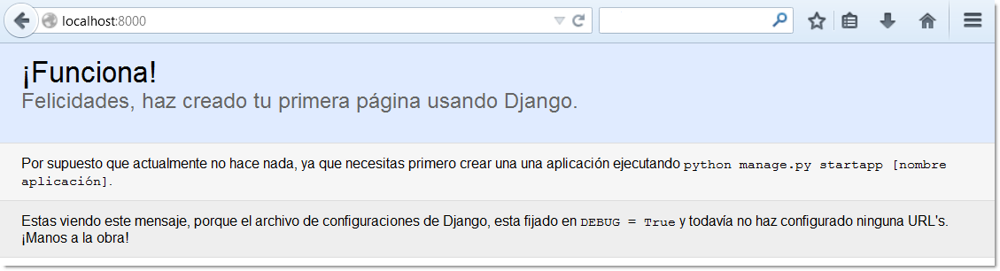

=====================
Capitulo 2: Empezando
=====================

**Instalar Django** es un proceso que consta de varios pasos, debido a las
múltiples  partes móviles de las que constan los entornos modernos de
desarrollo Web. En este  capítulo se explican las situaciones más comunes de
instalación del framework y algunas de sus dependencias.

Debido a que Django es "solo" código Python, se puede utilizar en cualquier
sistema que corra Python, ¡incluyendo algunos teléfonos celulares! Por
lo que este capítulo cubre los escenarios  más comunes para su instalación.
Asumiremos que quieres instalarlo en una computadora de escritorio/laptop o en
un servidor.

Más adelante, en el :doc:`capitulo 12 <chapter12>` te mostraremos, cómo
desplegar Django en un sitio de producción.

Instalar Python
===============

Django está escrito totalmente en código Python, por lo tanto  lo primero que
necesitas para usarlo, es asegurarte de que tienes instalada una versión
apropiada de Python.

Versiónes de Python
--------------------

El núcleo del framework en la versión 1.4  trabaja con cualquier versión de
Python superior a 2.5 y 2.7.  Django 1.5 y Django 1.6, requieren Python 2.6.5
como mínimo. A partir de este lanzamiento Python 3  es oficialmente soportado.
Recomendamos ampliamente utilizar las ultimas y menores versiónes de cada
lanzamiento de  Python soportados  (2.7.X, 3.2.X,  3.3.X y  3.4.X). Toma en
cuenta que Django 1.6 es la última  versión que dará soporte a Python 2.6; ya
que requiere como mínimo Python 2.7.

Si no estás seguro, sobre que versión de Python instalar y tienes completa
libertad para decidir, busca una de las últimas versiónes de la serie 2, en
especial la versión 3 o superior. Aunque Django trabaja bien con cualquiera de
estas versiónes, las últimas versiónes de la serie 3 proveen mejores
características.

.. admonition:: Django y Python 3

    A partir de la versión 1.7,  Django admite oficialmente Python 3, 3.2, 3.3,
    y 3.4. Por lo que si estas empezando un nuevo proyecto y las dependencias
    que piensas usar, trabajan bien en python 3  deberías usar Python 3. De
    cualquier forma si no la haces, no deberías tener ningún problema con el
    funcionamiento de tu código.

Las nuevas versiones de Python, en especial la serie 3 son más rápidas y tienen
más características, sin embargo si quieres usar una versión en especifico,
toma en cuenta la siguiente tabla, para usar una versión de Python adecuada a
la versión de Django que quieras usar:

.. table:: Compatibilidad entre Python y Django

  ===============    ===================================
  Versión Django        Versión Python
  ===============    ===================================
       1.4            2.5, 2.6, 2.7
       1.5            2.6, 2.7 y 3.2, 3.3 (experimental)
       1.6            2.6, 2.7 y 3.2, 3.3
       1.7            2.7 y 3.2, 3.3, 3.4
       1.8            2.7 y 3.2, 3.3, 3.4
       1.9            2.7 y 3.2, 3.3, 3.4
  ===============    ===================================

A partir de Django 1.6, el soporte para Python 3 es considerado estable y
puede ser usado de forma segura en producción. De cualquier forma, la
comunidad está empezando a migrar paquetes de terceros  y aplicaciones a
Python 3, por lo que es una buena idea empezar a usarlo, ya que es más sencillo
escribir código para Python 3 y luego hacerlo compatible con la serie 2, que
viceversa.

Instalación
-----------

Si estás usando Linux o Mac OS X probablemente ya tienes instalada alguna
versión de python o dos (Python 2.7 y Python3). Escribe python o python3  en
una terminal. Si ves algo así, Python está instalado::

    Python 3.4.0 (default, Apr 11 2014, 13:05:18)
    [GCC 4.8.2] on linux
    Type "help", "copyright", "credits" or "license" for more information.
    >>>

Si ves un error como: "command not found" u "orden no encontrada", necesitas
bajar e instalar Python primero. Para empezar puedes encontrar instrucciones
mas detalladas en la página de descargas oficial,  disponible en:
http://www.python.org/download/. La instalación es rápida y fácil.

Como instalar Django
====================

En cualquier momento, puedes disponer de dos versiones distintas de Django:

#. El lanzamiento oficial más reciente.
#. La versión de desarrollo.

La versión que decidas instalar dependerá de tus prioridades. Si quieres una
versión estable, probada y lista para producción, instala la primera opción,
sin embargo si quieres obtener  las últimas y mejores características y si tal
vez te gustaría contribuir con Django mismo, usa la segunda opción si no te
importa mucho la estabilidad.

Nosotros  recomendamos encarecidamente usar la versión oficial, pero siempre
es importante conocer que existe una versión de desarrollo, ya que como se
menciona en la documentación, esta está disponible para cualquier miembro de
la comunidad de forma libre.

En esta sección explicaremos algunas opciones de instalación, para instalar un
lanzamiento oficial, ya sea  manualmente o usando pip  y explicaremos la forma
de instalar la versión de desarrollo, desde el repositorio oficial Git.

Instalar un lanzamiento oficial
--------------------------------

Los lanzamientos oficiales tienen un número de versión, tal como 1.7, 1.8 o
1.9, la ultima versión siempre está disponible en la pagina de descargas del
proyecto en: http://www.djangoproject.com/download/.

Si estas usando alguna distribución de Linux, la mayoria incluye  un paquete de
Django, por lo que siempre es buena idea usar la versión que se distribuye para
tu plataforma e instalar Django con el gestor de paquetes predeterminado. De
esta forma la instalación no traerá problemas de seguridad al resto del sistema
de paquetes, actualizando paquetes de forma innecesaria, además los gestores se
encargan automáticamente de instalar las dependencias necesarias (como los
conectores para la base de datos).

Si no tienes acceso a una versión pre-empaquetada, puedes descargar e instalar
el framework manualmente. Para hacerlo primero descarga el tarball, que se
llamará algo así como ``Django-version.tar.gz`` (No importa cuál sea el
directorio local que elijas para la descarga, ya que el proceso de instalación
se encargara de colocar Django en el lugar correcto). Descomprímelo con alguna
utilidad como:  tar xzvf Django-*.tar.gz, cámbiate al directorio recién creado
con: cd Django-* y usa el comando: ``setup.py install`` o
``python setup.py install``, tal y como instalarías cualquier otra librería
Python (No olvides usar ``sudo`` o ``privilegios de administrador``).

En sistemas tipo Unix, esta es la forma en que se ve el proceso:

#. ``tar xzvf Django-2.0.tar.gz``
#. ``cd Django-*``
#. ``sudo python setup.py install``

En Windows, recomendamos usar  7-Zip (http://www.djangoproject.com/r/7zip/)
para manejar archivos comprimidos de todo  tipo, incluyendo  ``.tar.gz``.
Una vez que has descomprimido el archivo,  ejecuta un shell de comandos, con
privilegios de administrador y ejecuta el siguiente comando desde el
directorio que empieza con ``Django-``::

    python setup.py install

Si eres algo curioso, te darás cuenta que la instalación de Django, lo que
hace es instalarse en un directorio llamado ``site-packages`` --Un directorio
de paquetes, donde Python busca las librerías de terceros. Usualmente esta
ubicado en el directorio ``/usr/lib/python3/site-packages/``

Instalar un lanzamiento oficial con Pip
---------------------------------------

Una forma muy  sencilla y automática, para instalar paquetes en Python,  es
usando un instalador independiente llamado ``pip``.  Si tienes instalado
``pip``, lo único que necesitas, es utilizar una versión actualizada. (Ya que
en algunos casos la instalación de Django no trabaja, con versiones *muy*
antiguas de ``pip``), pip es la opción recomendada para instalar Django, usando
``virtualenv`` y ``virtualenvwrapper``.

Pip es un instalador de paquetes Python, usado oficialmente para instalar
paquetes desde  Python Package Index (PyPI). Con  ``pip`` puedes instalar
Django desde PyPI.

Si no tienes instalado ``pip`` instalalo y luego instala Django.

#. Abre una terminal de comandos y ejecuta  el comando ``easy_install pip``.
   Este comando instalara pip en tu sistema (La version 3.4 de Python, lo
   incluye como el instalador por defecto).

#. Opcionalmente puedes utilizar ``virtualenv`` o ``virtualenvwrapper``. Estas
   herramientas, proveen un entorno independiente  y aislado para ejecutar
   código  Python, con lo cual es mas practico instalar paquetes, sin alterar
   el sistema, ya que  permite instalar paquetes, sin privilegios de
   administrador y sin riesgos de actualizar dependencias y con la ventaja de
   usar el interprete Python que desees. Por lo que de ti depende que quieras
   aprender a usarlo o no.

#. Si estas usando  Linux, Mac OS X o algún otro sabor de Unix, usa el siguiente
   comando en una terminal para instalar Django: ``sudo pip install django``.
   Si estas usando Windows, inicia  el shell de comandos con privilegios de
   administrador y ejecuta el comando: ``pip install django``. Este comando
   instalara Django en el directorio de paquetes de tu instalación por defecto
   de Python.

Si estas usando virtualenv, no necesitas usar sudo o privilegios de
administrador, ya que los paquetes se instalaran en un  directorio
independiente, perteneciente al entorno  de paquetes que crea  el mismo
``virtualenv``.

Instalar la "Versión de Desarrollo"
-----------------------------------

Django usa Git (http://git-scm.com) para el control del código fuente. La
ultima versión de desarrollo está disponible desde el repositorio oficial en
Git (https://github.com/django/django). Si quieres trabajar sobre la versión
de desarrollo, o si quieres contribuir con el código de Django en sí mismo,
deberías instalar Django desde el repositorio alojado en Git.

Git  es libre, es un sistema de control de versiones de código abierto,
usado por el  equipo de Django para  administrar cambios en el código base.
Puedes descargar e instalar manualmente Git de http://git-scm.com/download,
sin embargo es más sencillo instalarlo con el manejador de paquetes de tu
sistema operativo (si es tu caso). Puedes utilizar un cliente Git  para hacerte
con el código fuente más actual de Django y, en cualquier momento, actualizar
tu copia local del código fuente, conocido como un checkout local, para obtener
los últimos cambios y mejoras hechas por los desarrolladores de Django.

Cuando uses  un versión de desarrollo, debes tener en mente que cualquier
cosa se puede romper en cualquier momento, por lo que no hay garantías de nada
Una vez dicho esto, también debemos decirte que algunos miembros del equipo
de Django ejecutan sitios de producción sobre la versión de desarrollo con el
incentivo de mantenerlo estable.

Para obtener la  última versión de desarrollo, sigue los siguientes pasos:

#.  Asegúrate de tener instalado Git. Puedes obtener el software de
    http://git-scm.com/,  también puedes encontrar excelente documentación
    en http://git-scm.com/documentation.

#. Clona el repositorio usando el comando
   ``git clone https://github.com/django/django djmaster``

#. Localiza  el directorio ``site-packages`` de tu instalación Python.
   Usualmente esta en el directorio: ``/usr/lib/python3/site-packages``. Si
   no tienes idea de su localización, usa la línea de comandos y tipea::

       python -c 'import sys, pprint; pprint.pprint(sys.path)'

.. usa comillas dobles en Windows, si no no funciona el comando.

El resultado de la salida, incluirá el directorio de ``site-packages``

#. Si no tienes un directorio ``site-packages``, crea un archivo con el
   nombre: ``djmaster.pth`` edítalo y agrega la ruta completa al directorio
   ``djmaster``. Por ejemplo, tu archivo puede contener una línea como la
   siguiente::

        /path/to/djmaster

#. La carpeta: ``djmaster/django/bin`` en la ruta de tu sistema. Es el
   directorio que incluye las utilidades administrativas, tales  como
   ``django-admin.py``.

.. admonition:: Tip:

    Si los archivo .pth son nuevos para ti, puedes aprender más de ellos en
    http://www.djangoproject.com/r/python/site-module/.

Luego de descargar el código fuentes desde  Git  y haber seguido los pasos
anteriores, no necesitas ejecutar ``setup.py install`` ¡Acabas de hacer este
trabajo a mano!

Debido a que el código de Django cambia a menudo corrigiendo bugs y agregando
funcionalidades, probablemente quieras actualizarlo con frecuencia o alguna
que otra vez. Para actualizar el código, solo ejecuta el comando
``git pull origin master`` desde el directorio ``djmaster``. Cuando ejecutes
este comando,  Git contactara https://github.com/django/django  y
automáticamente determinará si el código ha cambiado  y actualizará tu versión
local del código con cualquier cambio que se haya hecho desde la última
actualización. Es muy bueno.

Finalmente, si estas usando la versión de desarrollo, necesitas conocer la
versión de Django que estas ejecutando. Conocer el número de versión es
importante en caso de que alguna vez necesites ayuda de la comunidad o para
enviar alguna mejora del framework. En estos casos, es necesario informar
sobre la revisión, esta revisión es también conocida como "commit" . Para
encontrar el commit actual, tipea "git log -1" dentro del directorio
``django`` y busca el  identificador después del "commit". Este número cambia
cada vez que Django cambia, se corrige algún error, se agrega alguna
característica, se mejora la documentación o se implementa cualquier otra
cosa.

Probando la instalación
=======================

Para obtener un poco mas de  retroalimentación, después del proceso de
instalación,  tomémonos un momento para probar la instalación. Usando
la línea de comandos, cámbiate a otro directorio (*no* al directorio
que contiene el directorio ``django``) e inicia el interprete interactivo
tipeando ``python3`` o ``python`` dependiendo de la versión que estes usando.
Si el proceso de instalación fue exitoso, deberías poder importar el
modulo ``django``::

    >>> import django
    >>> django.VERSION
    (2.0, 'final', 0)

.. admonition:: Ejemplos en el intérprete interactivo

    El intérprete interactivo de Python es un programa de línea de comandos
    que te permite escribir un programa Python de forma interactiva. Para
    iniciarlo sólo ejecuta el comando python o python3 en la línea de comandos

    Durante todo este libro, mostraremos ejemplos de código Python como si
    estuviesen escritos en el intérprete interactivo. El triple signo de
    mayor que (>>>) es el prompt de Python. Si estas siguiendo los ejemplos
    interactivamente, no copies estos signos.

    Toma en cuenta que en el intérprete interactivo, las declaraciones
    multilinea son completadas con tres puntos (``...``). Por ejemplo::

        >>>from __future__ import print_function
        >>> print ("""Esta es una
        ... cadena de texto que abarca
        ... tres lineas.""")
        Esta es una
        cadena de texto que abarca
        tres lineas.
        >>> def mi_funcion(valor):
        ...     print (valor)
        >>> mi_funcion('hola')
        hola

    Estos tres puntos adicionales, al inicio de la línea son insertados por
    el interprete  Python -- No son parte de la entrada de datos. Los hemos
    incluido aquí para ser fieles a la salida  del intérprete. Si copias estos
    ejemplos, asegúrate de  no incluir estos tres puntos.

    Observa como importamos la función ``print_function`` del paquete ``future``
    Esta es una solución perfecta para proyectos en los cuales se requiere
    mantener una compatibilidad entre versiones de python, sin tener que
    ramificar el codigo entre versiones 2.x y 3.x en especifico, de esta
    forma es posible mantener el codigo independiente de la version de Python.

Configurar la base de datos
===========================

En este punto, podrías escribir una aplicación Web usando Django, por que
el único prerrequisito de Django es una instalación funcionando de Python.
Sin embargo, este libro se centra en una de las mejores funcionalidades de
Django, el desarrollo de sitios Web con soporte para *base de datos*, para
ello necesitarás instalar un servidor de base de datos de algún tipo, para
almacenar tus datos.

Si sólo quieres comenzar a jugar con Django, salta a la sección titulada
"Empezar un proyecto" -- pero créenos, querrás instalar una base de datos
finalmente. Todos los ejemplos de este libro asumen que tienes una base de
datos configurada.

Hasta el momento de escribir esto, Django admite oficialmente estos cuatro
motores de base de datos:

:PostgreSQL: http://www.postgresql.org/
:SQLite 3: http://www.sqlite.org/
:MySQL: http://www.mysql.com/
:Oracle: http://www.oracle.com/

Además de las bases de datos oficialmente soportadas, existen otras ofrecidas
por  terceros,   que permiten utilizar  otras bases de datos con Django
como son: SAP SQL,  Anywhere,   IBM,  DB2,  Microsoft SQL Server,  Firebird,
ODBC,  ADSDB.

En general, todos los motores que listamos aquí trabajan bien con Django
(Una notable excepción, es el soporte opcional para GIS, el cual es más
poderoso usando PostgreSQL, que usando otras bases de datos.) Si no estás atado
a ningún sistema y tienes la libertad para cambiarte a cualquier bases de
datos, nosotros recomendamos PostgreSQL, el cual logra un balance fino entre
el costo, características,  velocidad y estabilidad.

Configurar la base de datos, es un proceso que toma dos pasos:

* Primero, necesitas instalar y configurar la base de datos en sí mismo. Este
  proceso  va mas allá de los alcances de este libro, pero cada una de las
  cuatro bases de datos que mencionamos anteriormente posee una basta
  documentación en su sitio Web (Si usas un servicio de hosting compartido,
  lo más probable es que la base de datos ya este configurada y lista para usarse.)

* Segundo, necesitas instalar ciertas librerías Python para la base de datos
  en específico que vayas a utilizar (drivers). Estas forman parte del código
  de terceros, que permiten a Python conectarse a la base de datos.
  Repasararemos mas los requisitos en las siguientes secciones.

SQLite merece especial atención como herramienta de desarrollo. Es un motor de
base de datos extremadamente simple y no requiere ningún tipo de instalación
y configuración del servidor. Es por lejos el más fácil de configurar si sólo
quieres jugar con Django, y viene incluido en la biblioteca estándar de
Python.

En Windows, obtener los drivers binarios para cualquier base de datos es a
veces un proceso complicado. Ya que sólo estás iniciándote con Django,
recomendamos usar Python 3 y el soporte incluido para SQLite. La compilación de
drivers puede ser estresante.

Usar Django con PostgreSQL
--------------------------

Si estás utilizando PostgreSQL, necesitarás el paquete ``psycopg2``
disponible en  http://www.djangoproject.com/r/python-pgsql/.
Toma nota de la versión de Python que estás usando; necesitarás esta
información para descargar la versión apropiada.

Si estás usando PostgresSQL en Windows, puedes encontrar los binarios
precompilados de ``psycopg`` en
http://www.djangoproject.com/r/python-pgsql/windows/.

Si estas usando Linux, checa el instalador o gestor de paquetes que ofrece tú
sistema, busca algo llamado "python-psycopg", "psycopg-python",
"python-postgresql" o algo similar.

Usar Django con SQLite 3
------------------------

Si quieres usar SQLite, estas de suerte, ya que no necesitas instalar nada,
porque Python ofrece soporte nativo para SQLite, además Django ofrece por
omisión usar esta configuración, por lo que puedes saltarte esta sección.

Usar Django con MySQL
---------------------

Django requiere MySQL 4.0 o superior; la versión 3.x no admite subconsultas
anidadas, ni algunas otras sentencias SQL perfectamente estándar.

También  necesitas instalar el paquete ``MySQLdb`` desde
http://www.djangoproject.com/r/python-mysql/.

Si estas usando Linux, checa el instalador o gestor de paquetes que ofrece tú
sistema y busca algo llamado "python-mysql", "python-mysqldb", "mysql-python"
o algo similar.

Usar Django con Oracle
----------------------

Django trabaja con versiones servidor de Oracle 9i o más alto.

Si estas usando Oracle necesitas instalar la librería ``cx_Oracle``,
disponible en http://cx-oracle.sourceforge.net/. Usa una versión superior a la
4.31, pero evita la versión 5.0  ya que existe un error en la versión del
controlador. La versión 5.0.1 corrige ese error, de cualquier forma usa en lo
posible una versión superior.

Usar Django sin una base de datos
---------------------------------

Como mencionamos anteriormente, Django actualmente no requiere una base de
datos. Si sólo quieres usar este como un servidor dinámico de páginas que no
use una base de datos, está perfectamente bien.

Con esto dicho, ten en cuenta que algunas de las herramientas extras de Django
requieren una base de datos, por lo tanto si eliges no usar una base de datos,
perderás estas utilidades. (Señalaremos estas utilidades a lo largo del libro).

Comenzar un proyecto
====================

Una vez que has instalado Python, Django y (opcionalmente) una base de datos
(incluyendo los controladores), puedes empezar a dar tus primeros pasos en el
desarrollo de aplicaciones, creando un *proyecto*.

Un proyecto es una colección de configuraciones para una instancia de Django,
incluyendo configuración de base de datos, opciones específicas de Django y
configuraciones específicas de aplicaciones.

Si esta es la primera vez que usas Django, tendrás que tener cuidado de
algunas configuraciones iníciales. Crea un nuevo directorio para empezar a
trabajar, por ejemplo algo como ``/home/username/djcode/``.

.. admonition:: ¿Dónde debería estar este directorio?

    Si has trabajado con PHP, probablemente pondrías el código debajo de la
    carpeta raíz del servidor Web (en lugares como ``/var/www``). Con Django,
    no tienes que hacer esto. No es una buena idea poner cualquier código
    Python en la carpeta raíz del servidor Web, porque al hacerlo se arriesga
    a que la gente sea capaz de ver el código en la Web. Esto no es bueno
    para la seguridad.

    Pon tu código en algún directorio **fuera** de la carpeta raíz.

Cámbiate al directorio que acabas de crear y ejecuta el siguiente comando:
``django-admin.py startproject misitio``. Este comando creara un directorio
llamado ``misitio`` en el directorio actual.

.. admonition:: Nota:

    ``django-admin.py`` debería estar en la ruta de búsqueda de tu sistema o
    ``PATH``, si instalaste Django con la utilidad ``setup.py``.

    Si estas usando la versión de desarrollo, puedes encontrar
    ``django-admin.py`` en  ``djmaster/django/bin``. Como vas a utilizar con
    frecuencia ``django-admin.py`` considera agregarlo a tu PATH. En Unix,
    puedes hacer un enlace simbólico a ``/usr/local/bin`` usando un comando
    como ``sudo ln -s /path/to/django/bin/django-admin.py /usr/local/bin/django-admin.py``.
    En Windows, puedes actualizar tu variable de entorno ``PATH`` de forma
    grafica.

    Si instalaste Django  a través del gestor de paquetes de tu distribución,
    ``django-admin.py`` o en sistemas Windows, ahora tienes un ejecutable
    llamado ``django-admín``.

Si obtienes un mensaje como "permiso denegado", al usar  el comando
``django-admin.py startproject``, necesitas cambiarle los permisos al archivo,
para hacerlo, navega al directorio donde se instalo ``django-admin.py``,
(e.g., ``cd /usr/local/bin``) y ejecuta el comando
``chmod +x django-admin.py``.

El comando  ``startproject`` crea un directorio que contiene varios archivos::

    misitio/
        manage.py
        misitio/
            __init__.py
            settings.py
            urls.py
            wsgi.py

.. note:: ¿No es lo mismo que ves?

    El diseño del proyecto puede cambiar, por lo que si estás viendo
    un árbol de directorios diferente al anterior (archivos mas, archivos
    menos), probablemente estas usando una versión distinta a la que se
    maneja en este libro.

    Puedes consultar la documentación oficial , que está siempre disponible
    en: https://docs.djangoproject.com para detalles completos.

Estos archivos son los siguientes:

* ``misitio/``: El directorio externo ``misitio/``, es solo un contenedor,
  es decir una carpeta  que contiene nuestro proyecto. Por lo que se le
  puede cambiar el nombre en cualquier momento sin afectar el proyecto en si.

* ``manage.py``: Una utilidad de línea de comandos que te permite interactuar
  con un proyecto Django de varias formas. Usa ``manage.py help`` para
  ver lo que puede hacer. No deberías editar este archivo, ya que este es
  creado en el directorio convenientemente para manejar el proyecto.

* ``misitio/misitio/``: El directorio  interno ``misitio/`` contiene el paquete
  Python para tu  proyecto. El nombre de este paquete Python se usara
  para importar cualquier cosa dentro del.(e.g. ``import misitio.settings``).

* ``__init__.py``:  Un archivo requerido para que Python trate el
  directorio ``misitio`` como un paquete o como un grupo de módulos. Es un
  archivo vacio y generalmente no necesitaras agregarle nada.

* ``settings.py``: Las opciones/configuraciones para nuestro proyecto  Django.
  Dale un vistazo, para que te des una idea de los tipos de configuraciones
  disponibles y sus valores predefinidos.

* ``urls.py``: Declaración de las URLs para este proyecto de Django. Piensa
  que es como una “tabla de contenidos” de tu sitio hecho con Django.

* ``wsgi.py``:  El punto de entrada WSGI para el servidor Web, encargado de
  servir nuestro proyecto.  Para más detalles consulta el
  :doc:`capitulo 12<chapter12>`.

Todos estos pequeños archivos, constituyen un proyecto Django, que puede
albergar multiples aplicaciones.

El servidor de desarrollo
-------------------------

Para obtener un poco de información y mas retroalimentación, ejecuta el servidor
de desarrollo de Django, para ver el proyecto en acción.

Django incluye un servidor Web ligero (Que es  llamado con el comando
"runserver" ) que puedes usar mientras estás desarrollando tu sitio. Incluimos
este servidor para que puedas desarrollar tu sitio rápidamente, sin tener que
lidiar con configuraciones de servidores Web para producción (por ejemplo,
Apache) hasta que estés listo para producción.

Este servidor de desarrollo vigila tu código a la espera de cambios y se
reinicia automáticamente, ayudándote a hacer algunos cambios rápidos en tu
proyecto sin necesidad de reiniciar nada.

.. admonition:: Nota:

    Antes de iniciar el servidor de desarrollo, edita el archivo ``settings.py``
    y comenta las variables: ``INSTALLED_APPS`` y ``MIDDLEWARE_CLASSES`` ya que
    no las usaremos por el momento, también asegurate que el archivo ``urls.py``,
    este vacio, ya que incluye algunas aplicaciones que necesitan configurarse
    y que dependen de otras (como las sesiones que necesitan tablas en la base
    de datos), nos ocuparemos de ellas en capitulos posteriores::

        from django.conf.urls import url

        urlpatterns = [
        ]

.. Solo para usarlo sin una base de datos.

Para iniciar el servidor, entra en el directorio  que contiene tu proyecto
(``cd misitio``) si aún no lo has hecho y ejecuta el comando::

    python manage.py runserver

Verás algo parecido a esto::

    Performing system checks...

    System check identified no issues (0 silenced).
    October 16, 2014 - 21:17:11
    Django version 2.0, using settings 'misitio.settings'
    Starting development server at http://127.0.0.1:8000/
    Quit the server with CONTROL-C.

El comando runserver inicia el servidor de desarrollo en el puerto 8000,
escuchando sólo conexiones locales. Ahora que el servidor está corriendo,
visita la dirección http://127.0.0.1:8000/ con tu navegador Web. Verás una
página de “Bienvenido a Django” sombreada con un azul pastel agradable.
¡Funciona!  "Bienvenido a Django"

   Página de bienvenida de django, ¡Funciona!.

Aunque el servidor de desarrollo es extremadamente útil para, bueno,
desarrollar, resiste la tentación de usar este servidor en cualquier entorno
parecido a producción. El servidor de desarrollo puede manejar fiablemente
una sola petición a la vez, y no ha pasado por una auditoría de seguridad de
ningún tipo. Cuando sea el momento de lanzar tu sitio, mira el
:doc:`capitulo 12<chapter12>` para obtener más información, sobre cómo hacerlo
con Django.

.. admonition:: Cambiar el host o el puerto

    Por defecto, el comando runserver inicia el servidor de desarrollo en el
    puerto 8000, escuchando sólo conexiones locales. Si quieres cambiar el
    puerto del servidor, pasaselo a este como un argumento en la línea de comandos::

        python manage.py runserver 8080

    También puedes cambiar las direcciones IP que escucha el servidor. Esto
    es utilizado especialmente si quieres compartir el desarrollo de un sitio
    con otros desarrolladores o miembros de tu equipo. Por ejemplo la dirección
    IP ``192.148.1.103`` hará que Django escuche sobre cualquier interfaz de red,
    permitiendo que los demás miembros del equipo puedan conectarse al
    servidor de desarrollo.::

        python manage.py runserver 192.148.1.103:8000

    Cuando hagas esto, otras computadoras de tu red local, podrán conectarse
    a tu sitio, visitando la dirección IP  directamente en sus navegadores
    por ejemplo usando: http://192.148.1.103:8000/ . (Ten en cuenta que para
    poder acceder a tu red, es necesario primero determinar la dirección IP
    de tu red local, en sistemas Unix, puedes usar el comando "ifconfig" en la
    línea de comandos o terminal, en sistemas Windows puedes conseguir esta
    misma información usando el comando "ipconfig" )

¿Qué sigue?
===========

Ahora que tienes todo instalado y el servidor de desarrollo corriendo, en el
próximo capítulo :doc:`Los principios de las páginas Web dinámicas <chapter03>`
escribirás algo de código, que muestra cómo servir páginas Web usando Django.

.. OK

