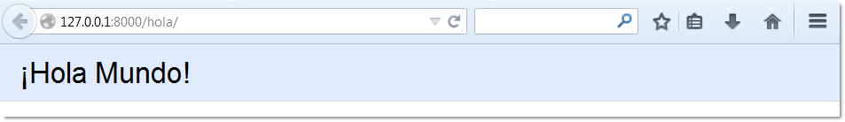
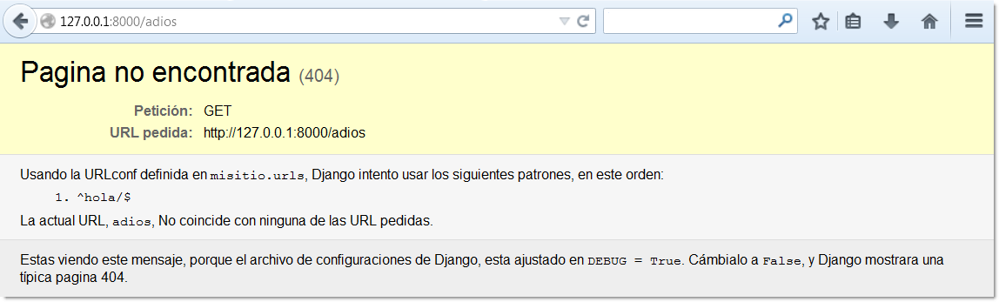
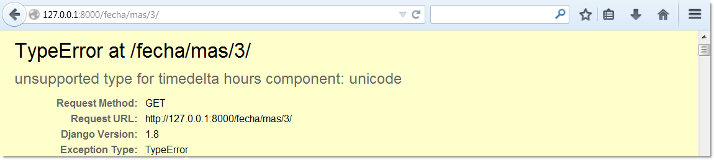

=======================================================
Capítulo 3: Los principios de las páginas Web dinámicas
=======================================================

En el capítulo anterior, explicamos cómo crear un proyecto en Django y cómo
poner en marcha el servidor de desarrollo. Por supuesto, el sitio no hace nada
útil todavía -- sólo muestra el mensaje "It worked!". Cambiemos eso.
Este capítulo presenta cómo crear **páginas web dinámicas** con Django.

Tu primera pagina creada con Django: Hola mundo
===============================================

Como primer objetivo, vamos  a crear una página web, que muestre por salida el
famoso y clasico mensaje: "Hola mundo".

Si quisiéramos publicar un simple "Hola mundo" en una página web, sin usar un
framework, simplemente escribiríamos  "Hola mundo" en un archivo de texto y
lo  llamaríamos ``Hola mundo``,  después lo subiríamos a alguna parte de
nuestro servidor web,  fíjate en el proceso, hemos especificado dos piezas
de información acerca de la página web: tenemos el contenido (La cadena
``"Hola mundo"`` ) y la URL(``http://www.example.com/hola.html``) o tal vez
``http://www.example.com/archivos/hola.html`` si lo pusimos en un
subdirectorio)

Con Django, es necesario especificar esas mismas cosas, pero de diferente
forma. El contenido de la pagina será producido por la *función vista* y la
URL se especificara en la  *URLconf*.

Primero escribamos la vista "Hola mundo", podríamos crear una aplicación
Django para este propósito, pero lo haremos de forma manual, para conocer
paso a paso el proceso.

Tu primera Vista creada con Django
----------------------------------

Dentro del directorio ``misitio``, el cual creamos en el capitulo anterior con
el comando  ``django-admin.py startproject``, crea un archivo vacio llamado
``views.py`` en el mismo nivel que ``settings.py``. Este modulo Python
contendrá la vista que usaremos en este  capitulo. Observa que no hay nada
especial acerca del  nombre ``views.py`` -- A Django no le interesa como lo
llames. Le dimos este nombre solo por convención y para beneficio de otros
desarrolladores que lean nuestro código.

Nuestra vista "Hola mundo" sera bastante simple. Esta es la función completa,
la cual incluye las declaraciones que debemos escribir en un archivo llamado
``views.py``:

.. code-block:: python

    from django.http import HttpResponse

    def hola(request):
        return HttpResponse("Hola Mundo")

Repasemos el código anterior línea a línea:

* Primero, importamos la clase ``HttpResponse``, la cual pertenece al
  módulo ``django.http``. Necesitamos importar esta clase porque será usada
  posteriormente en nuestro código.

* Después, definimos una función llamada  ``hola``, la función vista.

  Cada función de vista o vista, toma al menos un parámetro llamado por
  convención ``request``. El cual es un objeto que contiene información
  sobre la vista que llama a la pagina actual, la cual es una instancia de
  la clase ``django.http.HttpRequest``. En este ejemplo, no hace nada el
  método ``request``, no obstante siempre deve ser el primer parámetro de
  cualquier vista.

  Observa también que el nombre de la función no importa; ya que no tiene
  que ser  nombrada de una determinada forma para que Django la reconozca.
  La llamamos ``hola``, por que claramente indica lo que hace esta función,
  pero se podría haber llamado, ``hola_maravilloso_y_bello_mundo``, o algo
  igualmente provocador. En la siguiente sección "Tu primera URLconf", te
  mostraremos como le decimos a Django, que encuentre esta función.

* La función que hemos creado, es una simple linea: que retorna un objeto
  ``HttpResponse`` que ha sido instanciado con el texto ``"Hola mundo"``

Es posible mostrar por salida no solo texto, si no HTML directamente asi:

.. code-block:: python

    from django.http import HttpResponse

    HTML = """
    <!DOCTYPE html>
    <html lang="es">
    <head>
      <meta http-equiv="content-type" content="text/html; charset=utf-8">
      <meta name="robots" content="NONE,NOARCHIVE"><title>Hola mundo</title>
      
    </head>
    <body>
    

      <h1>¡Hola Mundo!</h1>
     

    </body></html>
    """

    def hola(request):
        return HttpResponse(HTML)

La lección principal que debes aprender aquí, es que una vista es solo
una función Python, que toma como primer argumento una petición
``HttpRequest`` y  retorna como respuesta una instancia de ``HttpResponse``.
Por lo que **una función Python es una vista en Django**. (Hay excepciones,
pero las veremos más adelante)

Tu primera URLconf creada con Django
------------------------------------

En este punto, puedes ejecutar otra vez  ``python manage.py runserver`` y
veras de nuevo el mensaje "Bienvenido a Django", sin rastros de la vista
"Hola mundo" que creamos anteriormente. Esto se debe a que nuestro proyecto
``misitio``, no sabe nada acerca de esta  vista, por lo  que necesitamos
decirle a Django explícitamente, como activar esta vista para una
determinada URL (Continuando con la analogía que mencionamos anteriormente,
sobre publicar archivos estáticos, esto sería como crear un archivo HTML,
sin subirlo al directorio del servidor). Para  enganchar o apuntar una vista
a una determinada función URL, usamos una URLconf.

Una *URLconf* es como una tabla de contenidos para tu sitio web hecho con
Django. Básicamente, es un mapeo entre los patrones URL y las funciones de
vista que deben ser llamadas por esos patrones URL. Es como decirle a Django,
"Para esta URL, llama a este código, y para esta otra URL, llama a este otro
código".  Por ejemplo, "Cuando alguien visita la URL ``/foo/``, llama a la
vista ``foo_view()`` la cual está en el modulo Python ``views.py``."

Cuando ejecutaste ``django-admin.py startproject`` en el capítulo anterior,
el script creó automáticamente una URLconf por tí: el archivo ``urls.py``.
Por omisión, se verá así:

.. code-block:: python

    from django.conf.urls import include, url
    from django.contrib import admin

    urlpatterns = [
    # Examples:
    # url(r'^$', 'misitio.views.home', name='home'),
    # url(r'^blog/', include('blog.urls')),

    url(r'^admin/', include(admin.site.urls)),
    ]

Repasemos el código anterior línea a línea:

* La primera línea importa las funciones: ``url`` e ``include``, del modulo
  ``django.conf.urls``, la función ``url`` es una tupla, donde el  primer
  elemento es una   expresión regular simple y el segundo elemento es la
  función de vista que se usa para ese patrón, mientras que la función
  ``include``  se encarga de importar módulos que contienen otras URLconf,
  al camino de búsqueda de Python, como una forma de “incluir”  urls que
  pertenecen a otro paquete,   en este caso al sitio administrativo, que
  viene  activado por defecto (Esto lo veremos mas adelante).

* Después tenemos a la función ``urlpatterns()``, una variable que  recibe
  los argumentos de las url en forma de lista, inclusive cadenas de
  caracteres vacías.

Por defecto, todo lo que está en la URLconf está comentado e incluye algunos
ejemplos de configuraciones comúnmente usados, a excepción del sitio
administrativo, el cual esta activado por omisión. (Para desactivarlo, solo
es necesario comentarlo.)

Si ignoramos el código comentado, esto es esencialmente una URLconf:

.. code-block:: python

    from django.conf.urls import url
    urlpatterns = [

    ]

El principal punto  que debes notar aquí es la variable ``urlpatterns``,
la cual Django espera encontrar en tu módulo ``ROOT_URLCONF``. Esta variable
define el mapeo entre las URLs y el código que manejan esas URLs.  Por
defecto, todo lo que está en la URLconf está comentado -- tu aplicación de
Django es una pizarra blanca. (Como nota adicional, esta es la forma en la
que Django sabía que debía mostrar la página "It worked!" en el capítulo
anterior.  Si la URLconf está vacía, Django asume que acabas de crear el
proyecto, por lo tanto, muestra ese mensaje).

Para agregar una URL y una vista a la URLconf, solamente  agrega un mapeo,
es decir un enlace entre el patrón URL y la función vista a usar. Esta es
la forma en la que enganchamos la vista ``hola`` a la URL::

    from django.conf.urls import url
    from misitio.views import hola

    urlpatterns = [
        url(r'^hola/$', hola),
    ]

(Nota que hemos borrado el código por brevedad. Puedes dejar las líneas
comentadas si así lo deseas)

Observa que hicimos dos cambios:

* Primero, importamos la vista ``hola``, desde el modulo ``misitio/views.py``
  que en la sintaxis de import de Python se traduce a ``misitio.views``.
  (La cual asume que el paquete ``misitio/views.py``, está en la ruta de
  búsqueda de Python o python path).

* Luego, agregamos la línea  ``url(r'^hola/$', hola),`` a ``urlpatterns``
  Esta línea hace referencia a un *URLpattern* -- Una tupla de Python en
  dónde el primer elemento es una expresión regular simple y el segundo
  elemento es la función de vista que usa para manejar ese patrón. La
  ``url()`` puede tomar argumentos opcionales, los cuales cubriremos mas a
  fondo en él :doc:`capitulo 8<chapter08>`,

Un detalle importante que hemos introducido aquí, es el carácter ``r``  al
comienzo de la expresión regular. Esto le dice a Python que es una "cadena
en crudo" -- lo que permite que las expresiones regulares sean escritas sin
demasiadas sentencias de escape tal como cadenas ``'\n'`` , la cual es una
cadena que indica una nueva línea. Cuando agregamos la ``r`` hicimos una cadena
en crudo, la cual Python no tratara de escapar con ``r'\n'`` una cadena de dos
caracteres, la diagonal y la "n" minúscula. Para evitar colisiones entre las
diagonales que usa Python y las encontradas en las expresiones regulares, es
fuertemente recomendado usar cadenas en crudo, cada vez que necesites definir
una expresión regular en Python. Todas los patrones en este libro usan cadenas
en crudo.

En resumidas cuentas, le estamos diciendo a Django  que cualquier petición
a la URL ``/hola/`` sea manejada por la función de vista: ``/hola/`` (y no, no
tienen que llamarse igual)

.. admonition:: Tu ruta de Python o Python Path

    **Python path** es la lista de directorios en tu sistema en donde Python
    buscará cuando uses la sentencia ``import`` de Python.

    Por ejemplo, supongamos que tu Python path tiene el valor ``['',
    '/usr/lib/python3.4/site-packages', '/home/username/djcode/']``. Si
    ejecutas el código Python ``from foo import bar``, Python en primer lugar
    va a buscar el módulo llamado ``foo.py`` en el directorio actual. (La
    primera entrada en el Python path, una cadena de caracteres vacía,
    significa "el directorio actual.") Si ese archivo no existe, Python va a
    buscar el módulo en ``/usr/lib/python3.4/site-packages/foo.py``. Si ese
    archivo no existe, entonces probará en ``/home/username/djcode/foo.py``.
    Finalmente, si *ese* archivo no existe, Python lanzará una excepción
    ``ImportError``

    Si estás interesado en ver el valor de tu Python path, abre un interprete
    interactivo de Python y escribe::

        >>> from __future__ import print_function
        >>> import sys
        >>> print (sys.path)

    De nuevo, importamos la funcion ``print_function()`` del paquete ``future``
    para mantener compatibilidad entre Python 2 y 3.

    Generalmente no tienes que preocuparte por asignarle valores al Python path
    -- Python y Django se encargan automáticamente de hacer esas cosas por ti
    entre bastidores. (Si eres un poco curioso, establecer el Python path es
    una de las primera tareas que hace el archivo ``manage.py``).

Vale la pena discutir un poco más la sintaxis que usamos en ``URLpattern``, ya
que no es muy obvio el ejemplo, si esta es la primera vez que tropezamos con las
expresiones regulares:

* La ``r`` en ``r'^hola/$'`` significa que ``'^hola/$'`` es una cadena de
  caracteres en crudo de Python. Esto permite que las expresiones
  regulares sean escritas sin demasiadas sentencias de escape.

* Puedes excluir la barra al comienzo de la expresión ``'^hola/$'`` para que
  coincida con ``/hola/``. Django automáticamente agrega una barra antes de
  toda expresión. A primera vista esto parece raro, pero una URLconf puede ser
  incluida en otra URLconf, y el dejar la barra de lado simplifica mucho las
  cosas. Esto se retoma en él :doc:`capítulo 8<chapter08>`.

* El patrón incluye el *acento circunflejo* (``^``) y el *signo de dólar*
  (``$``) estos son caracteres de la expresión regular que tienen un
  significado especial. El acento circunflejo significa que "requiere que el
  patrón concuerde con el inicio de la cadena de caracteres", y el signo de
  dólar significa que "exige que el patrón concuerde con el fin  de la
  cadena".

* Este concepto se explica mejor con un ejemplo. Si hubiéramos utilizado el
  patrón ``'^hola/'`` (sin el signo de dólar al final), entonces *cualquier*
  URL que comience con ``hola/`` concordaría, así como ``/hola/foo`` y
  ``/hola/bar``, no sólo ``/hola/``. Del mismo modo, si dejamos de lado el
  carácter acento circunflejo inicial (``'hola/$'``), el patrón coincidiría
  con *cualquier* URL que termine con ``hola/``, así como ``/foo/bar/time/``.
  Por lo tanto, usamos tanto el acento circunflejo como el signo de dólar
  para asegurarnos que sólo la URL ``/hola/`` coincida. Nada más y nada
  menos.

  La mayor parte de los patrones URL, empiezan  con el acento circunflejo
  (``^``) y  terminan con el signo de dólar (``$``), esto es bueno, ya que
  permite una mayor flexibilidad para  realizar concordancias más complejas
  y exactas.

  .. admonition:: Expresiones Regulares:

    Las *Expresiones Regulares* (o *regexes*) son la forma compacta de
    especificar patrones en un texto. Aunque las URLconfs de Django permiten
    el uso de regexes arbitrarias para tener un potente sistema de definición
    de URLs, probablemente en la práctica no utilices más que un par de
    patrones regex.

    Esta es una pequeña selección de patrones comunes:

    =============  ===========================================================
    Símbolo        Coincide con
    =============  ===========================================================
    ``. (punto)``  Cualquier carácter

    ``\d``         Cualquier dígito

    ``[A-Z]``      Cualquier carácter, A-Z (mayúsculas)

    ``[a-z]``      Cualquier carácter, a-z (minúsculas)

    ``[A-Za-z]``   Cualquier carácter, a-z (no distingue entre mayúscula y
                   minúscula)

    ``+``          Una o más ocurrencias de la expresión anterior (ejemplo,
                   ``\d+``  coincidirá con uno o más dígitos)

    ``[^/]+``      Cualquier carácter excepto la barra o diagonal.

    ``?``          Cero o una ocurrencia (ejemplo ``\d?`` coincidirá con
                   cero o un digito

    ``*``          Cero o más ocurrencias de la expresión anterior (ejemplo,
                   ``\d*``   coincidirá con cero o más dígitos)

    ``{1,3}``      Entre una y tres (inclusive) ocurrencias de la expresión
                   anterior  (ejemplo ``\d{1,3}``  coincidirá con uno, dos o
                   tres dígitos)
    =============  ===========================================================

    Para más información acerca de las expresiones regulares, mira el módulo
    http://www.djangoproject.com/r/python/re-module/.

  Quizás te preguntes qué pasa si alguien intenta acceder a ``/hola``. (*sin*
  poner la segunda barra o diagonal). Porque no concuerda con el patrón que
  definimos, sin embargo por defecto cualquier petición a cualquier URL  que
  *no* contenga una barra final y que no concuerde  con un patrón, será
  redireccionado a la misma URL con la diagonal final,  siempre y cuando la
  variable ``APPEND_SLASH`` tenga asignado el valor ``True``. (APPEND_SLASH,
  significa "Agrega una diagonal al final".  Consulta  el
  :doc:`apéndice D,<appendixD>`, si quieres ahondar más en este tema).

  Si eres el tipo de persona que le gusta que todas sus URL, contengan una
  barra al final (como lo prefieren muchos desarrolladores de Django), todo
  lo que necesitas es agregar la barra a cada patrón URL o  asignar ``True``
  a la variable ``APPEND_SLASH``. Si prefieres que tus URLs *no* contengan la
  barra o si quieres decidir esto en cada URL, agrega ``False`` a
  la variable ``APPEND_SLASH`` y pon las barras en tus patrones URL
  respectivamente, como lo prefieras.

La otra cosa que debes observar acerca de las URLconf es que hemos pasado la
función vista ``hola``  como un objeto, sin llamar a la función. Esto es una
característica de Python (y otros lenguajes dinámicos): las funciones son
objetos de primera clase, lo cual significa que puedes pasarlas como
cualquier otra variable. ¡Qué bueno!, ¿no?

Para probar nuestros cambios en la URLconf, inicia el servidor de
desarrollo de Django, como hiciste en él :doc:`capítulo 2<chapter02>`,
ejecutando el comando ``python manage.py runserver`` (Si no lo tenías
corriendo.) El servidor de desarrollo automáticamente detecta los cambios en
tu código de Python y recarga de ser necesario, así no tienes que reiniciar
el servidor al hacer cambios). El servidor está corriendo en la dirección
``http://127.0.0.1:8000/``, entonces abre tu navegador web y ve a la pagina
http://127.0.0.1:8000/hola/. Deberías ver la salida de tu vista de
Django, con el texto "Hola mundo", en un tono azul.

   Pagina "hola mundo", creada con Django.

¡Enhorabuena! Has creado tu primera página Web hecha con Django.

Algunas notas rápidas sobre errores 404
---------------------------------------

En las URLconf anteriores, hemos definido un solo patrón URL: el que maneja la
petición para la URL ``/hola/``. ¿Qué pasaría si se solicita una URL diferente?

Para averiguarlo, prueba ejecutando el servidor de desarrollo Django e intenta
acceder a una página Web como http://127.0.0.1:8000/adios/  o
http://127.0.0.1:8000/hola/directorio/ , o mejor como
http://127.0.0.1:8000/  (la "raíz" del sitio). Deberías ver el mensaje
"Page not found" ("Pagina no encontrada", ver la Figura siguiente). Es linda,
¿no? A la gente de Django seguro le gustan los colores pastel.

   Pagina de error 404

Django muestra este mensaje porque solicitaste una URL que no está definida en
tu URLconf.

La utilidad de esta página va más allá del mensaje básico de ``error 404``;
nos dice también, qué URLconf utilizó Django y todos los patrones de esa
URLconf. Con esa información, tendríamos que ser capaces de establecer porqué
la URL solicitada lanzó un ``error 404``.

Naturalmente, esta es información importante sólo destinada a ti, el
administrador Web. Si esto fuera un sitio en producción alojado en Internet,
no quisiéramos mostrar esta información al público. Por esta razón, la página
"Page not found" es sólo mostrada si nuestro proyecto en Django está en modo
de depuración (*debug mode*). Explicaremos cómo desactivar este modo más
adelante. Por ahora, sólo diremos que todos los proyectos están en modo de
depuración cuando los creamos, y si el proyecto no lo estuviese, se
retornaría una respuesta diferente.

Algunas notas rápidas sobre la raíz del sitio
---------------------------------------------

Como explicamos en la sección anterior,  si estás viendo un mensaje de error
404 al acceder a la raíz de tu sitio http://127.0.0.1:8000/. Es porque
Django no agrega mágicamente nada y las URLs no son un caso especial. Si
quieres asignar un patrón  a la raíz de tu sito, necesitas crear una vista y
agregarla a la URL conf.

Cuando estés listo para implementar una vista a la raíz de tu sito, usa  el
patrón ``'^$'``, el  cual coincidirá con cualquier cadena vacía. Por ejemplo
supongamos que creas una vista llamada ``raiz`` la cual quieres usar como
raíz de tu sitio::

    from django.conf.urls import url
    from misitio.views import raiz, hola

    urlpatterns = [
       url(r'^$', raiz),
       url(r'^hola/$', hola),
       # ...
    ]

Cómo procesa una petición Django
================================

Antes de crear una segunda vista, hagamos una pausa para aprender un poco mas
sobre la forma en Django trabaja. Especialmente analicemos cuando recibimos
el mensaje "Hola mundo", al visitar  la página http://127.0.0.1:8000/hola/
en el  navegador web, esto es lo que Django hace tras bambalinas.

Todo comienza cuando el comando ``manage.py runserver`` importa un
archivo llamado ``settings.py`` desde el directorio interno  ``misitio``.
Este archivo contiene todo  tipo de configuraciones opcionales para esta
instancia de Django en particular, todas estas configuraciones están en
mayúsculas: ``TEMPLATE_DIRS``, ``DATABASES``. Sin embargo una de las
configuraciones más importantes  es ``ROOT_URLCONF``. La variable
``ROOT_URLCONF`` le dice a Django qué módulo de Python debería  usar para la
URLconf de este sitio Web.

¿Recuerdas cuando ``django-admin.py startproject`` creó el archivo
``settings.py`` y el archivo ``urls.py``? Bueno, el ``settings.py`` generado
automáticamente contenía una variable ``ROOT_URLCONF`` que apunta al
``urls.py`` generado automáticamente. ¡Qué conveniente! Si abres el archivo
``settings.py``; encontraras algo como esto::

    ROOT_URLCONF = 'misitio.urls'

Este corresponde al archivo ``misitio/urls.py``.

Cuando llega una petición --digamos, una petición a la URL ``/hola/``
Django carga la URLconf apuntada por la variable ``ROOT_URLCONF``. Luego
comprueba cada uno de los patrones de URL,  en la URLconf en orden, comparando
la URL solicitada con un patrón a la vez, hasta que encuentra uno que
coincida. Cuando encuentra uno que coincide, llama a la función de vista
asociada con ese patrón, pasando un objeto ``HttpRequest`` como primer
parámetro de la función. (Veremos más de ``HttpRequest`` mas adelante).

Como vimos en el ejemplo anterior, la función de vista es responsable de
retornar un objeto ``HttpResponse``. Una vez que hace esto, Django hace el
resto, convierte el objeto Python en una apropiada respuesta Web, que contiene
las cabeceras HTTP y un cuerpo (es decir el contenido de la pagina Web.)

En resumen:

1. Se recibe una petición a ``/hola/``
2. Django determina la URLconf a usar, buscando la variable ``ROOT_URLCONF``
   en el archivo de configuraciones.
3. Django busca todos los patrones en la URLconf buscando la primera
   coincidencia con ``/hola/``.
4. Si encuentra uno que coincida, llama a la función vista asociada.
5. La función vista retorna una ``HttpResponse``.
6. Django convierte ``HttpResponse`` en una apropiada respuesta HTTP, la cual
   convierte  en una página Web.

Ahora ya conoces lo básico sobre cómo hacer páginas Web con Django. Es muy
sencillo, realmente -- sólo tienes que escribir funciones de vista y
relacionarlas con URLs mediante URLconfs. Podrías pensar que es lento enlazar
las URL con funciones usando una serie de expresiones regulares, ¿pero te
sorprenderás...!

Tu segunda Vista: Contenido dinámico
====================================

El ejemplo anterior, "Hola mundo" fue bastante instructivo y demostró la forma
básica en la que trabaja Django, sin embargo no es un buen ejemplo de una página
Web *dinámica*  porque el contenido siempre es el mismo. Cada vez que visitemos
``/hola/``, veremos la misma cosa; por lo que esta pagina, es más un archivo
estático HTML.

Para  nuestra segunda vista, crearemos algo mas dinámico y divertido. Una
página Web que muestre la fecha y la hora actual. Este es un buen ejemplo de
una página *dinámica*, porque el contenido de la misma no es estático -- ya
que los contenidos cambian de acuerdo con el resultado de un cálculo (en este
caso, el cálculo de la hora actual). Este segundo  ejemplo no involucra una
base de datos o necesita de entrada alguna, sólo muestra la salida del
reloj interno del servidor. Es un poco más instructivo que el ejemplo anterior
y demostrara algunos conceptos nuevos.

La vista necesita hacer dos cosa: calcular la hora actual y la fecha, para
retornar una respuesta ``HttpResponse`` que contenga dichos valores. Si tienes
un poco de experiencia usando Python, ya sabes que Python incluye un modulo
llamado ``datetime``, encargado de calcular fechas. Esta es la forma en que se
usa::

    >>> from __future__ import print_function
    >>> import datetime
    >>> ahora = datetime.datetime.now()
    >>> ahora
    datetime.datetime(2014-10-16 17:36:30.493000)
    >>> print (ahora)
    2014-10-16 17:06:30.493000

El ejemplo es bastante simple y Django no necesita hacer nada. Ya que es solo
código Python.(Es necesario hacer énfasis en que el código usado, "es solo
Python" comparándolo específicamente con el código Django que usaremos. Para que
no solo aprendas Django, sino no para que puedas aplicar tu conocimiento Python
en otros proyectos, no necesariamente usando Django)

Para crear esta página, crearemos una *función de vista*, que muestre la
fecha y la hora actual, por lo que necesitamos anclar la declaración
``datetime.datetime.now()`` dentro de la vista para que la  retorne como una
respuesta ``HttpResponse``.

Esta es la vista que retorna la fecha y hora actual, como un documento HTML::

    from django.http import HttpResponse
    import datetime

    def fecha_actual(request):
        ahora = datetime.datetime.now()
        html = "<html><body><h1>Fecha:</h1><h3>%s<h/3></body></html>" % ahora
        return HttpResponse(html)

Asi como la función ``hola``, que creamos en la vista anterior, la función
``fecha_actual`` deve de colocarse en el mismo archivo ``views.py`` .
Si estás siguiendo el libro y programando al mismo tiempo, notarás que el
archivo ``views.py`` ahora contiene dos vistas. (Omitimos el HTML del ejemplo
anterior sólo por claridad y brevedad). Poniéndolas juntas, veríamos algo
similar a esto:

.. code-block:: python

    from django.http import HttpResponse
    import datetime

    def hola(request):
        return HttpResponse("Hola mundo")

    def fecha_actual(request):
        ahora = datetime.datetime.now()
        html = "<html><body><h1>Fecha:</h1><h3>%s<h/3></body></html>" % ahora
        return HttpResponse(html)

(Por ahora no será necesario mostrar el código anterior en los ejemplos
siguientes,  excepto cuando sea necesario. Sin embargo te animamos a distinguir
el contexto, adivinando cuales partes son nuevas y cuáles no)

Repasemos los cambios que hemos hecho a ``views.py``, para acomodar la función
``fecha_actual`` en la vista.

* Hemos agregado ``import datetime`` al inicio del modulo, el cual calcula
  fechas (Importamos el módulo ``datetime`` de la biblioteca estándar de
  Python) El módulo ``datetime`` contiene varias funciones y clases para
  trabajar con fechas y horas, incluyendo una función que retorna la hora
  actual.

* La nueva función ``fecha_actual``  calcula la hora y la fecha actual y
  almacena el resultado en la variable local ``ahora``.

* La segunda línea de código dentro de la función construye la respuesta
  HTML usando el formato de cadena de caracteres de Python. El ``%s``
  dentro de la cadena de caracteres es un marcador de posición, y el signo
  de porcentaje después de la cadena de caracteres, significa "Reemplaza el
  ``%s`` por el valor de la variable ahora." La variable ``ahora`` es
  técnicamente un objeto ``datetime.datetime``, no una cadena, pero  ``%s``
  el formato de cadenas de caracteres de Python lo convierte  en algo así
  como: *"2014-10-16 17:36:30.493000"*. La cadena resultante será
  transformada en HTML de esta forma:
  *"<html><body>Hoy es 2014-10-16 17:36:30.493000.</body></html>"*.
  (Sí si si, el HTML es inválido, pero estamos tratando de mantener el ejemplo
  de forma simple y breve).

* Por último, la vista retorna un objeto ``HttpResponse`` que contiene la
  respuesta generada. Justo como en ``Hola mundo``.

Después de agregar la función a  ``views.py``, necesitamos agregar el patrón
a ``urls.py`` para decirle a Django que maneje esta vista. Algo así como lo
que hicimos con ``hola/`` :

.. code-block:: python

    from django.conf.urls import url
    from misitio.views import hola, fecha_actual

    urlpatterns = [
       url(r'^hola/$', hola),
       url(r'^fecha/$', fecha_actual),
    ]

Hemos hecho dos cambios aqui. Primero, importamos la vista ``fecha_actual``
desde el módulo (``misitio/views.py``, que en la sintaxis de import de Python
se traduce a ``misitio.views``). Segundo, y más importante agregamos un nuevo
patrón que mapea la URL ``/fecha/`` a la nueva función  vista que hemos
creado, agregando la línea ``url(r'^fecha/$', fecha_actual)``. Esta línea
hace referencia a un *URLpattern* -- una tupla de Python en dónde el
primer elemento es una expresión regular simple y el segundo elemento es la
función de vista que se usa para ese patrón.

Una vez que hemos escrito la vista y actualizado el patrón URL, ejecuta
``runserver`` y visita la página http://127.0.0.1:8000/fecha/ en tu
navegador. Deberías poder ver la fecha y la hora actual.

.. admonition:: Zona Horaria de Django

    Dependiendo de tu computadora, de la fecha y la hora, la salida puede
    ser distinta. Esto se debe a que Django incluye una opción ``TIME_ZONE``
    que por omisión es ``America/Chicago``. Probablemente no es donde vivas,
    por lo que puedes cambiarlo en tu archivo de configuraciones
    ``settings.py``.  Puedes consultar
    http://en.wikipedia.org/wiki/List_of_tz_zones_by_name, para encontrar una
    lista completa de las zonas horario de todo el mundo.

URLconfs y el acoplamiento débil
================================

Ahora es el momento de resaltar una parte clave de la filosofía detrás de las
URLconf y detrás de Django en general: el principio de acoplamiento débil
(*loose coupling*). Para explicarlo de forma simple: el acoplamiento débil es
una manera de diseñar software aprovechando el valor de la importancia de que
se puedan cambiar las piezas. Si dos piezas de código están débilmente acopladas
(*loosely coupled*) los cambios realizados sobre una de dichas piezas va a
tener poco o ningún efecto sobre la otra.

Las URLconfs de Django son un claro ejemplo de este principio en la práctica.
En una aplicación Web de Django, la definición de la URL y la función de
vista que se llamará están débilmente acopladas; de esta manera, la decisión
de cuál debe ser la URL para una función, y la implementación de la función
misma, residen en dos lugares separados. Esto permite el desarrollo de una
pieza sin afectar a la otra.

En contraste, otras plataformas de desarrollo Web acoplan la URL con el
programa. En las típicas aplicaciones PHP (http://www.php.net/), por ejemplo,
la URL de tu aplicación es designada por dónde colocas el código en el sistema
de archivos. En versiones anteriores del framework Web Python CherryPy
(http://www.cherrypy.org/) la URL de tu aplicación correspondía al nombre del
método donde residía tu código. Esto puede parecer un atajo conveniente en el
corto plazo, pero puede tornarse inmanejable a largo plazo.

Por ejemplo, consideremos la función de vista que escribimos antes, la cuál
nos mostraba la fecha y la hora actual. Si quieres cambiar la URL de tu
aplicación -- digamos, mover desde ``/fecha/`` a ``/otrafecha/`` -- puedes
hacer un rápido cambio en la URLconf, sin preocuparte acerca de la
implementación subyacente de la función. Similarmente, si quieres cambiar la
función de vista -- alterando la lógica de alguna manera -- puedes hacerlo
sin afectar la URL a la que está asociada tu función de vista. Además, si
quisiéramos exponer la funcionalidad de fecha actual en varias URL podríamos
hacerlo editando el URLconf con cuidado, sin tener que tocar una sola línea
de código de la vista así.

.. code-block:: python

    urlpatterns = [
        url(r'^hola/$', hola),
        url(r'^fecha/$', fecha_actual),
        url(r'^otrafecha/$', fecha_actual),
    ]

Este es el acoplamiento débil en acción. Continuaremos exponiendo ejemplos de
esta importante filosofía de desarrollo a lo largo del libro.

Tu tercer vista: contenido dinámico
===================================

En la vista anterior ``fecha_actual``, el contenido de la página -- la
fecha/hora actual -- eran dinámicas, pero la URL (``/fecha/``) era estática.
En la mayoría  de las aplicaciones Web, sin embargo, la URL contiene
parámetros que influyen en la salida de la página. Por ejemplo en una librería
en línea, cada uno de los libros tendría una URL distinta así: ``/libro/243/``
y ``/libro/81196/``.

Siguiendo con los ejemplos anteriores, vamos a crear una tercera  vista que nos
muestre la fecha y hora actual con un adelanto de ciertas horas. El objetivo es
montar un sitio en la que la página ``/fecha/mas/1/`` muestre la fecha/hora, una
hora más adelantada, la página ``/fecha/mas/2/`` muestre la fecha/hora, dos
horas más adelantada, la página ``/fecha/mas/3/`` muestre la fecha/hora, tres
horas más adelantada, y asísucesivamente.

A un novato se le ocurriría escribir una función de vista distinta para cada
adelanto de horas, lo que resultaría en una URLconf como esta:

.. code-block:: python

    urlpatterns = [
        (r'^fecha/$', fecha_actual),
        (r'^fecha/mas/1/$', una_hora_adelante),
        (r'^fecha/mas/2/$', dos_horas_adelante),
        (r'^fecha/mas/3/$', tres_horas_adelante),
        (r'^fecha/mas/4/$', cuatro_horas_adelante),
    ]

Claramente, esta línea de pensamiento es incorrecta. No sólo porque producirá
redundancia entre las funciones de vista, sino también la aplicación estará
limitada a admitir sólo el rango del horario definido -- uno, dos, tres o
cuatro horas. Si, de repente, quisiéramos crear una página que mostrara la
hora cinco horas adelantada, tendríamos que crear una vista distinta y una línea
URLconf, perpetuando la duplicación y la demencia. Aquí necesitamos algo de
abstracción.

.. admonition:: Algunas palabras acerca de las URLs bonitas

    Si tienes experiencia en otra plataforma de diseño Web, como PHP o Java,
    es posible que estés pensado, "¡Oye, usemos un parámetro como una  cadena de
    consulta!", algo así como ``/fecha/mas?horas=3``, en el cual la hora
    será designada por el parámetro ``hora`` de la cadena de consulta de la
    URL (la parte a continuación de ``?``).

    Con Django *puedes* hacer eso (pero te diremos cómo más adelante, si es
    que realmente quieres saberlo), pero una de las filosofías del núcleo de
    Django es que las URLs deben ser bonitas. La URL ``/fecha/mas/3``
    es mucho más limpia, más simple, más legible, más fácil de dictarse a
    alguien y ... Justamente más elegante que su homóloga forma de cadena de
    consulta. Las URLs bonitas son un signo de calidad en las aplicaciones Web.

    El sistema de URLconf que usa Django estimula a generar URLs bonitas,
    haciendo más fácil el usarlas que el *no* usarlas.

Comodines en los patrones URL
-----------------------------

Continuando con el diseño de nuestra aplicación, pongámosle un comodín al
patrón URL, para que maneje las horas de forma arbitraria. Como ya se
mencionó anteriormente, un patrón URL es una expresión regular; de aquí, es
que usamos el patrón de expresión regular ``\d+`` para que coincida con uno o
más dígitos:

.. code-block:: python

    urlpatterns = [
        # ...
        url(r'^fecha/mas/\d+/$', horas_adelante),
        # ...
    ]

Este nuevo patrón coincidirá con cualquier URL que del tipo
``/fecha/mas/2/``, ``/fecha/mas/25/``, o también
``/fecha/mas/100000000000/``. Ahora que lo pienso, podemos limitar el
lapso máximo de horas en 99. Eso significa que queremos tener números de uno
o dos dígitos en la sintaxis de las expresiones regulares, con lo que nos
quedaría así ``\d{1,2}``::

    url(r'^fecha/mas/\d{1,2}/$', horas_adelante),

(Hemos usado el carácter ``# ...`` para comentar los patrones anteriores,
solo por brevedad).

.. admonition:: Nota:

    Cuando construimos aplicaciones Web, siempre es importante considerar el
    caso más descabellado posible de entrada, y decidir si la aplicación
    admitirá o no esa entrada. Aquí hemos limitado a los exagerados
    reconociendo lapsos de hasta 99 horas. Y, por cierto, *Los Limitadores
    exagerados*, aunque largo, sería un nombre fantástico para una banda
    musical.

Ahora designaremos el comodín para la URL, necesitamos una forma de pasar esa
información a la función de vista, así podremos usar una sola función de vista
para cualquier adelanto de hora. Lo haremos colocando paréntesis alrededor de
los datos en el patrón URL que queramos guardar. En el caso del ejemplo,
queremos guardar cualquier número que se anotará en la URL, entonces pongamos
paréntesis alrededor de ``\d{1,2}``::

    url(r'^fecha/mas/(\d{1,2})/$', horas_adelante),

Si estás familiarizado con las expresiones regulares, te sentirás como en casa
aquí; estamos usando paréntesis para *capturar* los datos del texto que
coincide.

La URLconf final, incluyendo la vistas anteriores, ``hola`` y
``fecha_actual``, nos quedará así:

.. code-block:: python

    from django.conf.urls import url
    from misitio.views import hola, fecha_actual, horas_adelante

    urlpatterns = [
       url(r'^hola/$', hola),
       url(r'^fecha/$', fecha_actual),
       url(r'^fecha/mas/(\d{1,2})/$', horas_adelante),
    ]

Ahora con cuidado, vamos a escribir la función vista: ``horas_adelante``.

La vista ``horas_adelante`` es muy similar a la vista ``fecha_actual``,
que escribimos anteriormente, sólo que con una pequeña diferencia: tomará
un argumento extra, el número de horas a mostrar por adelantado.

Agrega al archivo ``views.py`` lo siguiente:

..  code-block:: python

    from django.http import Http404, HttpResponse
    import datetime

    def horas_adelante(request, offset):
        try:
            offset = int(offset)
        except ValueError:
            raise Http404()
        dt = datetime.datetime.now() + datetime.timedelta(hours=offset)
        html = "<html><body><h1>En %s hora(s), seran:</h1><h3> %s
            </h3></body></html>" % (offset, dt)
        return HttpResponse(html)

Repasemos el código anterior línea a línea:

* Tal como hicimos en la vista ``fecha_actual``, importamos la clase
  ``django.http.HttpResponse`` y el módulo ``datetime``.

* La función de vista ``horas_adelante``, toma *dos* parámetros: ``request`` y
  ``offset``.

* ``request`` es un objeto ``HttpRequest``, al igual que en ``hola`` y
  ``fecha_actual``.  Lo diremos nuevamente: cada vista *siempre* toma un objeto
  ``HttpRequest`` como primer parámetro.

* ``offset`` es la cadena de caracteres capturada por los paréntesis en
  el patrón URL. Por ejemplo, si la petición URL fuera ``/fecha/mas/3/``,
  entonces el ``offset`` debería ser la cadena de caracteres "3". Si la
  petición URL fuera ``/fecha/mas/21/``, entonces el ``offset`` debería ser
  la cadena de caracteres "21". Nota que la cadena de caracteres capturada
  siempre es una cadena de caracteres, no un entero, incluso si se compone
  sólo de dígitos, como en el caso ``'21'``.

  (Técnicamente, siempre debemos capturar *objetos unicode*, no bytestrings
  pero no te preocupes por esta distinción por el momento.)

  Decidimos llamar a la variable ``offset``, pero puedes asignarle el
  nombre que quieras, siempre que sea un identificador válido para
  Python. El nombre de la variable no importa; todo lo que importa es lo
  que contiene el segundo parámetro de la función (luego de
  ``request``).  Es posible también usar una palabra clave, en lugar de
  posición, como argumentos en la URLconf. Eso lo veremos en detalle en
  él :doc:`capítulo 8<chapter08>`.

* Lo primero que hacemos en la función es llamar a ``int()`` sobre ``offset``.
  Este método convierte el valor de una cadena de caracteres a entero.

  Toma  en cuenta que Python lanzará una excepción ``ValueError`` si se
  llama a la función ``int()`` con un valor que no puede convertirse a un
  entero, como lo sería la cadena de caracteres "foo". En este ejemplo
  si nos topáramos con ``ValueError`` se lanzaría  una excepción
  ``django.http.Http404``, la cual cómo puedes imaginarte, da como resultado
  una **"Pagina no encontrada"** o un error 404.

  Algún lector atento  se preguntara ¿Como podríamos levantar una excepción
  ``ValueError`` si estamos usando expresiones regulares en el patrón URL,
  ya que el patrón ``(\d{1,2})`` captura solo dígitos y por consiguiente
  ``offset`` siempre será una cadena de caracteres conformada sólo por
  dígitos? La respuesta es que no debemos preocuparnos de atrapar la
  excepción, porque  tenemos la certeza que la variable ``offset`` será una
  cadena de caracteres conformada sólo por dígitos. Esto ilustra otra ventaja
  de tener un URLconf: nos provee un  primer nivel de validación de entrada.
  Por lo que es una buena práctica implementar funciones que implementen
  vistas que no hagan suposiciones sobre sus parámetros. ¿Recuerdas el
  acoplamiento débil?

* En la siguiente línea de la función, calculamos la fecha actual y la hora y
  le sumamos apropiadamente el número de horas. Ya habíamos visto el método
  ``datetime.datetime.now()`` de la vista ``fecha_actual`` el nuevo concepto
  es la forma en que se realizan las operaciones aritméticas sobre la fecha y
  la hora creando un objeto  ``datetime.timedelta`` y agregándolo al
  objeto ``datetime.datetime``. La salida se almacene en la variable ``dt``.

  Esta línea  muestra la razón por la que se llamó a la función ``int()``
  con ``offset``. En esta línea, calculamos la hora actual más las hora que
  tiene ``offset``, almacenando el resultado en la variable ``dt``.
  La función ``datetime.timedelta`` requiere que el parámetro ``hours``
  sea un entero.

* A continuación, construimos la salida HTML de esta función de vista, tal
  como lo hicimos en la vista anterior ``fecha_actual``, con una pequeña
  diferencia en la misma linea, y es que usamos el formato de cadenas de Python
  con *dos*  valores, no sólo uno. Por lo tanto, hay dos símbolos ``%s`` en
  la cadena de caracteres y la tupla de valores a insertar sería:
  ``(offset, dt)``.

* Finalmente, retornamos el ``HttpResponse`` del HTML -- de nuevo, tal como
  hicimos en la vista ``fecha_actual``.

Con esta función de vista y la URLconf escrita, ejecuta el servidor de
desarrollo de Django (si no está corriendo), y visita
http://127.0.0.1:8000/fecha/mas/5/, para verificar que lo que hicimos
funciona. Luego prueba con http://127.0.0.1:8000/fecha/mas/15/.

Para terminar visita la pagina http://127.0.0.1:8000/fecha/mas/100/,
para verificar que el patrón en la URLconf sólo acepta número de uno o dos
dígitos, Django debería mostrar un error en este caso como "Page not found",
tal como vimos anteriormente en la sección "Errores 404". La URL
http://127.0.0.1:8000/fecha/mas/ (*sin* horas designadas) debería también
mostrar un error 404.

.. admonition:: Orden para programar

    En este ejemplo, primero escribimos el patrón URL y en segundo lugar la
    vista, pero en el ejemplo anterior, escribimos la vista primero y luego el
    patrón de URL. ¿Qué técnica es mejor? Bien, cada programador es diferente.

    Si eres del tipo de programadores que piensan globalmente, puede que tenga
    más sentido que escribas todos los patrones de URL para la aplicación al
    mismo tiempo, al inicio del proyecto, y después el código de las funciones
    de vista. Esto tiene la ventaja de darnos una lista de objetivos clara, y es
    esencial definir los parámetros requeridos por las funciones de vista que
    necesitaremos desarrollar.

    Si eres del tipo de programadores que les gusta ir de abajo hacia arriba,
    tal vez prefieras escribir las funciones de vista primero, y luego
    asociarlas a URLs. Esto también está bien.

    Al final, todo se reduce a elegir qué técnica se amolda más a tu cerebro.
    Ambos enfoques son válidos.

Cómo procesa una petición Django: Detalles completos
----------------------------------------------------

Además del mapeo directo de URLs con funciones vista que acabamos de
describir, Django nos provee un poco más de flexibilidad en el procesamiento
de peticiones.

Acabamos de ver el flujo típico -- resolución de una URLconf  y una función de
vista que retornan un ``HttpResponse``-- sin embargo el flujo puede ser
cortado o aumentado mediante middleware.  Los secretos del middleware serán
tratados en profundidad en él :doc:`capítulo15<chapter15>`, pero un esquema
(ver Figura 3-3) te ayudará conceptualmente a poner todas las piezas juntas.

En resumen esto es lo que pasa:

Cuando llega una petición HTTP desde el navegador, un *manejador* específico a
cada servidor construye la ``HttpRequest``, para pasarla a los componentes y
manejar el flujo del procesamiento de la respuesta.

El manejador luego llama a cualquier middleware de Petición o Vista
disponible. Estos tipos de middleware son útiles para aumentar los objetos
``HttpRequest`` así como también para proveer un manejo especial a
determinados tipos de peticiones. En el caso de que alguno de los mismos
retornara un ``HttpResponse`` la vista no es invocada.

Hasta a los mejores programadores se le escapan errores (*bugs*), pero el
*middleware de excepción* ayuda a aplastarlos. Si una función de vista lanza una
excepción, el control pasa al middleware de Excepción. Si este middleware no
retorna un ``HttpResponse``, la excepción se vuelve a lanzar.

Sin embargo, no todo está perdido. Django incluye vistas por omisión para
respuestas amigables a errores 404 y 500.

Finalmente, el *middleware de respuesta* es bueno para el procesamiento posterior
a un ``HttpResponse`` justo antes de que se envíe al navegador o haciendo una
limpieza de recursos específicos a una petición.

.. figure:: graphics/chapter03/get_response.png
   :alt: El flujo completo de un petición y una respuesta Django.

   El flujo completo de un petición y una respuesta en Django.

Páginas de error bonitas con Django
===================================

Tomémonos un momento para admirar la bonita aplicación web que hemos creado
hasta ahora . . . y ahora ¡rompámosla! Introduzcamos deliberadamente un error
de Python en el archivo ``views.py`` comentando la línea
``offset = int(offset)`` de la vista ``horas_adelante``:

..  code-block:: python

    def horas_adelante(request, offset):
        # try:
        #     offset = int(offset)
        # except ValueError:
        #     raise Http404()
        dt = datetime.datetime.now() + datetime.timedelta(hours=offset)
        html = "<html><body><h1>En %s hora(s), seran:</h1><h3> %s
            </h3></body></html>" % (offset, dt)
        return HttpResponse(html)

Ejecuta el servidor de desarrollo y navega a: http://127.0.0.1:8000/fecha/mas/3/.
Verás una página de error con mucha información significativa, incluyendo el
mensaje ``TypeError`` mostrado en la parte superior de la página:
``"unsupported type  for timedelta hours component: unicode"``.

   Pagina de error bonita 404, mostrando informacion sobre el tipo de error.

¿Qué ha ocurrido? Bueno, la función ``datetime.timedelta`` espera que el
parámetro ``hours`` sea un entero, y hemos comentado la línea de código que
realiza la conversión del ``offset`` a entero. Eso causa que
``datetime.timedelta`` lance un ``TypeError``. Este es un típico  error que
todo programador comete en algún momento.

El punto especifico de este ejemplo fue demostrar la página de error de Django.
Dediquemos un momento a explorar esta página y descubrir las distintas piezas
de  información que nos brinda:

* En la parte superior de la página se muestra la información clave de la
  excepción: el tipo y cualquier parámetro de la excepción (el mensaje
  ``"unsupported type"`` en este caso), y el archivo en el cuál la excepción
  fue lanzada, además de el número de línea que contiene el error.

* Abajo de la información ``clave de la excepción``, la página muestra la traza
  de error o [#]_ **traceback** de Python para dicha excepción. Esta es la traza
  estándar que se obtiene en el interprete de Python, sólo que más interactiva y
  explicita. Por cada marco de pila, Django muestra el nombre del archivo, el
  nombre de la función/método, el número de línea y el código fuente de esa línea.

  Haz clic en la línea de código (en gris oscuro) para ver las líneas
  anteriores y posteriores a la línea errónea, lo que nos brinda un poco mas
  de contexto.

  Haz clic  debajo de *"Locals vars"* (variables locales) sobre el marco de la
  pila para ver la tabla completa de todas las variables locales y sus valores,
  este marco muestra la posición exacta del código en el cual fue lanzada la
  excepción. Esta información de  depuración es invaluable y muy privada.

* Nota el texto *"Switch to copy-and-paste view"* (cambia a copiar y pegar)
  debajo de la cabecera de la traza de error. Haz clic en esas palabras, y
  la traza cambiará a una versión que te permitirá fácilmente copiar y pegar.
  Usa esto para cuando necesites compartir la traza de error de la excepción
  con otros o para obtener soporte técnico -- como con los amables colegas que
  encontraras en el canal de IRC o  la lista de correo de Django.

  Debajo  del boton "Share this traceback on a public Web site" (comparte esta
  traza de error en un sitio publico) puedes hacer clic en el boton, para
  postear la traza en un sitio público como http://www.dpaste.com/, donde
  podras pegarlo a una URL, cada vez que decidas compartirlo con otras personas.

* A continuación, la sección *"Request information"* incluye una gran
  cantidad de información sobre la petición Web que provocó el error:
  información ``GET`` y ``POST``, valores de las cookies y meta información, así
  como  las cabeceras CGI. Él :doc:`apéndice G<appendixG>` contiene una referencia
  completa sobre la información que contienen todos los objetos peticiones.

  Más abajo, en la sección *"Settings"* se encuentra la lista de
  configuraciones de la instalación de Django en particular. (El cual
  mencionamos en ``ROOT_URLCONF``)  y mencionaremos a lo largo del libro.
  Él :doc:`apéndice D<appendixD>`, cubre en detalle todos los ajustes de
  configuración disponibles. Por ahora, sólo mira los ajustes para obtener una
  idea de la información disponible.

La página de error de Django es capaz de mostrar más información en ciertos
casos especiales, como por ejemplo, en el caso de error de sintaxis en las
plantillas. Lo abordaremos más tarde, cuando discutamos el sistema de
plantillas de Django. Por ahora, quita el comentario en la línea
``offset = int(offset)`` para que la función de vista funcione de nuevo,
normalmente.

¿Eres el tipo de programador al que le gusta depurar con la ayuda de
sentencias ``print`` cuidadosamente colocadas? Puedes usar la página de error
de Django para hacer eso -- sin usar la sentencia ``print``. En cualquier lugar
de una vista, temporalmente puedes insertar un ``assert False`` para provocar
una página de error. Luego, podras ver las variables locales y el estado
del programa. (Hay maneras más avanzadas de depurar las vista en Django,
lo explicaremos más adelante, pero esta es la forma más rápida y fácil). Mira
el siguiente ejemplo:

.. code-block:: python

    def horas_adelante(request, offset):
        try:
            offset = int(offset)
        except ValueError:
            raise Http404()
        dt = datetime.datetime.now() + datetime.timedelta(hours=offset)
        assert False
        html = "<html><body><h1>En %s hora(s), seran:</h1><h3> %s
             </h3></body></html>" % (offset, dt)

        return HttpResponse(html)

Finalmente, es obvio que la mayor parte de la información mostrada es delicada
-- ya que expone las entrañas del código fuente de Python, asi como también la
configuración de Django y sería una estupidez mostrarla al público en
Internet. Una persona con malas intenciones podría usar esto para intentar
aplicar ingeniería inversa en la aplicación Web y hacer cosas maliciosas. Por
esta razón, la página de error es mostrada sólo cuando el proyecto está en modo
depuración. Explicaremos cómo desactivar este modo más adelante. Por ahora, hay
que tener en claro que todos los proyectos de Django están en modo depuración
automáticamente cuando son creados. (¿Suena familiar? Los errores
"Page not found", descriptos en la sección "Errores 404", trabajan de
manera similar.)

¿Qué sigue?
===========

Hasta ahora hemos producido las vistas mediante código HTML dentro del código
Python. Desafortunadamente, esto casi siempre es una mala idea.

Pero por suerte, con Django podemos hacer esto con un potente motor de
plantillas que nos permite separar el diseño de las páginas del código fuente
subyacente. Nos sumergiremos en el motor de plantillas de Django en el
:doc:`próximo capitulo<chapter04>`

.. [#] \N. del T.: hard-coded:(Codificado en duro)

.. [#] \N. del T.: Traza inversa: (traceback en ingles) Una lista de las funciones
        en curso de ejecución, presentadas cuando sucede un error en tiempo de
        ejecución.

