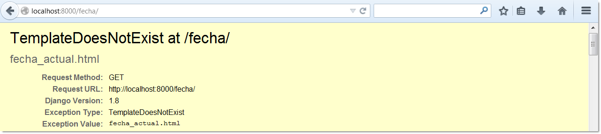
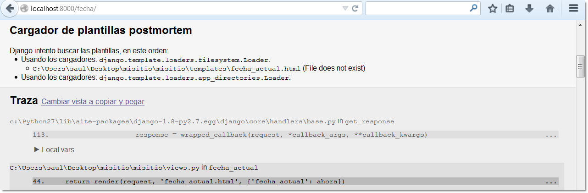

======================
Capítulo 4: Plantillas
======================

En el capítulo anterior, quizás notaste algo extraño en la forma en cómo
retornábamos el texto en nuestras vistas de ejemplos. Ya que el HTML fue
codificado [#]_ directamente en nuestro código Python, así::

    def fecha_actual(request):
        ahora = datetime.datetime.now()
        html = "<html><body><h1>Fecha:</h1><h3>%s<h/3></body></html>" % ahora
        return HttpResponse(html)

Aunque esta técnica fue conveniente para explicar la forma en que trabajan
las vistas, no es buena idea codificar directamente el HTML en las vistas,
ya que este convenio conduce a problemas severos:

* Cualquier cambio en el diseño de la página requiere un cambio en el código
  de Python. El diseño de un sitio tiende a cambiar más frecuentemente que
  el código de Python subyacente, por lo que sería conveniente si el diseño
  podría ser cambiado sin la necesidad de modificar el código Python.

* Escribir código Python y diseñar HTML son dos disciplinas diferentes, y la
  mayoría de los entornos de desarrollo web profesional dividen estas
  responsabilidades entre personas separadas (o incluso en departamento
  separados).  Diseñadores y programadores HTML/CSS no deberían tener que
  editar código Python para conseguir hacer su trabajo; ellos deberían
  tratar con HTML.

* Asimismo, esto es más eficiente si los programadores pueden trabajar sobre
  el código Python y los diseñadores sobre las plantillas al mismo tiempo,
  más bien que una persona espere por otra a que termine de editar un solo
  archivo que contiene ambos: Python y HTML.

Por esas razones, es mucho más limpio y mantenible separar el diseño de la
página del código Python en sí mismo. Podemos hacer esto con *el sistema de
plantillas* de Django, el cual trataremos en este capítulo.

Sistema básico de plantillas
=============================

Una plantilla de Django es una cadena de texto que pretende separar la
presentación de un documento de sus datos. Una plantilla define rellenos y
diversos bits de lógica básica (esto es, etiquetas de plantillas) que regulan
cómo debe ser mostrado el documento. Normalmente, las plantillas son usadas
para producir HTML, pero las plantillas de Django son igualmente capaces de
generar cualquier formato basado en texto.

Comencemos con una simple plantilla de ejemplo. Esta plantilla en  Django,
describe una página HTML que agradece a una persona por hacer un pedido de
una empresa. Piensa en esto como un modelo de carta:

.. code-block:: html+django

    <html>
    <head><title>Orden de pedido</title></head>
    <body>
    <h1>Orden de pedido</h1>
    
Estimado: {{ nombre }},

    
Gracias por el pedido que ordeno de la {{ empresa }}. El pedido junto
    con la mercancía se enviaran el {{ fecha|date:"F j, Y" }}.

    
Esta es la lista de productos que usted ordeno:

    <ul>
    
        <li>{{ pedido }}</li>
    
    </ul>
    
        
La garantía será incluida en el paquete.

    
        
Lamentablemente no ordeno una garantía, por lo que los daños
        al producto corren por su cuenta.

    
    
Sinceramente  {{ empresa }}

    </body>
    </html>

Esta plantilla es un HTML básico con algunas variables y etiquetas de
plantillas agregadas. Vamos paso a paso a través de ésta:

* Cualquier texto encerrado por un par de llaves (por ej.
  ``{{ nombre }}``) es una *variable*. Esto significa "insertar el
  valor de la variable a la que se dio ese nombre". ¿Cómo especificamos el
  valor de las variables?. Vamos a llegar a eso en un momento.

* Cualquier texto que esté rodeado por llaves y signos de porcentaje (por
  ej. ````) es una *etiqueta de plantilla*. La
  definición de etiqueta es bastante amplia: una etiqueta sólo le indica
  al sistema de plantilla "haz algo".

  Este ejemplo de plantilla contiene dos etiquetas: la etiqueta
  ```` (una etiqueta ``for``) y la etiqueta
  ```` (una etiqueta ``if``).

  Una etiqueta ``for`` actúa como un simple constructor de bucle, dejándote
  recorrer a través de cada uno de los ítems de una secuencia. Una etiqueta
  ``if``, como quizás esperabas, actúa como una cláusula lógica "if". En
  este caso en particular, la etiqueta comprueba si el valor de la variable
  ``garantía`` se evalúa como ``True``. Si lo hace, el sistema de plantillas
  mostrará todo lo que hay entre ```` y   ````.
  Si no, el sistema de plantillas no mostrará esto. Nota que la etiqueta
  ```` es opcional.

* Finalmente, el segundo párrafo de esta plantilla, muestra  un ejemplo de un
  *filtro*, con el cual puedes alterar la exposición de una variable. En
  este ejemplo, ``{{ fecha|date:"F j, Y" }}``, estamos pasando la variable
  ``fecha`` por el filtro ``date``, pasando los argumentos ``"F j, Y"`` al
  filtro. El filtro ``date`` formatea fechas en el formato dado, especificado
  por ese argumento. Los filtros se encadenan mediante el uso de un carácter
  pipe (``|``), como una referencia a las  tuberías de Unix.

Cada plantilla de Django tiene acceso a varias etiquetas y filtros
incorporados,  algunos de los cuales serán tratados en la secciónes siguientes.
El :doc:`apéndice E<appendixE>` contiene la lista completa de etiquetas y
filtros, es una buena idea familiarizarse con estas etiquetas y filtros, para
aprender a usarlos e incorporarlos en tus propios proyectos. También es posible
crear tus propios filtros y  etiquetas, los cuales cubriremos en el
:doc:`capítulo 9<chapter09>`.

Usando el sistema de plantillas
===============================

Sumerjámonos por un rato en el sistema de plantillas, para entender la forma
en que trabajan --por ahora *no* las integraremos en las vistas que creamos
en el capitulo anterior. El objetivo será mostrar cómo trabaja el sistema de
plantillas,  independientemente del resto de Django (Veámoslo de otra forma:
normalmente usaríamos el sistema de plantillas dentro de una vista, sin
embargo  lo que queremos dejar muy en claro, es que el sistema de plantillas
es solo una librería de código Python,  que se puede utilizar en *cualquier*
parte, no solo en las vista de Django.

Esta es la forma básica, en la que podemos usar el sistema de plantillas de
Django en código Python.

#. Crea un objeto ``Template`` brindando el código en crudo de la plantilla
   como una cadena.

#. Llama al método ``render()`` del objeto ``Template`` con un conjunto de
   variables (o sea, el *contexto*). Este retorna una plantilla totalmente
   renderizada como una cadena de caracteres, con todas las variables y
   etiquetas de bloques evaluadas de acuerdo al contexto.

En código, esta es la forma que podría verse, solo inicia el interprete
interactivo con ``python manage.py shell`` ::

    >>> from __future__ import print_function
    >>> from django import template
    >>> t = template.Template('Mi nombre es {{ nombre }}.')
    >>> c = template.Context({'nombre': 'Adrian'})
    >>> print (t.render(c))
    Mi nombre es Adrian.
    >>> c = template.Context({'nombre': 'Fred'})
    >>> print (t.render(c))
    Mi nombre es Fred.

Las siguientes secciones describen cada uno de los pasos con mayor detalle.

Creación de objetos Template
-----------------------------

La manera fácil de crear objetos ``Template`` es instanciarlos directamente.
La clase ``Template`` se encuentra en el módulo ``django.template``, y el
constructor toma un argumento, el código en crudo de la plantilla. Vamos a
sumergirnos en el intérprete interactivo de Python para ver cómo funciona
este código.

En el directorio del proyecto ``misitio``, que creamos con el comando
``django-admin.py startproject`` (Cubierto en el :doc:`capítulo 2<chapter02>`)
tipea: ``python manage.py shell`` para iniciar el interprete interactivo.

.. admonition:: Un Intérprete Python especial

    Si has usado Python antes, tal vez te sorprenda que ejecutemos
    ``python manage.py shell`` en lugar de solo ``python`` que inicia el
    el interprete interactivo, pero debemos decirte que el comando
    ``manage.py shell`` tiene una importante diferencia: antes de iniciar el
    interprete, le pregunta a Django cual archivo de configuraciones usar,
    el cual incluye ajustes, como la ruta al sistema de plantillas, sin estos
    ajustes no podrás usarlo, a menos que los importes manualmente.

    Si eres curioso, esta es la forma en que trabaja Django tras bastidores.
    Primero busca la variable de entorno llamada ``DJANGO_SETTINGS_MODULE``,
    la cual debería encontrarse  en la ruta de importación del archivo
    ``settings.py``. Por ejemplo, puede ser ``DJANGO_SETTINGS_MODULE`` o
    ``'misitio.settings'``, asumiendo que  ``misitio``  este en la ruta de
    búsqueda de Python (Python path).

    Cuando ejecutas ``manage.py shell``, el comando se encarga de
    configurar ``DJANGO_SETTINGS_MODULE`` por ti.  Es por ello que te
    animamos a usar ``manage.py shell``, en estos ejemplos a  fin de
    reducir la cantidad de ajustes y configuraciones que tengas que hacer.

    Django también puede usar IPython_ o bpython_ , si están instalado, para
    iniciar un intérprete interactivo mejorado, el cual agrega
    funcionalidades extras al simple interprete interactivo plano por defecto.

    Si tienes instalados ambos, y quieres elegir entre usar IPython o bpython
    como intérprete, necesitas especificarlo con la opción ``-i`` o ``--interface``
    de esta forma:

    iPython::

      django-admin.py shell -i ipython
      django-admin.py shell --interface ipython

    bpython::

      django-admin.py shell -i bpython
      django-admin.py shell --interface bpython

    Para forzar al intérprete a usar el interprete interactivo "plano" usa::

      django-admin.py shell --plain

.. _IPython: http://ipython.scipy.org/
.. _bpython: http://bpython-interpreter.org/

Comencemos con algunos fundamentos básicos del sistema de plantillas::

    >>> from django.template import Template
    >>> t = Template('Mi nombre es {{ nombre }}.')
    >>> print (t)

Si lo estás siguiendo interactivamente, verás algo como esto::

    <django.template.Template object at 0xb7d5f24c>

Ese ``0xb7d5f24c`` será distinto cada vez, y realmente no importa; es la forma
simple en que Python "identifica" un objeto de ``Template``.

Cuando creas un objeto ``Template``, el sistema de plantillas compila el código
en crudo a uno interno, de forma optimizada, listo para renderizar. Pero si tu
código de plantilla incluye errores de sintaxis, la llamada a ``Template()``
causará una excepción ``TemplateSyntaxError``::

    >>> from __future__ import print_function
    >>> from django.template import Template
    >>> t = Template(' ')
    Traceback (most recent call last):
      File "<stdin>", line 1, in ?
      ...
      django.template.TemplateSyntaxError: Invalid block tag: 'notatag'

El  término "block tag"  "etiqueta de bloque" hace referencia a
````. "Etiqueta de plantilla" y "bloque de plantilla"
son sinónimos.

El sistema lanza una excepción ``TemplateSyntaxError`` por alguno de los
siguientes casos:

* Bloques de etiquetas inválidos
* Argumentos inválidos para una etiqueta válida
* Filtros inválidos
* Argumentos inválidos para filtros válidos
* Sintaxis inválida de plantilla
* Etiquetas de bloque sin cerrar (para etiquetas de bloque que requieran la
  etiqueta de cierre)

Renderizar una plantilla
------------------------

Una vez que tienes un objeto ``Template``, le puedes pasar datos brindando un
*contexto*. Un contexto es simplemente un conjunto de variables y sus valores
asociados. Una plantilla usa estas variables para llenar y evaluar estas
etiquetas de bloque.

Un contexto es representado en Django por la clase ``Context``, ésta se
encuentra en el módulo ``django.template``. Su constructor toma un argumento
opcional: un diccionario que mapea nombres de variables con valores. Llama
al método ``render()`` del objeto ``Template`` con el contexto para "llenar"
la plantilla::

    >>> from __future__ import print_function
    >>> from django.template import Context, Template
    >>> t = Template("Mi nombre es {{ nombre }}.")
    >>> c = Context({"nombre": "Estefanía"})
    >>> t.render(c)
    'Mi nombre es Estefanía.'

Una cosa que debemos apuntar aquí, es que el valor de retorno de
``t.render(c)`` es un objeto unicode --No una cadena normal de Python--.
Como sabes podemos usar la ``u`` al inicio de la cadena para usar objetos
unicode en Python 2, sin embargo en python3 esto no es necesario, ya que
soporta nativamente objetos unicode. Sin embargo no está de  más decirte que
Django también soporta nativamente datos unicode en lugar de cadenas normales
en todo el framework. Si comprendes  las repercusiones de esto, estarás
agradecido por las cosas sofisticadas que hace Django tras bastidores, para
facilitarte el trabajo. Si no las comprendes, no te preocupes por ahora;
solo debes saber que Django  hace que el soporte  unicode sea indoloro para
tus aplicaciones, para que puedan soportar una gran  variedad de caracteres,
que van más allá del básico "A-Z" del idioma Ingles.

.. admonition:: Diccionarios y Contextos

    Un diccionario en Python es un mapeo entre llaves conocidas y valores de
    variables. Un ``Context`` (contexto) es similar a un diccionario, pero un
    ``Context`` provee funcionalidades adicionales, como se cubre en el
    :doc:`capítulo 9<chapter09>`.

Los nombres de las variables deben comenzar con una letra (A-Z o a-z) y pueden
contener dígitos, guiones bajos y puntos. (Los puntos son un caso especial
al que llegaremos en un momento). Los nombres de variables son sensible a
mayúsculas-minúsculas.

Este es un ejemplo de compilación y renderización de una plantilla, usando la
plantilla de muestra del comienzo de este capítulo::

    >>> from __future__ import print_function
    >>> from django.template import Template, Context
    >>> raw_template = """
Estimado: {{ nombre }},

    ...
    ... 
Gracias por el pedido que ordeno de {{ empresa }}. El pedido
    ... se enviara el {{ ship_date|date:"j F Y"  }}.

    ...
    ... 
    ... 
La garantía será incluida en el paquete.

    ... 
    ... 
Lamentablemente no ordeno una garantía, por lo que los daños
    ... al producto corren por su cuenta.

    ... 
    ...
    ... 
Sinceramente  {{ empresa }}
"""
    >>> t = Template(raw_template)
    >>> import datetime
    >>> c = Context({'nombre': 'Juan Pérez',
    ...     'empresa': 'Entrega veloz',
    ...     'fecha': datetime.date(2014, 10, 10),
    ...     'ordered_warranty': False})
    >>> t.render(c)
    u"
Estimado Juan Pérez,
\n\n
Gracias por el pedido que ordeno de
    Entrega veloz. El pedido se enviara el 10 Octubre 2014.
\n\n\n

    Lamentablemente no ordeno una garantía, por lo que los daños\nal producto
    corren por su cuenta.
\n\n\n
Sinceramente, Entrega veloz
    
"

Veamos paso a paso este código, una sentencia a la vez:

* Primero, importamos la clase ``Template`` y ``Context``, ambas se
  encuentran en el módulo ``django.template``.

* Guardamos en texto crudo, nuestra plantilla en la variable ``raw_template``.
  Nota que usamos triple comillas para delimitar la cadena de caracteres,
  debido a que abarca varias líneas; en el código Python, las cadenas de
  caracteres delimitadas con una sola comilla indican que no puede abarcar
  varias líneas.

* Luego, creamos un objeto plantilla, ``t``, pasándole ``raw_template`` al
  constructor de la clase ``Template``.

* Importamos el módulo ``datetime`` desde la biblioteca estándar de Python,
  porque lo vamos a necesitar en la próxima sentencia.

* Entonces, creamos un objeto ``Context`` , ``c``. El constructor de
  ``Context`` toma un diccionario de Python, el cual mapea los nombres de
  las variables con los valores.  Aquí, por ejemplo, especificamos que
  ``nombre`` es ``'Juan Pérez'``, ``empresa`` es ``'Entrega Veloz'``, y así
  sucesivamente.

* Finalmente, llamamos al método ``render()`` sobre nuestro objeto de
  plantilla, pasando a éste el contexto. Este retorna la plantilla
  renderizada -- esto es, reemplaza las variables de la plantilla con los
  valores reales de las variables, y ejecuta cualquier bloque de
  etiquetas.

  Nota que el párrafo "Lamentablemente no ordeno una garantía" fue mostrado
  porque la variable ``garantía`` se evalúa como ``False``. También nota que
  la fecha ``10 Octubre 2014``, es mostrada acorde al formato de cadena de
  caracteres ``j F Y``. (Explicaremos los formatos de cadenas de caracteres
  para el  filtro ``date`` a la brevedad).

  Si eres nuevo en Python, quizás te preguntes por qué la salida incluye los
  caracteres de nueva línea (``'\n'``) en vez de mostrar los saltos de
  línea.  Esto sucede porque es una sutileza del intérprete interactivo de
  Python: la llamada a ``t.render(c)`` retorna una cadena de caracteres, y
  el intérprete interactivo, por omisión, muestra una *representación* de
  ésta, en vez de imprimir el valor de la cadena. Si quieres ver la cadena
  de caracteres con los saltos de líneas como verdaderos saltos de líneas en
  vez de caracteres ``'\n'``, usa la sentencia ``print``:
  ``print (t.render(c))``.

Estos son los fundamentos del uso del sistema de plantillas de Django: sólo
escribe una plantilla, crea un objeto ``Template``, crea un ``Context``, y
llama al método ``render()``.

Múltiples contextos, mismas plantillas
--------------------------------------

Una vez que tengas un objeto ``Template``, puedes renderizarlo con múltiples
contextos, por ejemplo:

.. code-block:: python

    >>> from __future__ import print_function
    >>> from django.template import Template, Context
    >>> t = Template('Hola, {{ nombre }}')
    >>> print (t.render(Context({'nombre': 'Juan'})))
    Hola, Juan
    >>> print (t.render(Context({'nombre': 'Julia'})))
    Hola, Julia
    >>> print (t.render(Context({'nombre': 'Paty'})))
    Hola, Paty

Cuando estés usando la misma plantilla fuente para renderizar múltiples
contextos como este, es más eficiente crear el objeto ``Template`` *una sola
vez* y luego llamar a ``render()`` sobre éste muchas veces:

.. code-block:: python

    # Mal
    for nombre in ('Juan', 'Julia', 'Paty'):
        t = Template('Hola, {{ nombre }}')
        print (t.render(Context({'nombre': nombre})))

    # Bien
    t = Template('Hola, {{ nombre }}')
    for nombre in ('Juan', 'Julia', 'Paty'):
        print (t.render(Context({'nombre': nombre})))

El analizador sintáctico de las plantillas de Django es bastante rápido.
Detrás de escena, la mayoría de los analizadores pasan con una simple llamada
a una expresión regular corta. Esto es un claro contraste con el motor de
plantillas de XML, que incurre en la excesiva actividad de un analizador XML,
y tiende a ser órdenes de magnitud más lento que el motor de renderizado de
Django.

Búsqueda del contexto de una variable
--------------------------------------

En los ejemplos vistos hasta el momento, pasamos valores simples a los
contextos --en su mayoría cadena de caracteres, más un ``datetime.date``.
Sin embargo, el sistema de plantillas maneja elegantemente estructuras de
datos más complicadas, como listas, diccionarios y objetos personalizados.

La clave para recorrer estructuras de datos complejos en las plantillas de
Django es el uso del carácter punto (``.``). Usa un punto para acceder a las
claves de un diccionario, atributos, índices o métodos de un objeto.

Esto es mejor ilustrarlos con algunos ejemplos. Por ejemplo, imagina que pasas
un diccionario de Python a una plantilla. Para acceder al valor de ese
diccionario por su clave, usa el punto.::

    >>> from django.template import Template, Context
    >>> persona = {'nombre': 'Silvia', 'edad': '43'}
    >>> t = Template('{{ persona.nombre }} tiene {{ persona.edad }} años.')
    >>> c = Context({'persona': persona})
    >>> t.render(c)
    u'Silvia tiene 43 años.'

De forma similar, los puntos te permiten acceder a los atributos de los objetos.
Por ejemplo, un objeto de Python ``datetime.date`` tiene los atributos ``year``,
``month`` y ``day``, y puedes usar el punto para acceder a ellos en las
plantillas de Django::

    >>> from django.template import Template, Context
    >>> import datetime
    >>> d = datetime.date(1993, 5, 2)
    >>> d.year
    1993
    >>> d.month
    5
    >>> d.day
    2
    >>> t = Template('El mes es {{ date.month }} y el año es {{ date.year }}.')
    >>> c = Context({'date': d})
    >>> t.render(c)
    u'El mes es 5 y el años es 1993.'

Este ejemplo usa una clase personalizada, que demuestra que la variable punto
permite acceder a objetos de forma arbitraria::

    >>> from django.template import Template, Context
    >>> class Persona(object):
    ...     def __init__(self, nombre, apellido):
    ...         self.nombre, self.apellido = nombre, apellido
    >>> t = Template('Hola, {{ persona.nombre }} {{ persona.apellido }}.')
    >>> c = Context({'persona': Persona('Juan', 'Pérez')})
    >>> t.render(c)
    u'Hola, Juan Pérez.'

Los puntos también son utilizados para llamar a métodos sobre los objetos. Por
ejemplo, cada cadena de caracteres de Python tiene los métodos ``upper()`` y
``isdigit()``, y puedes llamar a estos en las plantillas de Django usando la
misma sintaxis de punto::

    >>> from django.template import Template, Context
    >>> t = Template('{{ var }} -- {{ var.upper }} -- {{ var.isdigit }}')
    >>> t.render(Context({'var': 'hola'}))
    u'hola -- HOLA -- False'
    >>> t.render(Context({'var': '123'}))
    u'123 -- 123 -- True'

Nota que no tienes que incluir los paréntesis en las llamadas a los métodos.
Además, tampoco es posible pasar argumentos a los métodos; sólo puedes llamar a
los métodos que no requieran argumentos. (Explicaremos esta filosofía luego
en este capítulo).

Finalmente, los puntos también son usados para acceder a los índices de las
listas, por ejemplo::

    >>> from django.template import Template, Context
    >>> t = Template('Fruta 2 es {{ frutas.2 }}.')
    >>> c = Context({'frutas': ['manzana', 'plátano', 'pera']})
    >>> t.render(c)
    u'Fruta 2 es pera.'

Los índices negativos de las listas no están permitidos. Por ejemplo,
la variable ``{{ frutas.-1 }}`` causará una ``TemplateSyntaxError``.

.. admonition:: Listas de Python

    Las listas de Python comienzan en cero, entonces el primer elemento
    es el 0, el segundo es el 1 y así sucesivamente.

La búsqueda del punto puede resumirse como esto: cuando un sistema de
plantillas encuentra un punto en una variable, éste intenta la siguiente
búsqueda, en este orden:

* Diccionario (por ej. ``foo["bar"]``)
* Atributo (por ej. ``foo.bar``)
* Llamada de método (por ej. ``foo.bar()``)
* Índice de lista (por ej. ``foo[bar]``)

El sistema utiliza el primer tipo de búsqueda que funcione. Es la lógica de
cortocircuito.

Los puntos pueden ser anidados a múltiples niveles de profundidad. El siguiente
ejemplo usa ``{{ persona.name.upper }}``, el que se traduce en una búsqueda de
diccionario (``persona['nombre']``) y luego en una llamada a un método
(``upper()``)::

    >>> from django.template import Template, Context
    >>> persona = {'nombre': 'Silvia', 'edad': '43'}
    >>> t = Template('{{ persona.nombre.upper }} tiene {{ person.age }} años.')
    >>> c = Context({'persona': persona})
    >>> t.render(c)
    u'SILVIA tiene 43 años.'

Comportamiento de la llamada a los métodos
~~~~~~~~~~~~~~~~~~~~~~~~~~~~~~~~~~~~~~~~~~~~

La llamada a los métodos es ligeramente más compleja que los otros tipos de
búsqueda. Aquí hay algunas cosas a tener en cuenta:

* Si, durante la búsqueda de método, un método provoca una excepción, la
  excepción será propagada, a menos que la excepción tenga un atributo
  ``silent_variable_failure`` cuyo valor sea ``True``. Si la excepción
  *tiene* el atributo ``silent_variable_failure``, la variable será
  renderizada como un string vacío, por ejemplo:

.. code-block:: python

        >>> t = Template("Mi nombre es {{ persona.nombre }}.")
        >>> class ClasePersona:
        ...     def nombre(self):
        ...         raise AssertionError, "foo"
        >>> p = ClasePersona()
        >>> t.render(Context({"persona": p}))
        Traceback (most recent call last):
        ...
        AssertionError: foo

        >>> class SilentAssertionError(AssertionError):
        ...     silent_variable_failure = True
        >>> class ClasePersona2:
        ...     def nombre(self):
        ...         raise SilentAssertionError
        >>> p = ClasePersona2()
        >>> t.render(Context({"persona": p}))
        u'Mi nombre es .'

* La llamada a un método funcionará sólo si el método no requiere
  argumentos. En otro caso, el sistema pasará a la siguiente búsqueda de
  tipo índice de lista.

* Evidentemente, algunos métodos tienen efectos secundarios, por lo que
  sería absurdo, en el mejor de los casos, y posiblemente un agujero de
  seguridad, permitir que el sistema de plantillas tenga acceso a ellos.

Digamos, por ejemplo, que tienes un objeto ``CuentaBanco`` que tiene un método
``borrar()``. Una plantilla no debería permitir incluir algo como
``{{ cuenta.borrar }}``, donde ``cuenta`` es un objeto ``CuentaBanco``,  ¡ya
que el objeto será borrado cuando se renderice la plantilla!

Para prevenir esto, asigna el atributo ``alters_data`` de la función en el
método:

.. code-block:: python

          def borrar(self):
              # Borra una cuenta
          borrar.alters_data = True

.. admonition:: ¿Que es self?

  Self es simplemente el nombre convencional para el primer argumento de un
  método en Python. Por ejemplo, un método definido de la forma
  ``meth(self, a, b, c)`` debe ser llamado con x.meth(a, b, c), por alguna
  instancia de la clase x, en la cual ocurre la definición; de esta forma el
  método llamado pensara que es llamado como meth(x, a, b, c).

El sistema de plantillas no debería ejecutar cualquier método marcado de
esta forma. En otras palabras, si una plantilla incluye ``{{ cuenta.borrar}}``,
y el método ``borrar()``, marcado como ``alters_data=True``, esta etiqueta no
ejecutará el método ``borrar()``. Ya que este fallará silenciosamente.

¿Cómo se manejan las variables inválidas?
~~~~~~~~~~~~~~~~~~~~~~~~~~~~~~~~~~~~~~~~~~~

Por omisión, si una variable no existe, el sistema de plantillas renderiza
este como un string vacío, fallando silenciosamente, por ejemplo::

    >>> from django.template import Template, Context
    >>> t = Template('Tu nombre es {{ nombre }}.')
    >>> t.render(Context())
    u'Tu nombre es .'
    >>> t.render(Context({'var': 'hola'}))
    u'Tu nombre es .'
    >>> t.render(Context({'NOMBRE': 'hola'}))
    u'Tu nombre es .'
    >>> t.render(Context({'Nombre': 'hola'}))
    u'Tu nombre es .''

El sistema falla silenciosamente en vez de levantar una excepción porque
intenta ser flexible a los errores humanos. En este caso, todas las búsquedas
fallan porque los nombres de las variables, o su capitalización es incorrecta.
En el mundo real, es inaceptable para un sitio web ser inaccesible debido a un
error de sintaxis tan pequeño.

Jugando con objetos Context
---------------------------

La mayoría de la veces, instancias un objeto ``Context`` pasandole un
diccionario,  completamente poblado a  ``Context``. Pero puedes agregar y
quitar elementos de un objeto ``Context`` una vez que éste está instanciado,
también, usando la sintaxis estándar de los diccionarios de Python::

    >>> from django.template import Context
    >>> c = Context({"foo": "bar"})
    >>> c['foo']
    'bar'
    >>> del c['foo']
    >>> c['foo']
    Traceback (most recent call last):
      ...
    KeyError: 'foo'
    >>> c['nuevavariable'] = 'hola'
    >>> c['nuevavariable']
    'hola'

Etiquetas básicas de plantillas y filtros
=========================================

Como hemos mencionamos, el sistema de plantillas se distribuye con etiquetas y
filtros incorporados. Las secciones que siguen proveen un resumen de la mayoría
de las etiquetas y filtros.

Etiquetas
---------

if/else
~~~~~~~

La etiqueta ```` evalúa una variable, y si esta es "true" (esto es,
existe, no está vacía y no es un valor Boolean falso), el sistema mostrará
todo lo que hay entre ```` y ````, por ejemplo:

.. code-block:: html+django

    
        
¡Bienvenido fin de semana!

    

La etiqueta ```` es opcional:

.. code-block:: html+django

    
        
¡Bienvenido fin de semana!

    
        
De vuelta al trabajo.

    

.. admonition:: Las "verdades" en Python

    En Python y en el sistema de plantillas de Django, los siguientes objetos
    son evaluados como ``False`` (falsos) en un contexto booleano.

    * Una lista vacía (``[]``),
    * Una tupla vacía (``()``),
    * Un diccionario vacío (``{}``),
    * Una cadena vacía (``''``),
    * El cero (``0``),
    * El objeto especial  ``None``
    * El objeto ``False`` (obviamente)
    * Objetos personalizados que definen su propio comportamiento en un
      contexto boleano (Es la ventaja de usar Python)

    Todo lo demás es evaluado como verdadero (``True``).

    ``None``: es un valor especial de Python que devuelven funciones que o bien
    no tienen sentencia de return o bien tienen una sentencia de return sin
    argumento.

La etiqueta ```` acepta ``and``, ``or``, o ``not`` para testear
múltiples variables, o para negarlas. Por ejemplo:

.. code-block:: html+django

    
        Atletas y Entrenadores están disponibles
    

    
        No hay atletas
    

    
        Hay algunos atleta o algunos entrenadores
    

    
        No hay atletas o no hay entrenadores.
    

    
        Hay algunos atletas y absolutamente ningún entrenador.
    

Las etiquetas ```` no permiten las cláusulas ``and`` y ``or`` en la
misma etiqueta, porque el orden de evaluación lógico puede ser ambiguo. Por
ejemplo, esto es inválido:

.. code-block:: html+django

    

No se admite el uso de paréntesis para controlar el orden de las operaciones.
Si necesitas paréntesis, considera efectuar la lógica en el código de la
vista para simplificar las plantillas. Aún así, si necesitas combinar
``and`` y ``or`` para hacer lógica avanzada, usa etiquetas
```` anidadas, por ejemplo:

.. code-block:: html+django

    
        
            ¡Tenemos atletas y entrenadores o porristas!
        
    

Usar varias veces el mismo operador lógico están bien, pero no puedes combinar
diferentes operadores. Por ejemplo, esto es válido:

.. code-block:: html+django

    

No hay una etiqueta ````. En su lugar usa varias etiquetas ````
anidadas para conseguir el mismo resultado:

.. code-block:: html+django

    
        
Aquí están los atletas: {{ lista_atletas }}.

    
        
No hay atletas disponibles.

        
            
Aquí están los entrenadores: {{ lista_entrenadores }}.

        
    

Asegúrate de cerrar cada ```` con un ````. En otro caso,
Django levantará la excepción ``TemplateSyntaxError``.

for
~~~

La etiqueta ```` permite iterar sobre cada uno de los elementos de una
secuencia. Como en la sentencia ``for`` de Python, la sintaxis es ``for X in
Y``, dónde ``Y`` es la secuencia sobre la que se hace el bucle y ``X`` es el
nombre de la variable que se usará para cada uno de los ciclos del bucle. Cada
vez que atravesamos el bucle, el sistema de plantillas renderizará todo entre
```` y ````.

Por ejemplo, puedes usar lo siguiente para mostrar una lista de atletas tomadas
de la variable ``lista_atletas``:

.. code-block:: html+django

    <ul>
    
        <li>{{ atleta.nombre }}</li>
    
    </ul>

Agrega ``reversed`` a la etiqueta para iterar sobre la lista en orden inverso:

.. code-block:: html+django

    
    ...
    

Es posible anidar etiquetas ````:

.. code-block:: html+django

    
        <h1>{{ pais.nombre }}</h1>
        <ul>
        
            <li>{{ ciudad }}</li>
        
        </ul>
    

Un uso muy común, es comprobar el tamaño de una lista antes de iterar sobre ella
y mostrar algún texto en  especial,  si la lista esta vacía.:

.. code-block:: html+django

    
        
            
{{ atleta.nombre }}

        
    
        
No hay atletas. Únicamente programadores.

    

El ejemplo anterior es tan común, que la etiqueta ``for`` soporta una clausula
opcional: ````  que te permite definir lo que hay que hacer si la
lista está vacía. El siguiente ejemplo es equivalente al anterior:

.. code-block:: html+django

    
        
{{ athlete.nombre }}

    
        
No hay atletas. Únicamente programadores.

    

No se admite la "ruptura" de un bucle antes de que termine. Si quieres
conseguir esto, cambia la variable sobre la que estás iterando para que
incluya sólo los valores sobre los cuales quieres iterar. De manera similar,
no hay apoyo para la sentencia "continue" que se encargue de retornar
inmediatamente al inicio del bucle. (Consulta la sección "`Filosofía y
limitaciones`_" más adelante para comprender el razonamiento detrás de este
decisión de diseño.)

Dentro de cada  bucle, la etiqueta ```` permite acceder a una
variable llamada ``forloop``, dentro de la plantilla. Esta variable tiene
algunos atributos que toman información acerca del progreso del bucle:

* ``forloop.counter`` es siempre asignada a un número entero representando
  el número de veces que se ha entrado en el bucle. Esta es indexada a
  partir de 1, por lo que la primera vez que se ingresa al bucle,
  ``forloop.counter`` será ``1``. Aquí un ejemplo:

.. code-block:: html+django

      
          
{{ forloop.counter }}: {{ objeto }}

      

* ``forloop.counter0`` es como ``forloop.counter``, excepto que esta es
  indexada a partir de cero. Contendrá el valor ``0`` la primera vez que se
  atraviese el bucle.

* ``forloop.revcounter`` es siempre asignada a un entero que representa
  el número de iteraciones que faltan para terminar el bucle. La primera vez
  que se ejecuta el bucle ``forloop.revcounter`` será igual al número de
  elementos que hay en la secuencia. La última vez que se atraviese el
  bucle, a ``forloop.revcounter`` se la asignará el valor ``1``.

* ``forloop.revcounter0`` es como ``forloop.revcounter``, a excepción de que
  está indexada a partir de cero. La primera vez que se atraviesa el bucle,
  ``forloop.revcounter0`` es asignada al número de elementos que hay en la
  secuencia menos 1. La última vez que se atraviese el bucle, el valor de
  esta será ``0``.

* ``forloop.first`` es un valor booleano asignado a ``True`` si es la
  primera vez que se pasa por el bucle. Esto es conveniente para ocasiones
  especiales:

.. code-block:: html+django

      
          <li class="first"><li>
          {{ objeto }}
          </li>
          

* ``forloop.last`` es un valor booleano asignado a ``True`` si es la última
  pasada por el bucle. Un uso común es para esto es poner un carácter pipe
  entre una lista de enlaces:

.. code-block:: html+django

       {{ enlace }}  |
          

El código de la plantilla de arriba puede mostrar algo parecido a esto::

      Enlace1 | Enlace2 | Enlace3 | Enlace4

También se usa comúnmente, para poner comas entre  palabras de una lista:

.. code-block:: html+django

      Lugares favoritos:

      {{ p }},
          

* ``forloop.parentloop`` hace una referencia al objeto *padre* de ``forloop``,
  en el caso de bucles anidados. Aquí un ejemplo:

.. code-block:: html+django

    
        <table>
        
            <tr>
              <td>pais #{{ forloop.parentloop.counter }}</td>
              <td>City #{{ forloop.counter }}</td>
              <td>{{ ciudad }}</td>
            </tr>
        
        </table>
    

La variable mágica ``forloop`` está únicamente disponible dentro del bucle.
Después de que el analizados sintáctico encuentra ````,
``forloop`` desaparece.

.. note:: Contextos y la variable forloop

   Dentro de un bloque ````, las variables existentes se
   mueven fuera de tal manera de evitar sobrescribir la variable mágica
   ``forloop``. Django expone ese contexto movido en ``forloop.parentloop``.
   Generalmente no necesitas preocuparte por esto, si provees una variable a
   la plantilla llamada ``forloop`` (a pesar de que no lo recomendamos), se
   llamará ``forloop.parentloop`` mientras esté dentro del bloque
   ````.

ifequal/ifnotequal
~~~~~~~~~~~~~~~~~~

El sistema de plantillas de Django a propósito no es un lenguaje de
programación completo y por lo tanto no permite ejecutar sentencias
arbitrarias de Python. (Más sobre esta idea en la sección "`Filosofía y
limitaciones`_"). Sin embargo, es bastante común que una plantilla requiera
comparar dos valores y mostrar algo si ellos son iguales -- Django provee la
etiqueta ```` para este propósito.

La etiqueta ````  compara dos valores y muestra todo lo que se
encuentra entre ````  y ```` si el valor es igual.

Este ejemplo compara las variables ``usuario`` y ``actual_usuario`` de la
plantilla:

.. code-block:: html+django

    
        <h1>¡Bienvenido!</h1>
    

Los argumentos pueden ser strings "hard-codeados", con comillas simples o
dobles, por lo que lo siguiente es válido:

.. code-block:: html+django

    
        <h1>Noticias</h1>
    

    
        <h1>Comunidad</h1>
    

Tal como ````, la etiqueta ```` admite opcionalmente la
etiqueta ````:

.. code-block:: html+django

    
        <h1>Noticias</h1>
    
        <h1>No hay noticias nuevas</h1>
    

En las variables de plantilla, únicamente las  cadenas de texto, enteros y
los números decimales son permitidos como  argumentos para ````.
Estos son ejemplos válidos:

.. code-block:: html+django

    
    
    
    

Cualquier otro tipo de variables, tales como diccionarios de Python, listas,
o booleanos, no pueden ser comparados en ````. Estos ejemplos son
inválidos:

.. code-block:: html+django

    
    
    

Si necesitas comprobar cuando algo es verdadero o falso, usa la etiqueta
```` en lugar de ````.

Comentarios
~~~~~~~~~~~

Al igual que en HTML o en un lenguaje de programación como Python, el lenguaje
de plantillas de Django permite usar comentarios. Para designar un
comentario, usa ``{# #}``::

    {# Esto es un comentario #}

Este comentario no será mostrado cuando la plantilla sea renderizada.

Un comentario no puede abarcar múltiples líneas. Esta limitación mejora la
performance del analizador sintáctico de plantillas. En la siguiente plantilla,
la salida del renderizado mostraría exactamente lo mismo que la plantilla
(esto es, la etiqueta comentario no será tomada como comentario):

.. code-block:: html+django

    Esto es una {# Esto no es
    un comentario #}
    prueba.

Si quieres usar un comentario que abarque varias líneas, usa la etiqueta
````, así:

.. code-block:: html+django

    
    Este es un comentario
    que abarca varias líneas
    

Filtros
-------

Como explicamos anteriormente en este capítulo, los filtros de plantillas son
formas simples de alterar el valor de una variable antes de mostrarla. Los
filtros se parecen a esto::

    {{ nonmbre|lower }}

Esto muestra el valor de ``{{ nombre }}`` después de aplicarle el filtro
``lower``, el cual convierte el texto a minúscula. Usa una pipe o tubería
(``|``)  para  aplicar el filtro.

Los filtros pueden ser  *encadenados* -- esto quiere decir que, la salida de
uno de los filtros puede ser aplicada al próximo--. Aquí un ejemplo que toma
el primer elemento de una lista y la convierte a mayusculas::

    {{ mi_lista|first|upper }}

Algunos filtros toman argumentos. Un filtro con argumentos se ve de este modo::

    {{ bio|truncatewords:"30" }}

Esto muestra las primeras 30 palabras de la variable ``bio``. Los argumentos
de los filtros están siempre entre comillas dobles.

Los siguientes son algunos de los filtros más importantes; el Apéndice E cubre
el resto.

* ``addslashes``: Agrega una contra-barra antes de cualquier contra-barra,
  comilla simple o comilla doble. Esto es útil si el texto producido está
  incluido en un string de JavaScript.

* ``date``: Formatea un objeto ``date`` o ``datetime`` de acuerdo al formato
  tomado como parámetro, por ejemplo::

      {{ fecha|date:"F j, Y" }}

  El formato de los strings está definido en el Apéndice E.

* ``escape``: Escapa ampersands(&), comillas, y corchetes del string tomado.
  Esto es usado para desinfectar datos suministrados por el usuario y
  asegurar que los datos son válidos para XML y XHTML. Específicamente,
  ``escape`` hace estas conversiones:

  * Convierte ``&`` en ``&amp;``
  * Convierte ``<`` en ``&lt;``
  * Convierte ``>`` en ``&gt;``
  * Convierte ``"`` (comilla doble) en ``&quot;``
  * Convierte ``'`` (comilla simple) en ``&#39;``

* ``length``: Retorna la longitud del valor. Puedes usar este con una lista
  o con un string, o con cualquier objeto Python que sepa como determinar
  su longitud (o sea cualquier objeto que tenga el método ``__len__()``).

Filosofía y Limitaciones
========================

Ahora que tienes una idea del lenguaje de plantillas de Django, debemos
señalar algunas de sus limitaciones intencionales, junto con algunas
filosofías detrás de la forma en que este funciona.

Más que cualquier otro componente de la aplicación web, las opiniones de los
programadores sobre el sistema de plantillas varía extremadamente. El hecho de
que Python sólo implemente decenas, sino cientos, de lenguajes de plantillas de
código abierto lo dice todo. Cada uno fue creado probablemente porque su
desarrollador estima que todos los existentes son inadecuados. (¡De hecho, se
dice que es un rito para los desarrolladores de Python escribir su propio
lenguaje de plantillas! Si todavía no lo has hecho, tenlo en cuenta. Es un
ejercicio divertido).

Con eso en la cabeza, debes estar interesado en saber que Django no requiere
que uses su lenguaje de plantillas. Pero Django pretende ser un completo
framework que provee todas las piezas necesarias para que el desarrollo web sea
productivo, quizás a veces es *más conveniente* usar el sistema de plantillas
de Django que otras bibliotecas de plantillas de Python, pero no es un
requerimiento estricto en ningún sentido. Como verás en la próxima
sección "`Uso de plantillas en las vistas`_", es muy fácil usar otro lenguaje
de plantillas con Django.

Aún así, es claro que tenemos una fuerte preferencia por el sistema de
plantillas de Django. El sistema de plantillas tiene raíces en la forma en que
el desarrollo web se realiza en World Online y la experiencia combinada de los
creadores de Django. Éstas con algunas de esas filosofías:

* *La lógica de negocios debe ser separada de la presentación lógica*.
  Vemos al sistema de plantillas como una herramienta que controla la
  presentación y la lógica relacionado a esta -- y eso es todo. El sistema
  de plantillas no debería admitir funcionalidad que vaya más allá de
  este concepto básico.

  Por esta razón, es imposible llamar a código Python directamente dentro
  de las plantillas de Django. Todo "programador" está fundamentalmente
  limitado al alcance de lo que una etiqueta puede hacer. *Es* posible
  escribir etiquetas personalizadas que hagan cosas arbitrarias, pero las
  etiquetas de Django intencionalmente no permiten ejecutar código
  arbitrario de Python.

* *La sintaxis debe ser independiente de HTML/XML*. Aunque el sistemas de
  plantillas de Django es usado principalmente para producir HTML, este
  pretende ser útil para formatos no HTML, como texto plano. Algunos otros
  lenguajes de plantillas están basados en XML, poniendo toda la lógica de
  plantilla con etiquetas XML o atributos, pero Django evita
  deliberadamente esta limitación. Requerir un XML válido para escribir
  plantillas introduce un mundo de errores humanos y mensajes difícil de
  entender, y usando un motor de XML para parsear plantillas implica un
  inaceptable nivel de overhead en el procesamiento de la plantilla.

* *Los diseñadores se supone que se sienten más cómodos con el código HTML*.
  El sistema de plantillas no está diseñado para que las plantillas
  necesariamente sean mostradas de forma agradable en los editores WYSIWYG
  [#]_ tales como Dreamweaver. Eso es también una limitación severa y no
  permitiría que la sintaxis sea tan clara como lo es. Django espera las
  plantillas de los autores para estar cómodo editando HTML directamente.

* *Se supone que los diseñadores no son programadores Python*. El sistema de
  plantillas de los autores reconoce que las plantillas de las páginas web
  son en la mayoría de los casos escritos por *diseñadores*, no por
  *programadores*, y por esto no debería asumir ningún conocimiento de
  Python.

  Sin embargo, el sistema también pretende acomodar pequeños grupos en los
  cuales las plantillas *sean* creadas por programadores de Python. Esto
  ofrece otro camino para extender la sintaxis del sistema escribiendo
  código Python puro. (Más de esto en él :doc:`Capítulo 9<chapter09>`).

* *El objetivo es no  inventar un lenguaje de programación*. El objetivo es
  ofrecer sólo la suficiente funcionalidad de programación, tales como
  ramificación e iteración, que son esenciales para hacer presentaciones
  relacionadas a decisiones.

Como resultado de esta filosofía, el lenguaje de plantillas de Django tiene las
siguientes limitaciones:

* *Una plantilla no puede asignar una variable o cambiar el valor de esta*.
  Esto es posible escribiendo una etiqueta personalizada para cumplir con
  esta meta (ve el :doc:`Capítulo 10<chapter10>`), pero la pila de etiquetas de Django no
  lo permite.

* *Una plantilla no puede llamar código Python crudo*. No hay forma de
  ingresar en "modo Python" o usar sentencias puras de Python. De nuevo,
  esto es posible creando plantillas personalizadas, pero la pila de
  etiquetas de Django no lo permiten.

Uso de plantillas en las vistas
================================

Has aprendido el uso básico del sistema de plantillas; ahora vamos a usar este
conocimiento para crear una vista. Recordemos la vista ``fecha_actual`` en
``misitio.views``, la que comenzamos en el capítulo anterior. Se veía como
esto:

.. code-block:: python

    from django.http import HttpResponse
    import datetime

    def fecha_actual(request):
        ahora= datetime.datetime.now()
        html = "<html><body>Hoy es: %s.</body></html>" % ahora
        return HttpResponse(html)

Vamos a cambiar esta vista usando el sistema de plantillas de Django. Primero,
podemos pensar en algo como esto:

.. code-block:: python

    from django.template import Template, Context
    from django.http import HttpResponse
    import datetime

    def fecha_actual(request):
        ahora = datetime.datetime.now()
        t = Template("<html><body>Hoy es {{ fecha_actual }}.</body></html>")
        html = t.render(Context({'fecha_actual': ahora}))
        return HttpResponse(html)

Seguro, esta vista usa el sistema de plantillas, pero no soluciona el problema
que planteamos en la introducción de este capítulo. A saber, la plantilla sigue
estando incrustada en el código Python. Vamos a solucionar esto poniendo la
plantilla en un *archivo separado*, que la vista cargará automáticamente.

Puedes considerar primero  guardar la plantilla en algún lugar del disco y usar
las funcionalidades de Python para abrir y leer el contenido de la plantilla.
Esto puede verse así, suponiendo que la plantilla esté guardada en
``/home/djangouser/templates/miplantilla.html``:

.. code-block:: python

    from django.template import Template, Context
    from django.http import HttpResponse
    import datetime

    def fecha_actual(request):
        ahora = datetime.datetime.now()
        # Manera simple de usar plantillas del sistema de archivos.
        # Esto es malo, porque no toma en cuenta los archivos no encontrados.
        fp = open('/home/djangouser/templates/miplantilla.html')
        t = Template(fp.read())
        fp.close()
        html = t.render(Context({'fecha_actual': ahora}))
        return HttpResponse(html)

Esta aproximación, sin embargo, es poco elegante por estas razones:

* No maneja el caso en que no encuentre el archivo. Si el archivo
  ``mytemplate.html`` no existe o no es accesible para lectura, la llamada a
  ``open()`` levantará la excepción ``IOError``.

* Involucra la ruta de tu plantilla. Si vas a usar esta técnica para cada
  una de las funciones de las vistas, estarás duplicando rutas de
  plantillas. ¡Sin mencionar que esto implica teclear mucho más!

* Incluye una cantidad aburrida de código repetitivo. Tienes mejores cosas
  para hacer en vez de escribir ``open()``, ``fp.read()`` y ``fp.close()``
  cada vez que cargas una plantilla

Para solucionar estos problemas, usamos *cargadores de plantillas* y
*directorios de plantillas*, los cuales son descritos, en las  siguientes
secciones.

Cargadores de plantillas
==========================

Django provee una práctica y poderosa API [#]_ para cargar plantillas del
disco, con el objetivo de quitar la redundancia en la carga de la plantilla y
en las mismas plantillas.

Para usar la API para cargar plantillas, primero necesitas indicarle al
framework dónde están guardadas tus plantillas. El lugar para hacer esto es en
el *archivo de configuración*, que mencionamos en el capitulo anterior, cuando
introducimos los ajuste en ``ROOT_URLCONF`` ( El archivo de configuración de
Django es el lugar para poner configuraciones para tu instancia de Django).

Si estas siguiéndonos  abre tu archivo  ``settings.py`` y encuentra la variable
``TEMPLATE_DIRS`` , por omisión es una tupla vacía, que contiene algunos
comentarios generados automáticamente.::

    TEMPLATE_DIRS = (
        # Put strings here, like "/home/html/django_templates" o
        # "C:/www/django/templates".
        # Always use forward slashes, even on Windows.
        # Don't forget to use absolute paths, not relative paths.
    )

Estas configuraciones le indican al mecanismo de carga de plantillas dónde
buscar las plantillas. Por omisión, ésta es una tupla vacía. Elige un
directorio en el que desees guardar tus plantillas y agrega este a
``TEMPLATE_DIRS``, así:::

    TEMPLATE_DIRS = (
        '/home/django/misitio/templates',
    )

Hay algunas cosas para notar:

* Puedes especificar cualquier directorio que quieras, siempre y cuando la
  cuenta de usuario en la cual se ejecuta el servidor web tengan acceso al
  directorio y a su contenido. Si no puedes pensar en un lugar apropiado para
  poner las plantillas, te recomendamos crear un directorio ``templates``
  dentro del proyecto de Django (esto es, dentro del directorio ``misitio``
  que creaste en él :doc:`capítulo 2<chapter02>` , si vienes siguiendo los
  ejemplos a lo  largo del libro).

* Si tu variable ``TEMPLATE_DIRS`` contiene únicamente un directorio, ¡no
  olvides poner una coma al final de la cadena de texto!

  Mal::

      # ¡Olvidaste la coma!
      TEMPLATE_DIRS = (
          '/home/django/misitio/templates'
      )

  Bien::

      # La coma en el lugar correcto.
      TEMPLATE_DIRS = (
          '/home/django/misitio/templates',
      )

  Python requiere una coma en las tuplas de un solo elemento para
  diferenciarlas de una expresión de paréntesis. Este es un error muy común
  en los  usuarios nuevos.

* Si estás en Windows, incluye la letra de tu unidad y usa el estilo de Unix
  para las barras en vez de barras invertidas, como sigue::

      TEMPLATE_DIRS = (
          'C:/www/django/templates',
      )

* Es muy sencillo usar rutas absolutas (esto es, las rutas de directorios
  comienzan desde la raíz del sistema de archivos). Pero si quieres ser un poco
  más flexible e independiente, puedes tomar el hecho de que el archivo de
  configuración de Django es sólo código Python y construir la variable
  ``TEMPLATE_DIRS`` dinámicamente, por ejemplo:

.. code-block:: python

      import os.path

      TEMPLATE_DIRS = (
          os.path.join(os.path.dirname(__file__), 'templates').replace('\\','/'),
      )

Este ejemplo usa la variable "mágica" de Python ``__file__``, la cual es
automáticamente asignada al nombre del archivo del módulo de Python en
el que se encuentra el código.

Con la variable ``TEMPLATE_DIRS`` configurada, el próximo paso es cambiar el
código de vista, para que use la funcionalidad automática de carga de plantillas
de Django, para no incluir la ruta de la plantilla en la vista, solo el nombre.

Volvamos a  la vista ``fecha_actual`` y hagamosle algunos cambios:

.. code-block:: python

    from django.template.loader import get_template
    from django.template import Context
    from django.http import HttpResponse
    import datetime

    def fecha_actual(request):
        ahora = datetime.datetime.now()
        t = get_template('fecha_actual.html')
        html = t.render(Context({'fecha_actual': ahora}))
        return HttpResponse(html)

En este ejemplo, usamos la función ``django.template.loader.get_template()``
en vez de cargar la plantilla desde el sistemas de archivos manualmente. La
función ``get_template()`` toma el nombre de la plantilla como argumento,
se da cuenta en dónde está la plantilla en el sistema de archivos, la abre, y
retorna el objeto ``Template`` compilado.

La plantilla de nuestro ejemplo es ``fecha_actual.html``, pero no hay nada
especial acerca de la extensión ``.html``. Tu puedes darle la extensión que
quieras a tus aplicaciones o puedes omitir las extensiones.

Para determinar la localización de las plantillas en tu sistema de archivos
``get_template()`` combina el directorio de plantillas de  la variable
``TEMPLATE_DIRS`` con el nombre que le pasamos al método ``get_template()``.
Por ejemplo si la variable  ``TEMPLATE_DIRS`` es
``'/home/django/misitio/templates'``, el método ``get_template()`` buscara las
plantillas en  ``/home/django/misitio/templates/fecha_actual.html``.

    Página de error que muestra cuando una plantilla no se encuentra

Si ``get_template()`` no puede encontrar la plantilla con el nombre pasado,
esta levanta una excepción ``TemplateDoesNotExist``. Para ver que cómo se ve
esto, ejecuta el servidor de desarrollo de Django otra vez, ejecutando
``python manage.py runserver`` en el directorio de tu proyecto de Django.
Luego, escribe en tu navegador la página que activa la vista ``fecha_actual``
(o sea, ``http://127.0.0.1:8000/fecha/``). Asumiendo que tu variable de
configuración ``DEBUG`` está asignada a ``True`` y  que todavía no hayas
creado la plantilla ``fecha_actual.html``, deberías ver una página de error
de Django resaltando el error ``TemplateDoesNotExist``.

Esta página de error es similar a la que explicamos en el
:doc:`capítulo 3<chapter03>`, con una pieza adicional de información de
depuración: una sección "Postmortem del cargador de plantillas". Esta sección
te indica qué plantilla intentó cargar Django acompañado de una razón para
cada intento fallido (por ej. "File does not exist"). Esta información es
invaluable cuando hacemos depuración de errores de carga de plantillas.

    Página de error que muestra la sección postmortem.

Como probablemente puedas distinguir de los mensajes de error de la figura
anterior Django intentó buscar una plantilla combinando el directorio de la
variable ``TEMPLATE_DIRS`` con el nombre de la plantilla pasada a ``get_template()``.
Entonces si tu variable ``TEMPLATE_DIRS`` contiene ``'/home/django/templates'``,
Django buscará ``'/home/django/templates/fecha_actual.html'``.  Si
``TEMPLATE_DIRS`` contiene más que un directorio, cada uno de estos es examinado
hasta que se encuentre la plantilla o hasta que no haya más directorios.

Continuando, crea el archivo ``fecha_actual.html`` en tu directorio de
plantillas usando el siguiente código:

.. code-block:: html+django

    <html><body>Hoy es {{ fecha_actual }}.</body></html>

Refresca la página en tu navegador web, y deberías ver la página completamente
renderizada.

render()
--------

Hemos visto como cargar una plantilla, rellenar un ``Context``  y retornar un
objeto ``HttpResponse`` con el resultado de la plantilla renderizada. Lo hemos
optimizado para usar ``get_template()`` en lugar de mezclar la plantilla y
las rutas de búsqueda de las plantillas. Pero seguimos requeriendo tipear una
cantidad considerable de cosas. Sin embargo esto es tan común  que Django
provee un atajo que te deja hacer todas estas cosas, en una sola línea de
código.

Este atajo es la función llamada ``render()``, la cual se encuentra en el
módulo ``django.shortcuts``. La mayoría de las veces, usarás
``render()``  en vez de cargar las plantillas y crear los objetos
``Context`` y ``HttpResponse`` manualmente. -- a menos que te paguen por el
total de líneas que escribas.

Aquí está el ejemplo que hemos venido usando ``fecha_actual`` reescrito
utilizando el método-atajo  ``render()``:

.. code-block:: python

    from django.shortcuts import render
    import datetime

    def fecha_actual(request):
        ahora = datetime.datetime.now()
        return render(request, 'fecha_actual.html', {'fecha_actual': ahora})

¡Qué diferencia! Veamos paso a paso, los cambios a través del código:

* No tenemos que importar ``get_template``, ``Template``, ``Context``, o
  ``HttpResponse``. En vez de eso, solo importamos ``django.shortcuts.render``,
  mientras que ``import datetime`` se  mantiene.

* En la función ``fecha_actual``, seguimos calculando ``ahora``, pero de la
  carga de la plantilla, la creación del contexto, la renderización, y la
  creación de ``HttpResponse`` se encarga la llamada a ``render()``. Como
  ``render()`` retorna un objeto ``HttpResponse``, podemos simplemente
  ``retornar`` ese valor en la vista.

El primer argumento de ``render()`` debe ser el nombre de la plantilla a
utilizar. El segundo argumento, si es pasado, debe ser un diccionario para
usar en la creación de un ``Context`` para esa plantilla. Si no se le pasa un
segundo argumento, ``render`` utilizará un diccionario vacío.

Subdirectorios en get_template()
--------------------------------

Puede ser un poco inmanejable guardar todas las plantillas en un solo
directorio. Quizás quieras guardar las plantillas en subdirectorios del
directorio de tus plantillas, y esto está bien. De hecho, recomendamos hacerlo;
algunas de las características más avanzadas de Django (como las vistas
genéricas del sistema, las cuales veremos en el :doc:`capítulo 11<chapter11>`)
esperan esta distribución de las plantillas como una convención por omisión.

Guardar las plantillas en subdirectorios de tu directorio de plantilla es
fácil. En tus llamadas a ``get_template()``, sólo incluye el nombre del
subdirectorio y una barra antes del nombre de la plantilla, así:

.. code-block:: python

    t = get_template('aplicacion/fecha_actual.html')

Debido a que ``render()`` es un pequeño envoltorio de ``get_template()``,
puedes hacer lo mismo con el primer argumento de ``render``.

.. code-block:: python

    return render(request, 'aplicacion/fecha_actual.html', {'fecha_actual': ahora})

No hay límites para la profundidad del árbol de subdirectorios. Siéntete libre
de usar tantos como quieras o necesites.

.. note::

    Para usuarios de Windows, es necesario asegurar el uso de barras comunes en
    vez de barras invertidas. ``get_template()`` asume el estilo de designación
    de archivos usado en Unix.

La etiqueta de plantilla ``include``
--------------------------------------

Ahora que hemos visto en funcionamiento el mecanismo para cargar plantillas, podemos
introducir un tipo de plantilla incorporada que tiene una ventaja para esto:
````. Esta etiqueta te permite incluir el contenido de otra plantilla.
El argumento para esta etiqueta debería ser el nombre de la plantilla a incluir, y
el nombre de la plantilla puede ser una variable string hard-coded (entre comillas),
entre simples o dobles comillas. En cualquier momento que tengas el mismo código en
varias etiquetas, considera utilizar la etiqueta ```` para eliminar la
redundancia entre las plantillas.

Estos dos ejemplos incluyen el contenido de la plantilla ``nav.html``. Los
ejemplos son equivalentes e ilustran que cualquier modo de comillas está  permitido:

.. code-block:: html+django

    
    

Este ejemplo incluye el contenido de la plantilla ``includes/nav.html``:

.. code-block:: html+django

    

Este ejemplo incluye el contenido de la plantilla cuyo nombre se encuentra en
la variable ``template_name``:

.. code-block:: html+django

    

Como en ``get_template()``, el nombre del archivo de la plantilla es
determinado agregando el directorio de plantillas tomado de ``TEMPLATE_DIRS``
para el nombre de plantilla solicitado.

Las plantillas incluidas son evaluadas con el contexto de la plantilla en la
cual está incluida. Considera estos dos ejemplos:

.. code-block:: html+django

    # mipagina.html

    <html>
    <body>
    
        <h1>{{ titulo }}</h1>
    </body>
    </html>

    # includes/nav.html

    

        Tu estas en: {{ seccion_actual }}
    

Si renderizas ``mipagina.html``con un contexto que contiene la variable
``sección_ actual``, la variable estará disponible en la plantilla "incluida"
tal como esperarías.

Si una plantilla no encuentra la etiqueta ```` , Django hará una
de estas dos cosas:

* Si ``DEBUG`` es ``True``, verás la excepción ``TemplateDoesNotExist``
  sobre la página de error de Django.

* Si ``DEBUG`` es ``False``, la etiqueta fallará silenciosamente, sin
  mostrar nada en el lugar de la etiqueta.

Herencia de plantillas
=======================

Nuestras plantillas de ejemplo hasta el momento han sido fragmentos de HTML,
pero en el mundo real, usarás el sistema de plantillas de Django para crear
páginas HTML enteras. Esto conduce a un problema común en el desarrollo web:
¿Cómo reducimos la duplicación y la redundancia de las áreas comunes de las
páginas, como por ejemplo, los paneles de navegación?

Una forma clásica de solucionar este problema es usar *includes*, insertando
dentro de las páginas HTML a "incluir" una página dentro de otra. Es más,
Django admite esta aproximación, con la etiqueta ````
anteriormente descrita. Pero la mejor forma de solucionar este problema con
Django es usar una estrategia más elegante llamada *herencia de plantillas*.

En esencia, la herencia de plantillas te deja construir una plantilla base
"esqueleto" que contenga todas las partes comunes de tu sitio y definir
"bloques" que las plantillas hijas puedan sobrescribir.

Veamos un ejemplo de esto creando una plantilla completa para nuestra vista
``fecha_actual``, editando el archivo ``fecha_actual.html``:

.. code-block:: html+django

    <!DOCTYPE HTML PUBLIC "-//W3C//DTD HTML 4.01//EN">
    <html lang="en">
    <head>
        <title>Fecha Actual</title>
    </head>
    <body>
        <h1>Mi util sitio</h1>
        
Hoy es: {{ fecha_actual }}.

        

        
Gracias por visitar nuestro sitio web.

    </body>
    </html>

Esto se ve bien, pero ¿Qué sucede cuando queremos crear una plantilla para
otra vista --digamos, ¿La vista ``horas_adelante`` del
:doc:`capítulo 3<chapter03>`? Si queremos hacer nuevamente una plantilla
completa agradable y  válida,  crearíamos algo como esto:

.. code-block:: html+django

    <!DOCTYPE HTML PUBLIC "-//W3C//DTD HTML 4.01//EN">
    <html lang="en">
    <head>
        <title>Fecha Futura</title>
    </head>
    <body>
        <h1>Mi util sitio</h1>
        
En {{ horas_adelante }} hora(s), será {{ hora_siguiente }}.

        

        
Gracias por visitar nuestro sitio web.

    </body>
    </html>

Claramente, estaríamos duplicando una cantidad considerable de código HTML.
Imagina si tuvieramos mas cosas típicas, como barras de navegación, algunas hojas
de estilo, quizás algo de JavaScript -- terminaríamos poniendo todo tipo de HTML
redundante en cada plantilla--.

La solución a este problema, es usar "includes" en el servidor  para sacar
factor común de las plantillas y guardarlas en recortes de
plantillas separados, que luego son incluidos en cada plantilla. Quizás
quieras guardar la parte superior de la plantilla en un archivo
llamado ``cabecera_pagina.html``:

.. code-block:: html+django

    <!DOCTYPE HTML PUBLIC "-//W3C//DTD HTML 4.01//EN">
    <html lang="en">
    <head>

Y quizás quieras guardar la parte inferior en un archivo llamado
``pie_pagina.html``:

.. code-block:: html+django

        

        
Gracias por visitar nuestro sitio web.

    </body>
    </html>

Con una estrategia basada en "includes", la cabecera y la parte de abajo son
fáciles. Es el medio el que queda desordenado. En este ejemplo, ambas páginas
contienen un título -- ``<h1>Mi útil sitio</h1>`` pero ese título no puede
encajar dentro de ``header.html`` porque  el ``<title>`` en las dos páginas
es diferente. Si incluimos ``<h1>`` en la cabecera, tendríamos que incluir
``<title>``, lo cual no permitiría personalizar este en cada página. ¿Ves a
dónde queremos llegar?

El sistema de herencia de Django soluciona estos problemas. Lo puedes pensar a
esto como la versión contraria a la del lado del servidor. En vez de definir
los pedazos que son *comunes*, solo defines los pedazos que son *diferentes*.

El primer paso es definir una *plantilla base* -- un "esqueleto" de tu página
que las *plantillas hijas* llenaran luego.

Aquí hay una plantilla para nuestro ejemplo actual:

.. code-block:: html+django

    <!DOCTYPE HTML PUBLIC "-//W3C//DTD HTML 4.01//EN">
    <html lang="en">
    <head>
        <title></title>
    </head>
    <body>
        <h1>Mi sitio Web</h1>
        
        
        

        
Gracias por visitar nuestro sitio web.

        
    </body>
    </html>

Esta plantilla, que llamamos ``base.html``, define un esqueleto HTML o mejor
dicho define la estructura del documento, que usaremos para todas las páginas
del sitio. Es trabajo de las plantillas hijas sobrescribir, agregar, dejar
vacío el contenido de los bloques. (Si continuas siguiendo los ejemplos, guarda
este archivo en tu directorio de plantillas).

Usamos una etiqueta de plantillas aquí, nueva: la etiqueta ````.
Todas las etiquetas ````, le indican al motor de plantillas que una
plantilla hija,  quizás sobrescriba esa parte de la plantilla.

Ahora que tenemos una plantilla base, podemos modificar nuestra plantilla
existente ``fecha_actual`` para usar la etiqueta ``extends`` y usar la
plantilla ``base.html``:

.. code-block:: html+django

    

    La fecha actual

    
     
Hoy es: {{ fecha_actual }}

    

Siguiendo con el tema de plantillas, vamos a crear una plantilla para la vista
``horas_adelante`` del :doc:`capítulo 3<chapter03>`. (Si estás siguiendo los
ejemplos, cambia el código de la vista ``horas_adelante`` para que use el
sistema de plantillas).

La función vista del el archivo ``views.py`` queda de la siguiente forma,
incluyendo la vista anterior:

.. code-block:: python

    import datetime
    from django.shortcuts import render

    def fecha_actual(request):
      ahora = datetime.datetime.now()
      return render(request, 'fecha_actual.html', {'fecha_actual': ahora})

    def horas_adelante(request, horas):
        try:
            horas = int(horas)
        except ValueError:
            raise Http404()
        dt = datetime.datetime.now() + datetime.timedelta(hours=horas)
        return render(request, 'horas_adelante.html',
            {'hora_siguiente': dt, 'horas': horas })

Y esta es la plantilla para ``horas_adelante.html``:

.. code-block:: html+django

    

    Fecha Futura

    
        
En {{ horas }} horas(s), la fecha sera: {{ hora_siguiente }}.

    

¿No es hermoso? Cada plantilla contiene sólo el código que es *diferente* para
esa plantilla. No necesita redundancia. Si necesitas hacer un cambio radical
en el diseño del sitio Web, sólo cambia la plantilla ``base.html``, y todas las
demas  plantillas reflejarán los cambios inmediatamente.

Veamos cómo trabaja.

Cuando cargamos una plantilla, por ejemplo ``fecha_actual.html``, el motor de
plantillas ve la etiqueta ````, nota que esta plantilla es la hija
de otra. El motor inmediatamente carga la plantilla padre --en este caso,
``base.html``.

Hasta este punto, el motor de la plantilla nota las tres etiquetas ````
en ``base.html`` y reemplaza estos bloques por el contenido de la plantilla
hija. Entonces, el título que definimos en el bloque ```` será
usado, así como el que definimos en el bloque ````.

Nota que  la plantilla hija no define el bloque ``footer``, entonces el sistema
de plantillas usa el valor de la plantilla padre por defecto. El contenido de
la etiqueta ```` en la plantilla padre es usado siempre que no se
sobrescribe en una plantilla hija.

La herencia no afecta el funcionamiento del contexto, y puedes usar tantos
niveles de herencia como necesites. Una forma común de utilizar la herencia es
el siguiente enfoque de tres niveles:

1. Crea una plantilla ``base.html`` que contenga el aspecto principal de
   tu sitio. Esto es lo que rara vez cambiará, si es que alguna vez cambia.

2. Crea una plantilla ``base_SECTION.html`` para cada "sección" de tu
   sitio (por ej. ``base_fotos.html`` y ``base_foro.html``). Esas
   plantillas heredan de ``base.html`` e incluyen secciones específicas de
   estilo y diseño.

3. Crea una plantilla individual para cada tipo de página, tales como
   páginas de formulario o galería de fotos. Estas plantillas heredan de la
   plantilla solo la sección apropiada.

Esta aproximación maximiza la reutilización de código y hace mas fácil agregar
elementos para compartir distintas áreas, como puede ser un navegador
de sección, un contenido o una cabecera.

Aquí hay algunos consejos para trabajar con la herencia de plantillas:

* Si usas etiquetas ```` en la plantilla, esta debe ser la primera
  etiqueta de esa plantilla. En otro caso, la herencia no funcionará.

* Generalmente, cuanto más etiquetas ```` tengas en tus
  plantillas, mejor. Recuerda, las plantillas hijas no tienen que definir
  todos los bloques del padre, entonces puedes rellenar un número razonable
  de bloques por omisión, y luego definir sólo lo que necesiten las
  plantillas hijas. Es mejor tener más conexiones que menos.

* Si encuentras código duplicado en un número de plantillas, esto
  probablemente signifique que debes mover ese código a un ````
  en la plantilla padre.

* Si necesitas obtener el contenido de un bloque desde la plantilla padre,
  la variable ``{{ block.super }}`` hará este truco. Esto es útil si
  quieres agregar contenido del bloque padre en vez de sobreescribirlo
  completamente.

* No puedes definir múltiples etiquetas ```` con el mismo nombre
  en la misma plantilla. Esta limitación existe porque una etiqueta bloque
  trabaja en ambas direcciones. Esto es, una etiqueta bloque no sólo provee
  un agujero a llenar, sino que también define el contenido que llenará ese
  agujero en el *padre*. Si hay dos nombres similares de etiquetas ```` en una plantilla, el padre de esta plantilla puede no saber
  cuál de los bloques usar (aunque usara el primero que encuentre).

* El nombre de plantilla pasado a ```` es cargado usando el
  mismo método que ``get_template()``. Esto es, el nombre de la plantilla
  es agregado a la variable ``TEMPLATE_DIRS``.

* En la mayoría de los casos, el argumento para ```` será un
  string o cadena, pero también puede ser una variable, si no sabes el nombre
  de la  plantilla padre hasta la ejecución. Esto te permite hacer cosas
  divertidas y dinámicas.

¿Qué sigue?
===========

Los sitios Web modernos,  son *manejados con una base de datos*: el contenido
de la página Web está guardado en una base de datos relacional. Esto permite
una clara separación entre los datos y la lógica de los datos (de la misma
forma en que las vistas y las plantillas permiten una separación de la lógica
y la vista).

Él :doc:`próximo capítulo<chapter05>` cubre las herramientas que Django
brinda para interactuar con bases de datos.

.. [#] \N. del T.: hard-coded:(Codificado en duro)
.. [#] \N. del T.: WYSIWYG: What you see is what you get (Lo que ves es lo que obtienes)
.. [#] \N. del T.: API: Application Program Interface (Interfaz de programación de aplicaciones)

