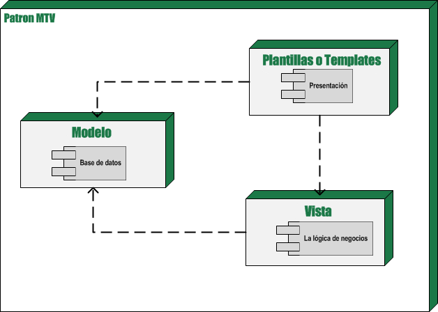

===================
Capítulo 5: Modelos
===================

Él :doc:`capítulo 3<chapter03>`, cubrió los conceptos fundamentales sobre la
construcción dinámica de sitios web con Django, así como la configuración de
vistas y URLconfs. Como explicamos, una vista es responsable de implementar
*alguna lógica arbitraria* y luego retornar una respuesta. En el ejemplo,
nuestra lógica arbitraria era calcular la fecha y la hora actual.

En las aplicaciones web modernas, la lógica arbitraria a menudo implica
interactuar con una base de datos. Detrás de escena, un sitio web impulsado
por una base de datos se conecta a un servidor de base de datos, recupera
algunos datos de este, y los muestra con un formato agradable en una página
web, del mismo modo el sitio puede proporcionar funcionalidad que permita a
los visitantes del sitio ingresar datos a la base de datos; por su propia cuenta.

Muchos sitios web complejos proporcionan alguna combinación de las dos,
Amazon.com por ejemplo, es un buen ejemplo de un sitio que maneja una base de
datos. Cada página de un producto es esencialmente una consulta a la base de
datos de productos de Amazon formateada en HTML, y cuando envías una opinión
de cliente (*customer review*), esta es insertada en la base de datos de
opiniones.

Django es apropiado para crear sitios web que manejen una base de datos, ya que
incluye una manera fácil pero poderosa de realizar consultas a bases de
datos utilizando Python. Este capítulo explica esta funcionalidad: **la capa de
la base de datos de Django**.

.. warning::

  Aunque no es estrictamente necesario conocer teoría básica sobre  bases de
  datos y SQL para usar la capa de la base de datos de Django, es altamente
  recomendado. Una introducción a estos conceptos está más allá del alcance de
  este libro, pero continúa leyendo si eres nuevo en el tema. Probablemente seas
  capaz de seguir adelante y captar los conceptos básicos en base al contexto.

La manera "tonta" de hacer una consulta a la base de datos en las vistas
=========================================================================

Así como en él :doc:`capítulo 3<chapter03>` detallamos la manera "tonta" de
producir una salida con la vista (codificando *en duro* el texto directamente
dentro de la vista), hay una manera "tonta" de recuperar datos desde una base
de datos en una vista. Esto es simple: sólo usa una biblioteca de Python
existente para ejecutar una consulta SQL y haz algo con los resultados.

En este ejemplo de una vista, usamos la biblioteca ``MySQLdb`` (disponible en
http://www.djangoproject.com/r/python-mysql/)  para conectarnos a una base de
datos de MySQL, recuperar algunos registros e introducirlos en una plantilla
para mostrar una página web:

.. code-block:: python

    from django.shortcuts import render
    import MySQLdb

    def lista_biblioteca(request):
        db = MySQLdb.connect(user='yo', db='biblioteca.db', passwd='admin', host='localhost')
        cursor = db.cursor()
        cursor.execute('SELECT nombre FROM biblioteca ORDER BY nombre')
        names = [row[0] for row in cursor.fetchall()]
        db.close()
        return render(request, 'lista_biblioteca.html', {'nombres': nombres})

Este enfoque funciona, pero inmediatamente se hacen evidentes algunos
problemas:

* Estamos codificando *en duro* (*hard-coding*) los parámetros de la
  conexión a la base de datos. Lo ideal sería que esos parámetros se
  guardarse en la configuración de Django.

* Tenemos que escribir una gran  cantidad de código repetitivo: crear una
  conexión, un cursor, ejecutar una sentencia, y cerrar la conexión. Lo
  ideal sería que todo lo que tuviéramos que hacer fuera especificar los
  resultados que queremos obtener.

* Nos ata a MySQL. Si, en el camino, cambiamos de MySQL a PostgreSQL,
  tenemos que usar un adaptador de base de datos diferente (por ej.
  ``psycopg`` en vez de ``MySQLdb``), alterar los parámetros de conexión
  y -- dependiendo de la naturaleza de las sentencia de SQL, posiblemente
  reescribir el SQL. La idea es que el servidor de base de datos que usemos
  esté abstraído, entonces el pasarnos a otro servidor podría significar
  realizar un cambio en un único lugar.

Como esperabas, la capa de la base de datos de Django apunta a resolver estos
problemas. Este es un adelanto de cómo la vista anterior puede ser reescrita
usando la API de Django::

    from django.shortcuts import render_to_response
    from misitio.biblioteca.models import Libro

    def lista_biblioteca(request):
        libro = Libro.objects.order_by('nombre')
        return render_to_response('lista_biblioteca.html', {'biblioteca': biblioteca})

Explicaremos este código un poco más adelante, en este mismo capítulo. Por
ahora, solo observa la forma en que lo escribimos.

El patrón de diseño MTV
=======================

Antes de profundizar en más código, tomémonos un momento para considerar el
diseño global de una aplicación Web Django impulsada por una  bases de datos.

Como mencionamos en los capítulos anteriores, Django fue diseñado para promover
el acoplamiento débil y la estricta separación entre las piezas de una
aplicación. Si sigues esta filosofía, es fácil hacer cambios en un lugar
particular de la aplicación sin afectar otras piezas. En las funciones de vista,
por ejemplo, discutimos la importancia de separar la lógica de negocios de la
lógica de presentación usando un sistema de plantillas. Con la capa de la base
de datos, aplicamos esa misma filosofía para el acceso lógico a los datos.

Estas tres piezas juntas -- la lógica de acceso a la base de datos, la lógica
de negocios, y la lógica de presentación -- comprenden un concepto que a veces
es llamado el patrón de arquitectura de software *Modelo-Vista-Controlador*
(MVC). En este patrón, el "Modelo" hace referencia al acceso a la capa de datos,
la "Vista" se refiere a la parte del sistema que selecciona qué mostrar y cómo
mostrarlo, y el "Controlador" implica la parte del sistema que decide qué
vista usar, dependiendo de la entrada del usuario, accediendo al modelo si es
necesario.

.. admonition:: ¿Por qué el acrónimo?

    El objetivo de definir en forma explícita patrones como MVC es
    principalmente simplificar la comunicación entre los desarrolladores. En
    lugar de tener que decirle a tus compañeros de trabajo, "Vamos a hacer una
    abstracción del acceso a la base de datos, luego vamos a crear una capa que
    se encarga de mostrar los datos, y vamos a poner una capa en el medio para
    que regule esto", puedes sacar provecho de un vocabulario compartido y
    decir, "Vamos a usar un patrón MVC aquí".

Django sigue el patrón MVC tan al pie de la letra que puede ser llamado
un framework MVC. Someramente, la M, V y C se separan en Django de la
siguiente manera:

* *M*, la porción de acceso a la base de datos, es manejada por la capa de
  la base de datos de Django, la cual describiremos en este capítulo.

* *V*, la porción que selecciona qué datos mostrar y cómo mostrarlos, es
  manejada por la vista y las plantillas.

* *C*, la porción que delega a la vista dependiendo de la entrada del
  usuario, es manejada por el framework mismo siguiendo tu URLconf y
  llamando a la función apropiada de Python para la URL obtenida.

Debido a que la "C" es manejada por el mismo framework y la parte más
emocionante se produce en los modelos, las plantillas y las vistas, Django es
conocido como un *Framework MTV*. En el patrón de diseño MTV.

* *M* significa "Model" (Modelo), la capa de acceso a la base de datos. Esta
  capa contiene toda la información sobre los datos: cómo acceder a estos,
  cómo validarlos, cuál es el comportamiento que tiene, y las relaciones
  entre los datos.

* *T* significa "Template" (Plantilla), la capa de presentación. Esta capa
  contiene las decisiones relacionadas a la presentación: como algunas cosas
  son mostradas sobre una página web o otro tipo de documento.

* *V* significa "View" (Vista), la capa de la lógica de negocios. Esta capa
  contiene la lógica que accede al modelo y la delega a la plantilla
  apropiada: puedes pensar en esto como un puente entre el modelos y las
  plantillas.

    Figura 5-1: El patrón de diseño MTV en Django.

Si estás familiarizado con otros frameworks de desarrollo web MVC, como Ruby on
Rails, quizás consideres que las vistas de Django pueden ser el "controlador" y
las plantillas de Django pueden ser la "vista". Esto es una confusión
desafortunada a raíz de las diferentes interpretaciones de MVC. En la
interpretación de Django de MVC, la "vista" describe los datos que son
presentados al usuario; no necesariamente el *cómo* se mostrarán, pero si
*cuáles* datos son presentados. En contraste, Ruby on Rails y frameworks
similares sugieren que el trabajo del controlador incluya la decisión de cuales
datos son presentados al usuario, mientras que la vista sea estrictamente el
*cómo* serán presentados y no *cuáles*.

Ninguna de las interpretaciones es más "correcta" que otras. Lo importante es
entender los conceptos subyacentes.

Configuración de la base de datos
=================================

Con toda esta filosofía en mente, vamos a comenzar a explorar la capa de la base
de datos de Django. Primero, necesitamos tener en cuenta algunas configuraciones
iníciales: necesitamos indicarle a Django qué servidor de base de datos usar y
cómo conectarse al mismo.

Asumimos que haz configurado un servidor de base de datos, lo has activado, y
has creado una base de datos en este punto (por ej. usando la sentencia
``CREATE DATABASE``). SQLite es un caso especial; ya que en este caso, no hay
que crear una base de datos manualmente, porque SQLite usa un archivo autónomo
sobre el sistema de archivos para guardar los datos y Django lo crea
automáticamente.

Como con ``TEMPLATE_DIRS`` en los capítulos anteriores, la configuración de la
base de datos se encuentra en el archivo de configuración de Django, llamado,
por omisión, ``settings.py``. Edita este archivo y busca las opciones de la
variable ``DATABASES``, el cual es un diccionario que contiene los ajustes
necesarios, para configurar la base datos::

    ENGINE = ''
    NAME = ''
    USER = ''
    PASSWORD = ''
    HOST = ''
    DATABASE_PORT = ''

Aquí hay un resumen de cada propiedad.

* **ENGINE** le indica a Django qué base de datos utilizar. Si usas una base de
  datos con Django, ``ENGINE`` debe configurarse con una cadena de las mostrados
  en la Tabla 5-1.

  .. table:: Configuración de motores de base de datos

      ============================================ ============== ================================================
       Configuración                               Base de datos         Adaptador requerido
      ============================================ ============== ================================================
      ``django.db.backends.postgresql_psycopg2``   PostgreSQL     ``psycopg`` version 2.x,
                                                                  http://www.djangoproject.com/r/python-pgsql/.

      ``django.db.backends.mysql``                 MySQL          ``MySQLdb``,
                                                                  http://www.djangoproject.com/r/python-mysql/.

      ``django.db.backends.sqlite3``               SQLite         No necesita adaptador

      ``django.db.backends.oracle``                Oracle         ``cx_Oracle``,
                                                                  http://www.djangoproject.com/r/python-oracle/.
      ============================================ ============== ================================================

  .. admonition:: Nota:

      Cualquiera que sea la base de datos que uses, necesitarás descargar
      e instalar el adaptador apropiado. Cada uno de estos está disponible
      libremente en la web; sólo sigue el enlace en la columna "Adaptador
      requerido" en la Tabla 5-1.

* **NAME** la indica a Django el nombre de tu base de datos. Si
  estás usando SQLite, especifica la ruta completo del sistema de archivos
  hacia el archivo de la base de datos (por ej. ``'/home/django/datos.db'``).

* **USER** le indica a Django cual es el nombre de usuario a usar
  cuando se conecte con tu base de datos. Si estás usando SQLite, deja este
  en blanco.

* **PASSWORD** le indica a Django cual es la contraseña a utilizar
  cuando se conecte con tu base de datos. Si estás utilizando SQLite o
  tienes una contraseña vacía, deja este en blanco.

* **HOST** le indica a Django cual es el host a usar cuando se
  conecta a tu base de datos. Si tu base de datos está sobre la misma computadora
  que la instalación de Django (o sea localhost), deja este en blanco. Si
  estás usando SQLite, deja este en blanco.

  MySQL es un caso especial aquí. Si este valor comienza con una barra
  (``'/'``) y estás usando MySQL, MySQL se conectará al socket especificado
  por medio de un socket Unix, por ejemplo::

          DATABASE_HOST = '/var/run/mysql'

  Si estás utilizando MySQL y este valor *no* comienza con una barra,
  entonces este valor es asumido como el host.

* **PORT** le indica a Django qué puerto usar cuando se conecte a la base de
  datos. Si estás utilizando SQLite, deja este en blanco. En otro caso, si dejas
  este en blanco, el adaptador de base de datos subyacente  usará el puerto por
  omisión acorde al servidor de base de datos. En la mayoría de los casos, el
  puerto por omisión está bien, por lo tanto puedes  dejar este en blanco.

La variable ``DATABASES``, por omisión  usa la configuración mas simple posible,
la cual está configurada para utilizar SQLite, por lo que no tendrás que
configurar nada, si vas a usar SQLite como base de datos::

    DATABASES = {
        'default': {
            'ENGINE': 'django.db.backends.sqlite3',
            'NAME': os.path.join(BASE_DIR, 'db.sqlite3'),
        }
    }

Sin embargo si quieres usar otra base de datos como MySQL, Oracle, o PostgreSQL
es necesario  especificar algunos parámetros adicionales,  que serán requeridos
en el archivo de configuración:

El siguiente ejemplo asume que quieres utilizar PostgreSQL::

    DATABASES = {
        'default': {
            'ENGINE': 'django.db.backends.postgresql_psycopg2',
            'NAME': 'basedatos.bd',
            'USER': 'yo',
            'PASSWORD': 'admin',
            'HOST': '127.0.0.1',
            'PORT': '5432',
        }
    }

Como podras darte cuenta, lo unico que necesitas cambiar es la 'ENGINE', si
quieres usar MySQL e introducir los datos apropiados de acuerdo a la base de
datos que estes usando.

Una vez que hayas ingresado estas configuraciones, compruébalas. Primero,
desde el directorio del proyecto que creaste en él :doc:`capítulo 2<chapter02>`,
ejecuta el comando ``python manage.py shell``.

Notarás que comienza un intérprete interactivo de Python. Las apariencias pueden
engañar. Hay una diferencia importante entre ejecutar el comando
``manage.py shell`` dentro del directorio del proyecto de Django y el intérprete
genérico ``python``. El último es el Python shell básico, pero el anterior
le indica a Django cuales archivos de configuración usar antes de comenzar el
shell. Este es un requerimiento clave para realizar consultas a la base de datos:
Django necesita saber cuáles son los archivos de configuraciones a usar para
obtener la información de la conexión a la base de datos.

Detrás de escena, ``manage.py shell`` simplemente asume que tu archivo de
configuración está en el mismo directorio que ``manage.py``. Hay otras maneras
de indicarle a Django qué módulo de configuración usar, pero este tópico lo
cubriremos mas adelante. Por ahora, usa ``manage.py shell`` cuando necesites
hacer modificaciones y consultas específicas a Django.

Una vez que hayas entrado al shell, escribe estos comando para probar la
configuración de tu base de datos:

.. code-block:: python

    >>> from django.db import connection
    >>> cursor = connection.cursor()
    >>>

Si no sucede nada, entonces tu base de datos está configurada correctamente. De
lo contrario revisa el mensaje de error para obtener un indicio sobre qué es lo
que está mal. La Tabla 5-2 muestra algunos mensajes de error comunes.

.. table:: Mensajes de error de configuración de la base de datos

  ==========================================================  ===============================================================
      Mensaje de error                                                      Solución
  ==========================================================  ===============================================================
      You haven't set the ENGINE setting yet.                    Configura la variable ``ENGINE`` con otra cosa que no sea
                                                                 un string vacío. Observa los valores de la tabla 5-1.
  Environment variable DJANGO_SETTINGS_MODULE is undefined.      Ejecuta el comando ``python manage.py shell``
                                                                 en vez de ``python``.
      Error loading _____ module: No module named _____.         No tienes instalado el módulo apropiado para
                                                                 la base de datos especificada (por ej. ``psycopg``
                                                                 o ``MySQLdb``).(Es tu responsabilidad instalarlos)
      _____ isn't an available database backend.                 Configura la variable ``ENGINE``
                                                                 con un motor válido descrito previamente.
                                                                 ¿Habrás cometido un error de tipeo?
      database _____ does not exist                              Cambia la variable ``NAME`` para que *apunte*
                                                                 a una base de datos existente, o ejecuta la
                                                                 sentencia ``CREATE DATABASE`` apropiada para
                                                                 crearla.
      role _____ does not exist                                  Cambia la variable ``USER`` para que *apunte*
                                                                 a un usuario que exista, o crea el usuario
                                                                 en tu base de datos.
      could not connect to server                                Asegúrate de que ``HOST`` y
                                                                 ``PORT`` esta configurados
                                                                 correctamente y que el servidor esté corriendo.
  ==========================================================  ===============================================================

Tu primera aplicación
=====================

Ahora que verificamos que la conexión está funcionando, es hora de crear una
**Aplicación de Django** -- una colección de archivos de código fuente, incluyendo
modelos y vistas, que conviven en un solo paquete de Python y representen
una aplicación completa de Django.

Vale la pena explicar la terminología aquí, porque esto es algo que suele hacer
tropezar a los principiantes. Ya hemos creado un *proyecto*, en el
:doc:`capítulo 2<chapter02>`, entonces, ¿cuál es la diferencia entre un
*proyecto* y una *aplicación*? Bueno, la diferencia es la que existe entre la
configuración y el código:

* **Un proyecto** es una instancia de un cierto conjunto de aplicaciones de
  Django, más las configuraciones de esas aplicaciones.

  Técnicamente, el único requerimiento de un proyecto es que este
  suministre un archivo de configuración o ``settings.py``, el cual define la
  información hacia la conexión a la base de datos, la lista de las aplicaciones
  instaladas, la variable ``TEMPLATE_DIRS``, y así sucesivamente.

* **Una aplicación** es un conjunto portable de alguna funcionalidad de Django,
  típicamente incluye modelos y vistas, que conviven en un solo paquete de
  Python (Aunque el unico requerimento es que contenga una archivo ``models.py``).

  Por ejemplo, Django incluye un número de aplicaciones, tales como un
  framework geográfico "Geodejango"  y una interfaz de administración automática.
  Una  cosa clave para notar sobre las aplicaciones es que son portables y
  reusables en múltiples proyectos.

Hay pocas reglas estrictas sobre cómo encajar el código Django en este esquema;
ya que es muy flexible. Si estás construyendo un sitio web simple, quizás uses
solo una aplicación. Si estás construyendo un sitio web complejo con varias piezas
que no se relacionan entre sí, tal como un sistema de comercio electrónico o un
foro, probablemente quieras dividirlo en aplicaciones para que te sea posible
rehusar piezas individualmente en un futuro.

Es más, no necesariamente debes crear aplicaciones en absoluto, como lo hace
evidente la función de la vista del ejemplo que creamos antes en este libro.  En
estos casos, simplemente creamos un archivo llamado ``views.py``, llenamos este
con una función de vista, y apuntamos nuestra URLconf a esa función. No se
necesitan "aplicaciones".

No obstante, existe un requisito respecto a la convención de la aplicación: si
estás usando la capa de base de datos de Django (modelos), debes crear una
aplicación de Django. Los modelos deben vivir dentro de aplicaciones.

Siguiendo con el ejemplo, dentro del directorio del proyecto ``misitio`` que
creaste en el :doc:`capítulo 2<chapter02>`, escribe este comando para crear una
nueva aplicación a la que llamaremos ``biblioteca``:

.. code-block:: bash

    python manage.py startapp biblioteca

Este comando no produce ninguna salida, pero crea un directorio llamado ``biblioteca``
dentro del directorio ``misitio`` y dentro de este crea otro directorio mas,
llamado ``migrations``. Echemos un vistazo al contenido::

    biblioteca/
        __init__.py
        admin.py
        models.py
        tests.py
        views.py
        migrations/
            __init__.py

* Estos archivos contendrán los modelos, las vistas, las pruebas,  y las migraciones
  para esta  aplicación, aprenderemos como usarlos en los siguientes capítulos.

  Echa un vistazo a ``models.py``, ``admin.py``, ``views.py``, ``tests.py`` en tu
  editor de texto favorito. Estos archivos están vacíos, excepto por las
  importaciónes. Este es el espacio disponible para ser creativo con tu aplicación
  de Django.

* En este punto, quizás te preguntes **¿Que son las migraciones?**

  Las migraciones son la forma en que Django se encarga de guardar los cambios que
  realizamos a los modelos (Agregando un campo, una tabla o borrando un modelo... etc.)
  en el esquema  de la base de datos. Están diseñado para funcionar en su mayor parte
  de forma automática, utilizan una version de control para almacenar los cambios
  realizados a los modelos y son guardadas en un archivo del disco llamado
  “migration files”, que no es otra cosa más que archivos Python, por lo que
  están disponibles en cualquier momento.

.. admonition:: ¿Como usar las migraciones?

    Las migraciones están creadas para funcionar sobre una aplicación Django,
    podemos pensar en ellas como en una version de control para nuestra base de
    datos. Permiten a Django y a los desarrolladores manejar el esquema de la
    base de datos de forma transparente.

    Existen dos comandos para usar e interactuar con las migraciones:

    * ``makemigrations``: es responsable de  crear nuevas migraciones basadas en
      los cambios aplicados a nuestros modelos.
    * ``migrate``: responsable de aplicar las migraciones y los cambios al
      esquema de la base de datos.

    Estos dos comandos se usan de forma interactiva, primero se crean o graban
    las  migraciones, después se aplican::

      python manage.py makemigrations
      python manage.py migrate

Las migraciones se derivan enteramente de los archivos de  los modelos y son
esencialmente registros, que se guardan como historia, para que Django (o
cualquier desarrollador) pueda consultarlos, cuando necesita actualizar el
esquema de la base de datos para que los modelos coincidan con los modelos
actuales.

Definir modelos en Python
=========================

Como discutimos en los capítulos anteriores, la "M" de "MTV" hace referencia al
"Modelo". Un modelo de Django es una descripción de los datos en la base de
datos, representada como código de Python. Esta es tu capa de datos -- lo
equivalente de tu sentencia SQL ``CREATE TABLE`` -- excepto que están en Python
en vez de SQL, e incluye más que sólo definición de columnas de la base de
datos. Django usa un modelo para ejecutar código SQL detrás de escena y retornar
estructuras de datos convenientes en Python representando las filas de las
tablas de la base de datos. Django también usa modelos para representar
conceptos de alto nivel que no necesariamente pueden ser manejados por SQL.

Si estás familiarizado con base de datos, inmediatamente podría pensar, "¿No es
redundante definir modelos de datos en Python *y* en SQL?" Django trabaja de
este modo por varias razones:

* La introspección requiere *overhead* y es imperfecta. Con el objetivo
  de proveer una API conveniente de acceso a los datos, Django necesita
  conocer *de alguna forma* la capa de la base de datos, y hay dos formas de
  lograr esto. La primera sería describir explícitamente los datos en
  Python, y la segunda sería la introspección de la base de datos en tiempo
  de ejecución para determinar el modelo de la base de datos.

  La segunda forma parece clara, porque los metadatos sobre tus tablas se
  alojan en un único lugar, pero introduce algunos problemas. Primero,
  introspeccionar una base de datos en tiempo de ejecución obviamente
  requiere overhead. Si el framework tuviera que introspeccionar la base
  de datos cada vez que se procese una petición, o incluso cuando el
  servidor web sea inicializado, esto podría provocar un nivel de overhead
  inaceptable. (Mientras algunos creen que el nivel de overhead es
  aceptable, los desarrolladores de Django apuntan a quitar del framework
  tanto overhead como sea posible, y esta aproximación hace que Django sea
  más rápido que los frameworks competidores de alto nivel en mediciones de
  desempeño). Segundo, algunas bases de datos, notablemente viejas
  versiones de MySQL, no guardan suficiente metadatos para asegurarse una
  completa introspección.

* Escribir Python es divertido, y dejar todo en Python limita el número de
  veces que tu cerebro tiene que realizar un "cambio de contexto". Si te
  mantienes en un solo entorno/mentalidad de programación tanto tiempo
  como sea posible, ayuda para la productividad. Teniendo que escribir SQL,
  luego Python, y luego SQL otra vez es perjudicial.

* Tener modelos de datos guardados como código en vez de en tu base de datos
  hace fácil dejar tus modelos bajo un control de versiones. De esta forma,
  puedes fácilmente dejar rastro de los cambios a tu capa de modelos.

* SQL permite sólo un cierto nivel de metadatos acerca de un *layout* de
  datos.  La mayoría de sistemas de base de datos, por ejemplo, no provee un
  tipo de datos especializado para representar una dirección web o de email.
  Los modelos de Django sí. La ventaja de un tipo de datos de alto nivel es
  la alta productividad y la reusabilidad de código.

* SQL es inconsistente a través de distintas plataformas. Si estás
  redistribuyendo una aplicación web, por ejemplo, es mucho más pragmático
  distribuir un módulo de Python que describa tu capa de datos que separar
  conjuntos de sentencias ``CREATE TABLE``  para MySQL, PostgreSQL y SQLite.

Una contra de esta aproximación, sin embargo, es que es posible que el código
Python quede fuera de sincronía respecto a lo que hay actualmente en la base. Si
haces cambios en un modelo Django, necesitarás hacer los mismos cambios dentro
de tu base de datos para mantenerla consistente con el modelo. Detallaremos
algunas estrategias para manejar este problema más adelante en este capítulo.

Finalmente, Django incluye una utilidad que puede generar modelos haciendo
introspección sobre una base de datos existente. Esto es útil para comenzar
a trabajar rápidamente sobre datos heredados.

Tu primer modelo
================

Como ejemplo, en este capitulo y en el siguiente nos enfocaremos en crear una
configuración de datos básica sobre libro/autor/editor. Usaremos este ejemplo
porque las relaciones conceptuales entre libros, autores y editores son bien
conocidas, y es una configuración de base datos comúnmente utilizada, en una
biblioteca online, ademas de que se usa en muchos lugares como texto
introductorio a SQL. Por otra parte, ¡estás leyendo un libro que fue
escrito por autores y producido por un editor!

Asumiremos los siguientes conceptos, campos y relaciones:

* Un autor tiene un nombre, apellidos, un correo electrónico...

* Un editor tiene un nombre, un domicilio, una ciudad, un estado o
  provincia, un país y un sitio Web.

* Un libro tiene un título y una fecha de publicación. También tiene uno o
  más autores (una relación muchos-a-muchos con autores) y un único editor
  (una relación uno a muchos -- también conocida como clave foránea -- con
  editores).

El primer paso para utilizar esta configuración de base de datos con Django es
expresarla como código Python. En el archivo ``models.py`` que se creó con el
comando ``startapp``, ingresa lo siguiente:

.. code-block:: python

  from django.db import models

  class Editor(models.Model):
      nombre = models.CharField(max_length=30)
      domicilio = models.CharField(max_length=50)
      ciudad = models.CharField(max_length=60)
      estado = models.CharField(max_length=30)
      pais = models.CharField(max_length=50)
      website = models.URLField()

  class Autor(models.Model):
      nombre = models.CharField(max_length=30)
      apellidos = models.CharField(max_length=40)
      email = models.EmailField()

  class Libro(models.Model):
      titulo = models.CharField(max_length=100)
      autores = models.ManyToManyField(Autor)
      editor = models.ForeignKey(Editor)
      fecha_publicacion = models.DateField()
      portada = models.ImageField(upload_to='portadas')

Examinemos rápidamente este código para conocer lo básico. La primer cosa a
notar es que cada modelo es representado por una clase Python que es una
subclase de ``django.db.models.Model``. La clase antecesora, ``Model``,
contiene toda la maquinaria necesaria para hacer que estos objetos sean
capaces de interactuar con la base de datos y que hace que nuestros modelos
sólo sean responsables de definir sus campos, en una sintaxis compacta y
agradable. Lo creas o no, éste es todo el código que necesitamos para tener
acceso básico a los datos con Django.

Cada modelo generalmente corresponde a una tabla única de la base de datos, y
cada atributo de un modelo generalmente corresponde a una columna en esa tabla.
El nombre de atributo corresponde al nombre de columna, y el tipo de campo
(ej.: ``CharField``) corresponde al tipo de columna de la base de datos (ej.:
``varchar``). Por ejemplo, el modelo ``Editor`` es equivalente a la
siguiente tabla (asumiendo la sintaxis de PostgreSQL para ``CREATE TABLE``):

.. code-block:: sql

    CREATE TABLE "Editor" (
        "id" serial NOT NULL PRIMARY KEY,
        "nombre" varchar(30) NOT NULL,
        "domicilio" varchar(50) NOT NULL,
        "ciudad" varchar(60) NOT NULL,
        "estado" varchar(30) NOT NULL,
        "pais" varchar(50) NOT NULL,
        "website" varchar(200) NOT NULL
    );

En efecto, Django puede generar esta sentencia ``CREATE TABLE`` automáticamente
como veremos en un momento.

La excepción a la regla una-clase-por-tabla es el caso de las relaciones
muchos-a-muchos. En nuestros modelos de ejemplo, ``libro`` tiene un
``ManyToManyField`` llamado ``autor``. Esto significa que un libro tiene uno
o más autores, pero la tabla de la base de datos ``libro``  no tiene una columna
``autores``. En su lugar, Django crea una tabla adicional -- una "tabla de
join" muchos-a-muchos -- que maneja la correlación entre biblioteca y autores.

Para una lista completa de todos los tipos de campo y las distintas opciones de
sintaxis de modelos, consulta  el :doc:`apéndice B<appendixB>`.

Finalmente, debes notar que no hemos definido explícitamente una clave primaria
en ninguno de estos modelos. A no ser que le indiques lo contrario, Django dará
automáticamente a cada modelo un campo de clave primaria entera llamado ``id``.
Es un requerimiento el que cada modelo Django tenga una clave primaria de
columna simple.

Instalar el modelo
==================

Ya escribimos el código; ahora necesitamos crear las tablas en la base de datos.
Para ello, el primer paso es **activar** estos modelos en nuestro proyecto Django.
Hacemos esto agregando la aplicación ``biblioteca`` a la lista de aplicaciones
instaladas en el archivo de configuración.

Edita el archivo ``settings.py`` otra vez, y examina la variable de
configuración ``INSTALLED_APPS``. ``INSTALLED_APPS`` le indica a Django qué
aplicaciones están activadas para un proyecto determinado. Por omisión, se ve
como esto::

    INSTALLED_APPS = (
    'django.contrib.admin',
    'django.contrib.auth',
    'django.contrib.contenttypes',
    'django.contrib.sessions',
    'django.contrib.messages',
    'django.contrib.staticfiles',
    )

Temporalmente, comenta todo el contenido de las siguientes variables de el archivo
settings.py (si no lo habías hecho ya) poniendo un  carácter (``#``) al principio.
(Están incluidos por omisión porque es frecuente usarlas, pero las activaremos y
las discutiremos más adelante) Cuando termines, haz lo mismo con las
configuraciones de ``MIDDLEWARE_CLASSES``.  Éstas dependen de algunas de las
aplicaciones que hemos comentado.

Ahora, agrega ``'biblioteca'`` a la lista ``INSTALLED_APPS``, de manera que
la configuración termine viéndose así::

    MIDDLEWARE_CLASSES = (
        #'django.contrib.sessions.middleware.SessionMiddleware',
        #'django.middleware.common.CommonMiddleware',
        #'django.middleware.csrf.CsrfViewMiddleware',
        #'django.contrib.auth.middleware.AuthenticationMiddleware',
        #'django.contrib.auth.middleware.SessionAuthenticationMiddleware',
        #'django.contrib.messages.middleware.MessageMiddleware',
        #'django.middleware.clickjacking.XFrameOptionsMiddleware',
    )

    INSTALLED_APPS = (
        #'django.contrib.admin',
        #'django.contrib.auth',
        #'django.contrib.contenttypes',
        #'django.contrib.sessions',
        #'django.contrib.messages',
        #'django.contrib.staticfiles',
        'biblioteca',
    )

(Como aquí estamos tratando con una tupla de un solo elemento, no olvides la
coma al  final. De paso, los autores de este libro prefieren poner una coma después
de *cada* elemento de una tupla, aunque la tupla tenga sólo un elemento. Esto
evita el problema de olvidar comas, y no hay penalización por el use de esa coma
extra)

Ten en cuenta que **biblioteca** se refiere a la aplicación ``biblioteca`` en
la que estamos trabajando. Cada aplicación en ``INSTALLED_APPS`` es representada
por su ruta Python completa -- esto es, la ruta de paquetes, separados por puntos,
que lleva al paquete de la aplicación.

.. warning::

    Si estás usando PostgreSQL o MySQL, debes  asegurarte de  crear una
    base de datos en este punto. Lo puedes hacer con el comando
    "``CREATE DATABASE nombre_base_de_datos;``" mediante  el intérprete
    interactivo de la base de datos.

    Asegúrate de instalar la librería de imagenes `Pillow`_, para
    validar imágenes ya que Django la utiliza para comprobar que los objetos
    que sean subidos a un campo ``ImageField`` sean imágenes validas, de lo
    contrario Django se quejara si intentas usar un campo ``ImageField`` sin
    tener instalada la librería Pillow. Para instalarla usa el comando::

        pip install pillow

    También agrega la ruta a la carpeta donde se guardaran las imagenes en el
    archivo de configuraciones ``setings.py``, usando la variable ``MEDIA_ROOT``::

        MEDIA_ROOT = 'media/'

    Y La URL que se encargara de servir dichas imagenes ``MEDIA_URL``, por
    ejemplo asumiendo que estas usando el servidor de desarrollo::

        MEDIA_URL = 'http://localhost:9000/media/'

    .. _Pillow: http://pypi.python.org/pypi/Pillow

Si estas usando SQLite no necesitaras  crear nada de antemano --la base de datos
se creará automáticamente cuando esta se necesite. Ahora que la aplicación
Django ha sido activada en el archivo de configuración, podemos crear las tablas
en nuestra base de datos. Primero, validemos los modelos ejecutando este comando:

El comando ``validate`` verifica si la sintaxis y la lógica de tus modelos son
correctas. Si todo está bien, verás el mensaje ``0 errors found``. Si no,
asegúrate de haber escrito el código del modelo correctamente. La salida del
error debe brindarte información útil acerca de qué es lo que está mal en el
código.

Cada vez que piensas que tienes problemas con tus modelos, ejecuta
``manage.py validate``. Tiende a capturar todos los problemas comunes
del modelo.

Si tus modelos son válidos, ejecuta el siguiente comando para que Django genere
sentencias ``CREATE TABLE`` para tus modelos en la aplicación ``biblioteca`` (con
sintaxis resaltada en colores disponible si estás usando Unix)::

    python manage.py sqlall biblioteca

En este comando, ``biblioteca`` es el nombre de la aplicación. Es lo que hayas
especificado cuando ejecutaste el comando ``manage.py startapp``. Cuando
ejecutes el comando, debes ver algo como esto:

.. code-block:: sql

  BEGIN;
  CREATE TABLE "biblioteca_editor" (
      "id" integer NOT NULL PRIMARY KEY AUTOINCREMENT,
      "nombre" varchar(30) NOT NULL,
      "domicilio" varchar(50) NOT NULL,
      "ciudad" varchar(60) NOT NULL,
      "estado" varchar(30) NOT NULL,
      "pais" varchar(50) NOT NULL,
      "website" varchar(200) NOT NULL
  )
  ;
  CREATE TABLE "biblioteca_autor" (
      "id" integer NOT NULL PRIMARY KEY AUTOINCREMENT,
      "nombre" varchar(30) NOT NULL,
      "apellidos" varchar(40) NOT NULL,
      "email" varchar(75) NOT NULL
  )
  ;
  CREATE TABLE "biblioteca_libro_autores" (
      "id" integer NOT NULL PRIMARY KEY AUTOINCREMENT,
      "libro_id" integer NOT NULL,
      "autor_id" integer NOT NULL REFERENCES "biblioteca_autor" ("id"),
      UNIQUE ("libro_id", "autor_id")
  )
  ;
  CREATE TABLE "biblioteca_libro" (
      "id" integer NOT NULL PRIMARY KEY AUTOINCREMENT,
      "titulo" varchar(100) NOT NULL,
      "editor_id" integer NOT NULL REFERENCES "biblioteca_editor" ("id"),
      "fecha_publicacion" date NOT NULL,
      "portada" varchar(100) NOT NULL
  )
  ;
  CREATE INDEX "biblioteca_libro_autores_dd67b109" ON "biblioteca_libro_autores"
      ("libro_id");
  CREATE INDEX "biblioteca_libro_autores_40e8bcf3" ON "biblioteca_libro_autores"
      ("autor_id");
  CREATE INDEX "biblioteca_libro_c2be667f" ON "biblioteca_libro" ("editor_id");

  COMMIT;

Observa lo siguiente:

* Los nombres de tabla se generan automáticamente combinando el nombre de
  la aplicación (``biblioteca``) y el nombre en minúsculas del modelo
  (``Editor``, ``Libro``, y ``autor``). Puedes sobreescribir este
  comportamiento, como se detalla en el Apéndice B.

* Como mencionamos antes, Django agrega una clave primaria para cada tabla
  automáticamente -- los campos ``id``. También puedes sobreescribir esto.

* Por convención, Django agrega ``"_id"`` al nombre de campo de las claves
  foráneas. Como ya puedes imaginar, también puedes sobreescribir esto.

* La relación de clave foránea se hace explícita con una sentencia
  ``REFERENCES``

* Estas sentencias ``CREATE TABLE`` son adaptadas a medida de la base de
  datos que estás usando, de manera que Django maneja automáticamente los
  tipos de campo específicos de cada base de datos, como ``auto_increment``
  (MySQL), ``serial`` (PostgreSQL), o ``integer primary key`` (SQLite),
  por ti. Lo mismo sucede con el uso de las comillas simples o dobles en
  los nombres de columna. La salida del ejemplo está en la sintaxis de
  PostgreSQL.

El comando ``sqlall`` no crea ni toca de ninguna forma tu base de datos -- sólo
imprime una salida en la pantalla para que puedas ver qué SQL ejecutaría Django
si le pidieras que lo hiciera. Si quieres, puedes copiar y pegar este fragmento
de SQL en tu cliente de base de datos, o usa los pipes de Unix para pasarlo
directamente. De todas formas, Django provee una manera más fácil de confirmar
el envío del SQL a la base de datos. Pero primero necesitamos crear las
migraciones. Ejecuta el comando ``makemigrations`` de esta manera::

    python manage.py makemigrations

Verás algo como esto::

  Migrations for 'biblioteca':
    0001_initial.py:
      - Create model Editor
      - Create model Autor
      - Create model Libro

Una vez que usamos este comando, para crear las migraciones, podemos usar el
comando ``sqlmigrate``  para ver el SQL generado. El comando ``sqlmigrate``
toma los nombres de las migraciones y las retorna en un lenguaje SQL.::

    python manage.py sqlmigrate biblioteca 0001

Una vez creado las migraciones con  ``makemigrations``, es necesario sincronizar
los cambios en la base de datos, ya que si ejecutas
``python manage.py makemigrations`` de nuevo nada sucede, porque no has
agregado ningún modelo a la aplicación ``biblioteca`` ni has incorporado ninguna
aplicación en ``INSTALLED_APPS``. Por lo que, siempre es seguro ejecutar
``python manage.py makemigrations`` -- no hará desaparecer, ni aparecer cosas.

Para realizar los cambios en la base de datos es necesario usar el comando
``migrate``::

    python manage.py migrate

Que crea las tablas de la base de datos::

    Operations to perform:
      Synchronize unmigrated apps: (none)
      Apply all migrations: biblioteca
    Synchronizing apps without migrations:
      Creating tables...
      Installing custom SQL...
      Installing indexes...
    Running migrations:
      Applying biblioteca.0001_initial... OK

El comando ``migrate`` es una simple sincronización de tus modelos hacia tu base
de datos. El mismo examina todos los modelos en cada aplicación que figure en tu
variable de configuración ``INSTALLED_APPS``, verifica la base de datos para ver
si las tablas apropiadas ya existen, y las crea si no existen.

El comando ``migrate`` toma todas las migraciones que se han aplicado al
proyecto (ya que Django rastrea cada una de las migraciones aplicadas, usando
una tabla especial llamada ``django_migrations``), esencialmente  las ejecuta
de nuevo contra la base de datos, sincronizando  los cambios hechos a los
modelos con el esquema de la base de datos.

Las migraciones son muy poderosas y nos permiten cambiar los modelos cada
cierto plazo de tiempo, como cuando estamos desarrollando nuestro proyecto,
sin la necesidad de borrar las tablas o borrar la base de datos actual  y
crear otra -- el propósito de las migraciones consiste en actualizar la base de
datos que usamos, sin perder datos.

Los tres pasos que  seguimos para crear cambios en el modelo.

* Cambia tu modelo (en ``models.py``).
* Ejecuta ``python manage.py makemigrations`` para crear las migraciones para
  esos cambios.
* Ejecuta ``python manage.py migrate`` para aplicar esos cambios a la base de
  datos.

La razón de usar comandos separados, para hacer y aplicar migraciones consiste
en  guardar las migraciones en  un sistema de control de versiones y enviarlas
con la  aplicación, de esta forma el desarrollo será mas fácil  y también
podrán ser usados por otros desarrolladores en producción.

Si estás interesado, toma un momento para bucear en el cliente de línea de
comandos de tu servidor de bases de datos y ver las tablas que creó Django.
Puedes ejecutar manualmente el cliente de línea de comandos (ej.: ``psql`` para
PostgreSQL) o puedes ejecutar el comando ``python manage.py dbshell``, que
deducirá qué cliente de línea de comando ejecutar, dependiendo de tu
configuración ``SERVER``. Esto último es casi siempre más conveniente.
Con todo esto, si estás interesado en verificar la base de datos, inicia el
cliente de tu base de datos y ejecuta ``\dt`` (PostgreSQL), ``SHOW TABLES;``
(MySQL), o ``.schema`` (SQLite) para mostrar las tablas que Django ha creado.

Acceso básico a datos
=====================

Una vez que has creado un modelo, Django provee automáticamente una API Python
de alto nivel para trabajar con estos modelos. Prueba ejecutando
``python manage.py shell`` y escribiendo lo siguiente::

    >>> from biblioteca.models import Editor
    >>> p1 = Editor(nombre='Addison-Wesley', domicilio='75 Arlington Street',
    ...     ciudad='Boston', estado='MA', pais='U.S.A.',
    ...     website='http://www.apress.com/')
    >>> p1.save()
    >>> p2 = Editor(nombre="O'Reilly", domicilio='10 Fawcett St.',
    ...     ciudad='Cambridge', estado='MA', pais='U.S.A.',
    ...     website='http://www.oreilly.com/')
    >>> p2.save()
    >>> Lista_Editores = Editor.objects.all()
    >>> Lista_Editores
    [<Editor: Editor object>, <Editor: Editor object>]

Estas pocas líneas logran bastantes resultados. Estos son los puntos sobresalientes:

* Para crear un objeto, sólo importa la clase del modelo apropiada y
  crea una instancia pasándole valores para cada campo.

* Para guardar el objeto en la base de datos, llama el método ``save()``
  del objeto. Detrás de la escena, Django ejecuta aquí una sentencia
  SQL ``INSERT``.

* Para recuperar objetos de la base de datos, usa el atributo
  ``Editor.objects``. Busca una lista de todos los objetos ``Editor``
  en la base de datos con la sentencia ``Editor.objects.all()``. Detrás
  de escenas, Django ejecuta aquí una sentencia SQL ``SELECT``.

.. warning:: Siempre guarda tus objetos con ``save()``:

  Una cosa que vale la pena mencionar y que no fue muy clara en el ejemplo
  anterior,  es que cuando creamos un objeto usando la API (la capa de modelo
  de Django), es que  los objetos no se guardan en la base de datos, hasta
  que se llama al método  ``save()`` explícitamente::

      p1 = Editor(...)
      # ¡En este punto, p1 no ha sido guardado en la base de datos!
      p1.save()
      # Ahora, si.

Si quieres crear y guardar un objeto en la base de datos, en un simple paso
usa el método ``objects.create()``. Este ejemplo, es equivalente al ejemplo
anterior::

    >>> p1 = Editor.objects.create(nombre='Apress',
    ...     domicilio='2855 Telegraph Avenue',
    ...     ciudad='Berkeley', estado='CA', pais='U.S.A.',
    ...     website='http://www.apress.com/')
    >>> p2 = Editor.objects.create(nombre="O'Reilly",
    ...     domicilio='10 Fawcett St.', ciudad='Cambridge',
    ...     estado='MA', pais='U.S.A.',
    ...     website='http://www.oreilly.com/')
    >>> Lista_Editores = Editor.objects.all()
    >>> Lista_Editores

Naturalmente, puedes hacer mucho mas con la API de base de datos de Django
-- pero primero, arreglemos una pequeña incomodidad--.

Agrega strings de representación a tus modelos
==============================================

Cuando imprimimos la lista de editores, todo lo que obtuvimos fue una salida
poco útil,  que hacía difícil distinguir los objetos ``Editor``::

    [<Editor: Editor object>, <Editor: Editor object>]

Podemos arreglar esto fácilmente agregando un método llamado ``__str__()``, si
estas usando python3 o un método ``__unicode__()``, si estas usando Python2, a
nuestro objeto ``Editor``. Un método ``__str__()`` le dice a Python como
mostrar la representación "string" de un objeto en unicode. Puedes ver esto en
acción agregando un método ``__str__()`` a tus tres modelos:

.. snippet:: python
    :filename: biblioteca/models.py

    from django.db import models

    class Editor(models.Model):
        nombre = models.CharField(max_length=30)
        domicilio = models.CharField(max_length=50)
        ciudad = models.CharField(max_length=60)
        estado = models.CharField(max_length=30)
        pais = models.CharField(max_length=50)
        website = models.URLField()

        def __str__(self):            # __unicode__ en Python 2
            return self.nombre

    class Autor(models.Model):
        nombre = models.CharField(max_length=30)
        apellidos = models.CharField(max_length=40)
        email = models.EmailField()

        def __str__(self):            # __unicode__ en Python 2
            return '%s %s' % (self.nombre, self.apellidos)

    class Libro(models.Model):
        titulo = models.CharField(max_length=100)
        autores = models.ManyToManyField(Author)
        editor = models.ForeignKey(Editor)
        fecha_publicacion = models.DateField()
        portada = models.ImageField(upload_to='portadas')

        def __str__(self):            # __unicode__ en Python 2
            return self.titulo

Como puedes ver, un método ``__str__()`` puede hacer lo que sea que necesite
hacer para devolver una representación textual. Aquí, los métodos ``__str__()``
de ``Editor`` y ``Libro`` devuelven simplemente el nombre y título del objeto
respectivamente, pero el ``__str__()`` del ``Author`` es un poco más complejo --
junta los campos ``nombre`` y ``apellidos``. El único requerimiento para
``__str__()`` es que devuelva una cadena. Si ``__str__()`` no devuelve una
cadena si retorna, digamos, un entero -- entonces Python generará un
``TypeError``con un mensaje como ``"__str__ returned non-string"``.

.. admonition:: ¿Que son los objetos unicode?

    Puedes pensar en objetos unicode, como en cadenas que pueden manejar más
    de un millón de distintos tipos de  caracteres, que van desde versiones de
    caracteres latinos, no latinos, citas en chino, y símbolos "obscuros".

    Las cadenas normales en Python2, son *codificadas* usando un tipo de
    codificación especial, tal como: ASCII, ISO-8859-1 o UTF-8 (En python3
    todas las cadenas son Unicode). Si almacenas caracteres sencillos(cualquier
    cosa entre el estándar 128 ASCII, tal como letras de la A-Z y números del 0-9)
    en cadenas normales de Python2 no debes de perder de vista la codificación
    que estas usando, para que los caracteres puedan ser mostrados cuando sean
    imprimidos. Los problemas ocurren cuando guardamos los datos en un tipo de
    codificación y los combinamos con diferentes codificaciones, si tratamos de
    mostrarlos en nuestras aplicaciones, estas asumen un cierto tipo de
    codificación. Alguna vez haz visto páginas Web o  e-mails que muestran
    caracteres como "??? ??????" en lugar de palabras; esto generalmente
    sugiere un problema de codificación.

    Los objetos unicode no tienen una codificación, su uso es consistente,
    son un conjunto universal de caracteres llamado  "Unicode."  Cuando se
    utilizan objetos unicode en Python, puedes mezclarlos y acoplarlos con
    seguridad,  si tener que preocupare sobre problema de codificación.

    Django utiliza objetos unicode en todo el framework. Los objetos de los
    modelos son recuperados como objetos Unicode, las vistas interactúan con
    datos Unicode, y las plantillas son renderizadas como Unicode. Generalmente
    no debes preocuparte por esto, solo asegúrate que tus codificaciones
    sean correctas; y las cosas trabajaran bien.

    Hemos tratado este tema muy a la ligera, sin embargo si quieres aprender
    mas sobre objetos Unicode, un buen lugar para empezar es:
    http://www.joelonsoftware.com/articles/Unicode.html .

Para que los cambios sean efectivos, sal del shell Python y entra de nuevo con
``python manage.py shell``. (Esta es la manera más simple de hacer que los
cambios en el código tengan efecto.) Ahora la lista de objetos ``Editor`` es
más fácil de entender::

    >>> from biblioteca.models import Editor
    >>> ListaEditores = Editor.objects.all()
    >>> ListaEditores
    [<Editor: Addison-Wesley>, <Editor: O'Reilly>]

Asegúrate de que cada modelo que definas tenga un método ``__str__()`` -- no
solo por tu propia conveniencia cuando usas el intérprete interactivo, sino
también porque Django usa la salida de ``__str__()`` en muchos lugares cuando
necesita mostrar objetos.

.. admonition::  Metodos ``__str__`` o ``__unicode__``?

    En Python 3, es fácil, solo utiliza ``__str__()``.

    En Python 2, es necesario definir  métodos ``__unicode__()`` para que los
    valores que retornen sean ``unicode``. Los modelos de Django usan por
    default :meth:`~django.db.models.Model.__str__`,  este método llama
    a :meth:`~django.db.models.Model.__unicode__` y convierte el resultado a
    UTF-8  bytestring. Esto significa que ``unicode (p)`` retornara como cadena
    unicode y ``str (p)`` devolverá una cadena normal, con los caracteres
    codificados como UTF-8. Python hace lo contrario: toma un ``objeto`` que
    tiene  ``__unicode__`` y llama a un método ``__str__`` e interpreta el
    resultado como una cadena ASCII  bytestring. Esta diferencia puede crear
    confusión.

    Si todo esto no tiene sentido para ti, solo usa Python 3 y todo funcionara
    bien.

Finalmente, observa como el metodo ``__str__()`` es un buen ejemplo para agregar
*comportamiento* a los modelos. Un modelo Django describe más que la
configuración de la tabla de la base de datos; también describe toda
funcionalidad que el objeto sepa hacer.  ``__str__()`` es un ejemplo de esa
funcionalidad -- un modelo sabe cómo mostrarse.

Insertar y actualizar datos
===========================

Ya has visto cómo se hace: para insertar una fila en tu base de datos, primero
crea una instancia de tu modelo usando argumentos por nombre, asi::

    >>> p = Editor(nombre='Apress',
    ...         domicilio='2855 Telegraph Ave.',
    ...         ciudad='Berkeley',
    ...         estado='CA',
    ...         pais='U.S.A.',
    ...         website='http://www.apress.com/')

Este acto de instanciar una clase modelo *no* toca la base de datos.

Para guardar el registro en la base de datos (esto es, para realizar la
sentencia SQL ``INSERT``), llama al método ``save()`` del objeto::

    >>> p.save()

En SQL, esto puede ser traducido directamente en lo siguiente:

.. code-block:: sql

    INSERT INTO biblioteca_Editor
        (nombre, domicilio, ciudad, estado, pais, website)
    VALUES
        ('Apress', '2855 Telegraph Ave.', 'Berkeley', 'CA',
         'U.S.A.', 'http://www.apress.com/');

Como el modelo ``Editor`` usa una clave primaria autoincremental ``id``, la
llamada inicial a ``save()`` hace una cosa más: calcula el valor de la clave
primaria para el registro y lo establece como el valor del atributo ``id``  de
la instancia::

    >>> p.id
    52    # esto es diferente, según tus datos

Las subsecuentes llamadas a ``save()`` guardarán el registro en su lugar, sin
crear un nuevo registro (es decir, ejecutarán una sentencia SQL ``UPDATE`` en
lugar de un ``INSERT``)::

    >>> p.nombre = 'Apress Publishing'
    >>> p.save()

La sentencia ``save()`` del párrafo anterior resulta aproximadamente en la
sentencia SQL siguiente:

.. code-block:: sql

    UPDATE biblioteca_Editor SET
        nombre = 'Apress Publishing',
        domicilio = '2855 Telegraph Ave.',
        ciudad = 'Berkeley',
        estado = 'CA',
        pais = 'U.S.A.',
        website = 'http://www.apress.com'
    WHERE id = 52;

Ahora, observa como *todos* los campos han sido actualizados, no solamente el
que habíamos cambiado. Dependiendo de tu aplicación, esto puede causar provocar
una condición. Consulta como "Actualizar múltiples objetos en una sola
declaración" más adelante, para ejecutar una consulta (ligeramente diferente).

.. code-block:: sql

    UPDATE biblioteca_editor SET
        nombre = 'Apress Publishing'
    WHERE id=52;

Seleccionar objetos
===================

Conocer cómo crear y actualizar datos en una base de datos es esencial, pero
hay ocasiones en que una aplicación web necesita realizar consultas para
examinar los objetos que se han creado. Ya hemos visto una forma de examinar
*todos* los datos de un determinado modelo::

    >>> Editor.objects.all()
    [<Editor: Addison-Wesley>, <Editor: O'Reilly>, <Editor: Apress Publishing>]

Eso se traslada a esto;  en SQL:

.. code-block:: sql

    SELECT
        id, nombre, domicilio, ciudad, estado, pais, website
    FROM book_Editor;

.. admonition::  Nota:

    Nota que Django no usa ``SELECT *`` cuando busca datos y en cambio lista
    todos los campos explícitamente. Esto es una decisión de diseño: en
    determinadas circunstancias ``SELECT *`` puede ser lento, y (más importante)
    listar los campos sigue el principio del Zen de Python: "Explícito es mejor
    que implícito".

    Para más sobre el Zen de Python, intenta escribiendo ``import this`` en el
    prompt de Python.

Echemos un vistazo a cada parte de esta línea ``Editor.objects.all()``:

* En primer lugar, tenemos nuestro modelo definido, ``Editor``. Aquí no
  hay nada extraño: cuando quieras buscar datos, usa el modelo para esto.

* Luego, tenemos ``objects``. Técnicamente, esto es un *administrador*
  (*manager*). Los administradores son discutidos en el
  :doc:`capitulo 10<chapter10>`. Por ahora, todo lo que necesitas saber es que
  los administradores se encargan de realizar todas las operaciones a
  "nivel de tablas" sobre los datos incluidos, y  lo más importante:
  **las consultas**.

  Todos los modelos automáticamente obtienen un administrador ``objects``;
  debes usar el mismo cada vez que quieras consultar sobre una instancia del
  modelo.

* Finalmente, tenemos ``all()``. Este es un método del administrador
  ``objects`` que retorna todas las filas de la base de datos. Aunque este
  objeto se *parece* a una lista, es realmente un *QuerySet* -- un objeto
  que representa algún conjunto de filas de la base de datos. El Apéndice C
  describe QuerySets en detalle. Para el resto de este capítulo, sólo
  trataremos estos como listas emuladas.

Cualquier búsqueda en base de datos va a seguir esta pauta general -- llamaremos
métodos del administrador adjunto al modelo en el cual queremos hacer nuestra
consulta.

Filtrar datos
-------------

Aunque obtener todos los objetos es algo que ciertamente tiene su utilidad, la
mayoría de las veces lo que vamos a necesitar es manejarnos sólo un subconjunto
de los datos. Para ello usaremos el método ``filter()``::

    >>>Editor.objects.filter(nombre="Apress Publishing")
    [<Editor: Apress Publishing>]

``filter()`` toma argumentos clave que son traducidos en las cláusulas SQL ``WHERE``
apropiadas. El ejemplo anterior sería traducido en algo como:

.. code-block:: sql

    SELECT
        id, nombre, domicilio, ciudad, estado, pais, website
    FROM biblioteca_Editor
    WHERE nombre = 'Apress Publishing';

Puedes pasarle a ``filter()`` múltiples argumentos,  para reducir las cosas aún
más::

    >>>Editor.objects.filter(ciudad="Berkeley", estado="CA")
    [<Editor: Apress Publishing>]

Estos múltiples argumentos son traducidos a cláusulas SQL ``AND``. Por lo tanto
el ejemplo en el fragmento de código se traduce a lo siguiente:

.. code-block:: sql

    SELECT
        id, nombre, domicilio, ciudad, estado, pais, website
    FROM biblioteca_Editor
    WHERE ciudad = 'U.S.A.' AND estado = 'CA';

Observa que por omisión la búsqueda usa el operador SQL ``=`` para realizar
búsquedas exactas. Existen también otros tipos de búsquedas::

    >>> Editor.objects.filter(nombre__contains="press")
    [<Editor: Apress Publishing>]

Nota el doble guión bajo entre ``nombre`` y ``contains``. Del mismo modo que
Python, Django usa el doble guión bajo para indicar que algo "mágico" está
sucediendo -- aquí la parte ``__contains`` es traducida por Django en una
sentencia SQL ``LIKE``:

.. code-block:: sql

    SELECT
        id, nombre, domicilio, ciudad, estado, pais, website
    FROM biblioteca_Editor
    WHERE nombre LIKE '%press%';

Hay disponibles varios tipos de búsqueda, incluyendo ``icontains`` (``LIKE`` no es
sensible a diferencias de mayúsculas/minúsculas), ``startswith`` y ``endswith``,
y ``range`` (consultas SQL ``BETWEEN``). El Apéndice C describe en detalle todos
estos tipos de búsqueda.

Obtener objetos individuales
----------------------------

El ejemplo anterior usa el método ``filter()``  que retorna un ``QuerySet`` el
cual es tratado como una lista, sin embargo en ocasiones desearás obtener un
único objeto. Para esto existe el método ``get()``::

    >>> Editor.objects.get(nombre="Apress Publishing")
    <Editor: Apress Publishing>

En lugar de una lista (o más bien, un QuerySet), este método retorna un objeto
individual. Debido a eso, una consulta cuyo resultado contenga múltiples objetos
causará una excepción::

    >>> Editor.objects.get(pais="U.S.A.")
    Traceback (most recent call last):
        ...
    MultipleObjectsReturned: get() returned more than one Editor --
        it returned 2! Lookup parameters were {'pais': 'U.S.A.'}

Por lo que una consulta, que no retorne un objeto también causará una excepción::

    >>> Editor.objects.get(nombre="Penguin")
    Traceback (most recent call last):
        ...
    DoesNotExist: Editor matching query does not exist.

La exepcion ``DoesNotExist`` es un atributo de el modelo de la clase
``Editor.DoesNotExist``. Si quieres atrapar las excepciones  en tus aplicaciones,
puedes hacerlo de la siguiente forma::

    try:
        p = Editor.objects.get(nombre='Apress')
    except Editor.DoesNotExist:
        print ("Apress no esta en la base de datos.")
    else:
        print ("Apress esta en la base de datos.")

Ordenar datos
-------------

A medida que juegas con los ejemplos anteriores, podrías descubrir que los
objetos son devueltos en lo que parece ser un orden aleatorio. No estás
imaginándote cosas, hasta ahora no le hemos indicado a la base de datos cómo
ordenar los resultados, de manera que simplemente estamos recibiendo datos con
algún orden arbitrario seleccionado por la base de datos.

Eso es, obviamente, un poco ingenuo. No quisiéramos que una página Web que
muestra una lista de editores estuviera ordenada aleatoriamente. Así que, en la
práctica, probablemente querremos usar ``order_by()`` para reordenar nuestros
datos en listas más útiles::

    >>> Editor.objects.order_by("nombre")
    [<Editor: Addison-Wesley>, <Editor: Apress Publishing>, <Editor: O'Reilly>]

Esto no se ve muy diferente del ejemplo de ``all()`` anterior, pero el SQL
incluye ahora un ordenamiento específico:

.. code-block:: sql

    SELECT
        id, nombre, domicilio, ciudad, estado, pais, website
    FROM biblioteca_Editor
    ORDER BY nombre;

Podemos ordenar por cualquier campo que deseemos::

    >>> Editor.objects.order_by("domicilio")
    [<Editor: O'Reilly>, <Editor: Apress Publishing>, <Editor: Addison-Wesley>]

    >>> Editor.objects.order_by("estado")
    [<Editor: Apress Publishing>, <Editor: Addison-Wesley>, <Editor: O'Reilly>]

Para ordenar por múltiples campos(donde el segundo campo es usado para quitar
las ambigüedades en el orden, en casos donde el nombre sea el mismo), puedes
usar múltiples argumentos::

    >>> Editor.objects.order_by("estado", "domicilio")
     [<Editor: Apress Publishing>, <Editor: O'Reilly>, <Editor: Addison-Wesley>]

También podemos especificar un ordenamiento inverso antecediendo al nombre del
campo un prefijo ``-`` (el símbolo menos)::

    >>> Editor.objects.order_by("-nombre")
    [<Editor: O'Reilly>, <Editor: Apress Publishing>, <Editor: Addison-Wesley>]

Aunque esta flexibilidad es útil, usar ``order_by()`` todo el tiempo puede ser
demasiado repetitivo. La mayor parte del tiempo tendrás un campo particular por
el que usualmente desearás ordenar tus datos. Es esos casos Django te permite
anexar al modelo un ordenamiento por omisión para el mismo, usando una clase
interna Meta:

.. code-block:: python

  class Editor(models.Model):
      nombre = models.CharField(max_length=30)
      domicilio = models.CharField(max_length=50)
      ciudad = models.CharField(max_length=60)
      estado = models.CharField(max_length=30)
      pais = models.CharField(max_length=50)
      website = models.URLField()

      def __str__(self):
          return self.nombre

      class Meta:
          ordering = ["nombre"]

Hemos introducido un nuevo concepto: ``class Meta`` (Una clase Meta interna),
esta clase esta embebida en la definición de la  clase  ``Editor``(identada
dentro de la clase ``Editor``). Podemos usar una clase ``Meta``  en cualquier
modelo para especificar varias opciones especificas en un modelo. Examina el
Apéndice B para conocer las  opciones que puede poner bajo ``Meta``.
En el ejemplo anterior ``ordering = ["nombre"]`` le indica a Django que a menos
que se proporcione un ordenamiento mediante ``order_by()``, todos los editores
deberán ser ordenados por su nombre. Django usa esta ``class Meta`` interna
como un lugar en el cual se pueden especificar metadatos  adicionales acerca de
un modelo. Es completamente opcional, pero puede realizar algunas cosas muy
útiles, como usar el nombre en plural de la tabla usando ``verbose_name_plural``.

Encadenar búsquedas
-------------------

Has visto cómo puedes filtrar datos y has visto cómo ordenarlos. En ocasiones,
por supuesto, vas a querer realizar ambas cosas. En esos casos simplemente
"encadena" las búsquedas entre sí::

    >>> Editor.objects.filter(pais="U.S.A.").order_by("-nombre")
    [<Editor: O'Reilly>, <Editor: Apress Publishing>, <Editor: Addison-Wesley>]

Como podrías esperar, esto se traduce a una consulta SQL conteniendo tanto un
``WHERE`` como un ``ORDER BY``:

.. code-block:: sql

    SELECT id, nombre, domicilio, ciudad, estado, pais, website
    FROM biblioteca_Editor
    WHERE country = 'U.S.A'
    ORDER BY nombre DESC;

Puedes encadenar consultas en forma consecutiva tantas veces como desees. No
existe un límite para esto.

Rebanar datos
-------------

Otra necesidad común es buscar sólo un número fijo de filas. Imagina que tienes
miles de editores en tu base de datos, pero quieres mostrar sólo el primero.
Puedes hacer eso usando la sintaxis estándar de Python para el rebanado de
listas::

    >>> Editor.objects.all()[0]
    <Editor: Addison-Wesley>

Esto se traduce, someramente, a:

.. code-block:: sql

    SELECT
        id, nombre, domicilio, ciudad, estado, pais, website
    FROM biblioteca_editor
    ORDER BY nombre
    LIMIT 1;

Similarmente, puedes recuperar un subconjunto especifico de datos usando
la sintaxis de Python y rebanando un rango de datos::

    >>> Editor.objects.order_by('nombre')[0:2]

Esto retorna dos objetos, traducidoa a grandes rasgos así:

.. code-block:: sql

    SELECT  id, nombre, domicilio, ciudad, estado, pais, website
    FROM biblioteca_editor
    ORDER BY nombre
    OFFSET 0 LIMIT 2;

Observa que el rebanado negativo *no* esta soportado::

    >>> Editor.objects.order_by('nombre')[-1]
    Traceback (most recent call last):
      ...
    AssertionError: Negative indexing is not supported.

Sin embargo es fácil darle la vuelta a esto. Cambia la declaración ``order_by()`` así::

    >>> Editor.objects.order_by('-nombre')[0]

Actualizar múltiples campos en una sola declaración
---------------------------------------------------

Ya vimos en la sección "Insertando y actualizando datos." que el método
``save()`` actualiza *todas* las columnas de una fila. Sin embargo, dependiendo
de nuestra aplicación, podemos actualizar únicamente un subconjunto de columnas.

Por ejemplo, digamos que queremos actualizar el nombre Apress de la tabla
``Editor``, para cambiarle  el nombre de ``'Apress'`` a ``'Apress Publishing'``.
Usando el método ``save()``, podemos hacerlo así::

    >>> p = Editor.objects.get(nombre='Apress')
    >>> p.nombre = 'Apress Publishing'
    >>> p.save()

Esto se traduce, aproximadamente en la siguiente declaración SQL:

.. code-block:: sql

    SELECT id, nombre, domicilio, ciudad, estado, pais, website
    FROM biblioteca_libro
    WHERE nombre = 'Apress';

    UPDATE biblioteca_editor SET
        nombre = 'Apress Publishing',
        domicilio = '2855 Telegraph Ave.',
        ciudad = 'Berkeley',
        estado = 'CA',
        pais = 'U.S.A.',
        website = 'http://www.apress.com'
    WHERE id = 52;

(Observa que el ejemplo asume que un Editor Apress, tiene un ID = ``52`` )

Puedes ver en este ejemplo que el método ``save()``, guarda *todos* los valores
de las columnas, no solo la columna ``nombre``. Si estas en un entorno donde
otras columnas de la base de datos puedan cambiar debido a otro proceso, es mas
elegante cambiar *únicamente* una columna que se necesita cambiar. Para esto
usa el método ``update()``  cuando consultes objetos. Por ejemplo::

    >>> Editor.objects.filter(id=52).update(nombre='Apress Publishing')

La traducción a SQL es mucho más eficiente y no hay probabilidades de errores:

.. code-block:: sql

    UPDATE biblioteca_editor
    SET name = 'Apress Publishing'
    WHERE id = 52;

El método ``update()`` trabaja con cualquier consulta, lo cual quiere decir
que puedes editar múltiples registros a la vez. Esta es la forma en podemos
cambiar ``ciudad``  de ``'U.S.A.'`` a ``USA`` en cada registro ``Editor``::

    >>> Editor.objects.all().update(ciudad='USA')
    2

El método ``update()`` retorna un valor -- un entero que representa las veces
que un registro ha cambiado--. En el ejemplo anterior obtuvimos 2.

Eliminar objetos
================

Para eliminar objetos, simplemente llama al método ``delete()`` de tu objeto::

    >>> p = Editor.objects.get(nombre="Addison-Wesley")
    >>> p.delete()
    >>> Editor.objects.all()
    [<Editor: Apress Publishing>, <Editor: O'Reilly>]

También puedes borrar objetos al por mayor llamando al método ``delete()`` en el
resultado de cualquier consulta. Esto es similar a el método ``update()`` que
mostramos en la sección anterior::

    >>> Editor.objects.filter(ciudad='USA').delete()
    >>> Editor.objects.all().delete()
    >>> Editor.objects.all()
    []

Los borrados son *permanentes*, así que, ¡se cuidadoso!. Como medida de
precaución, Django evita que puedas borrar los datos de una tabla en particular
directamente, a menos que explícitamente así lo requieras, usa el método
``all()``, si quieres borrar *toda* la tabla.

Por ejemplo esto no trabaja::

    >>> Editor.objects.delete()
    Traceback (most recent call last):
      File "<console>", line 1, in <module>
    AttributeError: 'Manager' object has no attribute 'delete'

Pero si agregas un método ``all()``, funcionara bien::

    >>> Editor.objects.all().delete()

Si solo quieres borrar un subconjunto de datos, no necesitas incluir el
método ``all()``.::

     >>> Editor.objects.filter(ciudad='USA').delete()

¿Qué sigue?
===========

Después de leer este capítulo, haz adquirido el conocimiento suficiente sobre
los modelos Django, esto te permitirá escribir aplicaciones básicas usando una
base de datos. En él :doc:`capítulo 10<chapter10>` encontraras mas información
sobre un uso más avanzado de la capa de modelos de Django.

Una vez que has definido tus modelos, el siguiente paso es ingresar datos a
la  base de datos. Podrías tener datos legados, en cuyo caso el
:doc:`capítulo 18<chapter18>` te aconsejará acerca de cómo integrar bases de
datos heredadas. Podrías delegar en los usuario del sitio la provisión de los
datos, en cuyo caso el :doc:`capítulo 7<chapter07>` te enseñará cómo procesar
datos enviados por los usuarios mediante formularios.

Pero en algunos casos, tú o tu equipo podrían necesitar ingresar datos en forma
manual, en cuyo caso sería de ayuda el disponer de una interfaz basada en Web
para el ingreso y el manejo de los datos. Él :doc:`próximo capítulo<chapter06>`
está dedicado a la interfaz de administración de Django, la cual existe
precisamente por esa razón.

