=============================================
Capítulo 6: El sitio de Administración Django
=============================================

Para un cierto tipo de sitios Web, una **interfaz de administración** es una
parte esencial de su infraestructura. Ya que se trata de una interfaz basada
en HTML, limitada a los administradores autorizados, que permite agregar,
editar y eliminar el contenido del sitio. La interfaz que usas para escribir en
tu blog, el sitio privado que los editores usan para moderar los comentarios de
sus lectores, la herramienta que tus clientes utilizan para actualizar los
comunicados de prensa en la Web, que construiste para ellos -- todos ellos son
ejemplos de interfaces de administración.

Sin embargo, existe un problema con las interfaces de administración: es aburrido
construirlas.  El desarrollo Web es divertido cuando estás desarrollando
funcionalidades del lado público del sitio, pero construir interfaces de
administración es siempre lo mismo.  Tienes que autentificar usuarios, mostrar y
manipular formularios, validar las entradas y demás tareas. Es aburrido y
repetitivo.

¿Cuál es la solución de Django para estas tareas aburridas y repetitivas? Las
hace todas por ti -- en sólo un par de líneas de código, ni más ni menos. Con
Django, construir interfaces de administración es un problema resuelto.

Este capítulo trata sobre la interfaz de administración automática de Django.
Esta característica funciona leyendo los meta-datos en tus modelos para brindar
una interfaz potente y lista para producción que los administradores del sitio
podrán usar inmediatamente. En este capítulo discutimos cómo activar, usar y
personalizar esta utilidad.

Recomendamos leer este capítulo, inclusive si no te propones usar el sitio de
administración, porque introduciremos algunos conceptos generales, que se pueden
aplicar a Django en general, sin importar si usas la interfaz administrativa o no.

El paquete django.contrib
=========================

La interfaz de administración de Django es solo una parte de la gran suite de
funcionalidades llamado ``django.contrib``, la parte del código de  Django que
contiene diversos accesorios útiles del framework base. Puedes pensar en
``django.contrib`` como el equivalente a una librería estándar de Python --
opcional, efectivo y que implementa muchos patrones comunes. Las cuales estas
incrustados en Django y nos ayudaran a no reinventar la rueda en nuestras
aplicaciones.

El sitio de administración es la primera parte de ``django.contrib``, que
cubriremos en este libro; técnicamente, es llamado ``django.contrib.admin``.
Algunas características mas que podemos mencionar de ``django.contrib``, es que
incluye un sistema de autentificación (``django.contrib.auth``), ofrece
soporte para sesiones anónimas (``django.contrib.sessions``), etiquetas para
desarrolladores Web, (``django.contrib.Webdesign``), etiquetas para darle un
toque humano al framework (``django.contrib.humanize``).  En este capítulo
conocerás diversas características de ``django.contrib`` que te convertirán
en un experto en Django, discutiremos más adelante este tema, en el
:doc:`capítulo16<chapter16>`. Por ahora, simplemente ten en cuenta que este
paquete contiene muchos agregados útiles, y que ``django.contrib`` es
generalmente el lugar en donde se localizan.

Activar la interfaz de administración
=====================================

Una de las partes más poderosas y atractivas de Django es la interfaz
administrativa.  Que se encarga de leer,  automáticamente los metadatos de
tus modelos para proveer una interfaz poderosa y lista para producción,
para que inmediatamente puedas comenzar a añadirle contenido a tu sitio Web.

Sin embargo la interfaz de administración es enteramente opcional, porque
únicamente un cierto tipo de sitios  necesitan esta funcionalidad. Esto
significa que se puede activar o desactivar según tus necesidades especificas.

En la siguiente parte discutimos cómo activar, usar y personalizar la interfaz
administrativa de Django.

Para referencia estos son los requisitos:

1. Agrega ``'django.contrib.admin'`` a la variable ``INSTALLED_APPS`` de
   tu archivo de configuraciones.(El orden en ``INSTALLED_APPS`` si importa, sin
   embargo estas están ordenadas alfabéticamente para facilitar su lectura, y
   Django las carga conforme están ordenadas, este detalle es importante ya que
   si quieres que django cargue primero tus plantillas, necesitas poner tu
   aplicación antes que el propio  ``'django.contrib.admin'``, para que las use.)

2. La interfaz administrativa tiene cuatro dependencias (que dependen unas de
   otras), por lo que asegúrate que estas esten todas activadas:

   - :mod:`django.contrib.auth`
   - :mod:`django.contrib.contenttypes`
   - :mod:`django.contrib.messages`
   - :mod:`django.contrib.sessions`

   Si estas aplicaciones no estás listadas en la variable ``INSTALLED_APPS``,
   agrégalas.

3. Agrega ``django.contrib.messages.context_processors.messages`` a
   :setting:`TEMPLATE_CONTEXT_PROCESSORS` (a la variable) así como tambien agrega
   :class:`django.contrib.auth.middleware.AuthenticationMiddleware` y
   :class:`django.contrib.messages.middleware.MessageMiddleware` a
   :setting:`MIDDLEWARE_CLASSES`. (Estos están activados por omisión, así que
   solo necesitas hacerlo manualmente, si hiciste algún cambio a la
   configuración o los habías comentado previamente).

4. Determina que modelos de tus aplicaciones serán editables en la interfaz
   administrativa.

   No todos los modelos pueden (o deberían) ser editables por los usuarios
   administradores, por lo que necesitas "marcar" los modelos que deberían
   tener una interfaz de administración. (Añadiendo una clase ``ModelAdmin`` al
   archivo ``admin.py``.)

5. Por cada uno de los modelos, crea opcionalmente una clase ``ModelAdmin``
   en el archivo ``admin.py``, que encapsule las funcionalidades personalizadas
   y las opciones especificas,  para cada modelo en particular.

6. Instancia una clase  ``AdminSite`` y registra cada uno de los modelos en la
   clase ``ModelAdmin``

7. Apunta la instancia ``AdminSite`` a tu URLconf.

.. Warning::

    La interfaz administrativa está habilitado por omisión en la plantilla de tu
    proyecto, si creaste tu proyecto usando ``startproject``. La cual incluye
    una URL y una configuración para usar SQLite como base de datos. Por lo que
    solo debes preocuparte por los requisitos anteriores, si haz personalizado,
    borrado o comentado el archivo de configuración ``settings.py``.

Una vez que nos hemos asegurado de tener todos los requisitos en orden, podemos
llamar al  comando ``makemigrations``, para crear las migraciones y despues usar
el comando  ``migrate`` para que se encargue de instalar las tablas, que la
interfaz de administración necesita en la base de datos.

Crea las migraciones:

.. code-block:: bash

    python manage.py makemigrations

Y sincroniza los cambios:

.. code-block:: bash

    python manage.py migrate

Como se menciona anteriormente el comando ``migrate`` examina todos los modelos
en cada aplicación activada,  que figure en tu variable de configuración
``INSTALLED_APPS``,  y verifica el esquema de la base de datos para  comprobar
si las tablas apropiadas ya existen, y las crea si no existen. Mostrando un
mensaje por cada migración aplicada.

La interfaz administrativa instala 4 aplicaciones y una de ellas es
``django.contrib.auth`` el sitio de autorizaciones, por lo  que al instalarlo es
necesario crear interactivamente un superusuario (aunque se puede omitir este paso).

.. admonition:: Sigamos interactivamente la salida del comando migrate:

  * Primero, nos preguntara si queremos crear un superusuario (una cuenta de
    superusuario para el sistema de autentificación). Le decimos que si,
    introduciendo la palabra ``yes`` y dándole a enter.::

        You have installed Django's auth system, and don't have any superusers
        defined. Would you like to create one now? (yes/no): yes

  * Nos pedirá un nombre de usuario. Por defecto utilizara el nombre del
    sistema. Introducimos el nombre de nuestra preferencia y presionamos de nuevo
    enter.::

        Username (leave blank to use 'your_username'): admin

  * Nos pedirá también una dirección de correo electrónico:::

        Email address: admin@example.com

  * Finalmente nos pedirá una contraseña. Por lo que es necesario introducir dos
    veces la misma contraseña (la segunda vez solo como confirmación de la
    primera)::

        Password: **********
        Password (again): *********
        Superuser created successfully.

El comando ``migrate`` toma todas las migraciones que se han aplicado al
proyecto (ya que Django rastrea cada una de las migraciones aplicadas, usando
una tabla especial llamada ``django_migrations``), esencialmente  las ejecuta
de nuevo contra la base de datos, sincronizando  los cambios hechos a los
modelos con el esquema de la base de datos.

Una vez creadas las tablas, solo necesitas agregar el patrón de URL al archivo
``urls.py``. Si aún estás usando el que  fue creado por ``startproject``, el
patrón de la URL de administración ya debería estar ahí, pero comentado. De
cualquier forma, el patron URL debe terminar siendo algo así:

.. code-block:: python

            from django.conf.urls import url
            from django.contrib import admin

            urlpatterns =[
                url(r'^admin/', include('django.contrib.admin.urls')),
            ]

Eso es todo. Ahora ejecuta ``manage.py runserver`` para iniciar el
servidor de pruebas. Verás algo como esto::

    Validating models...
    0 errors found.

    Django version 2.0, using settings 'misitio.settings'
    Development server is running at http://127.0.0.1:8000/
    Quit the server with CONTROL-C.

Ahora puedes visitar la URL que te brinda Django, para acceder a la
`interfaz administrativa`_, identificarte, y jugar un poco.
(http://127.0.0.1:8000/admin/)

.. _interfaz administrativa: http://127.0.0.1:8000/admin/

Usar la interfaz de administración
==================================

La interfaz de administración está diseñada para ser usada por usuarios no
técnicos, y como tal debería ser lo suficientemente clara como para explicarse
por sí misma. Aún así, se brindan unas pocas notas sobre sus características.

Lo primero que verás será  una página de identificación, como la que se muestra a
continuación:

.. figure:: graphics/chapter06/login.png
   :alt: Pantalla de autentificación de Django.

   **Figura 6-1.** Pantalla de autentificación de Django.

.. Imagen actualizada

Usarás el nombre de usuario y la clave que configuraste cuando agregaste tu
superusuario. Una vez identificado, verás que puedes gestionar usuarios, grupos
y permisos (veremos más sobre esto en breve).

Una vez que nos hemos autentificado, la primera cosa que veremos será la pagina
de inicio o "indice". Esta página contiene una lista de todos los datos
disponibles que pueden ser editados en la pagina del sitio de administración.
Como aun no hemos activado nuestros modelos (Los activaremos mas adelante),
la lista de aplicaciones es escasa, solo incluye **Grupos** y **Usuarios**, los
cuales son agregados a la interfaz por omision.

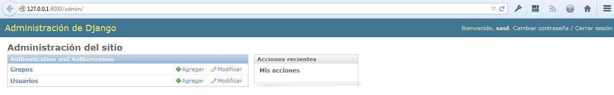

   **Figure 6-2.** El índice principal de la Administración de Django.

.. Imagen actualizada

Cada tipo de datos en la interfaz administrativa, contienen enlaces para agregar
y modificar objetos, que nos llevan a páginas  especificas a las que nos
referiremos como ``listas de cambio`` [#]_ y ``formularios de edición`` [#]_ de
objetos: La lista de cambios muestra todos los objetos disponibles en la base de
datos, mientras que el formulario de edición nos permite agregar, cambiar o
borrar registros específicos de la base de datos.

.. admonition:: Otros lenguajes en Django

    Si tu lenguaje natural, no es el Ingles  y si tu navegador está configurado
    para aceptar otros lenguajes además del Ingles, puedes hacer un cambio
    rápidamente para ver la interfaz administrativa traducida a tu idioma.
    Solo agrega a la variable ``LANGUAGE_CODE``, que se encuentra en el
    archivo de configuraciones tu idioma nativo. Django cuenta con traducciones
    para muchos lenguajes, entre los que se encuentran:

    'af', 'Afrikaans', 'ar', 'Arabic', 'az', 'Azerbaijani', 'bg', 'Bulgarian',
    'be', 'Belarusian', 'bn', 'Bengali', 'br', 'Breton', 'bs', 'Bosnian',
    'ca', 'Catalan', 'cs', 'Czech', 'cy', 'Welsh', 'da', 'Danish', 'de',
    'German', 'el', 'Greek', 'en', 'English', 'en-au', 'Australian English',
    'en-gb', 'British English', 'eo', 'Esperanto', 'es', 'Spanish', 'es-ar',
    'Argentinian Spanish', **'es-mx', 'Mexican Spanish',** 'es-ni', 'Nicaraguan Spanish',
    'es-ve', 'Venezuelan Spanish', 'et', 'Estonian', 'eu', 'Basque', 'fa', 'Persian',
    'fi', 'Finnish', 'fr', 'French', 'fy', 'Frisian', 'ga', 'Irish', 'gl', 'Galician',
    'he', 'Hebrew', 'hi', 'Hindi', 'hr', 'Croatian', 'hu', 'Hungarian', 'ia',
    'Interlingua', 'id', 'Indonesian', 'is', 'Icelandic', 'it', 'Italian', 'ja',
    'Japanese', 'ka', 'Georgian', 'kk', 'Kazakh', 'km', 'Khmer', 'kn', 'Kannada',
    'ko', 'Korean', 'lb', 'Luxembourgish', 'lt', 'Lithuanian', 'lv', 'Latvian', 'mk',
    'Macedonian', 'ml', 'Malayalam', 'mn', 'Mongolian', 'my', 'Burmese', 'nb',
    'Norwegian Bokmal', 'ne', 'Nepali', 'nl', 'Dutch', 'nn', 'Norwegian Nynorsk',
    'os', 'Ossetic', 'pa', 'Punjabi', 'pl', 'Polish', 'pt', 'Portuguese', 'pt-br',
    'Brazilian Portuguese', 'ro', 'Romanian', 'ru', 'Russian', 'sk', 'Slovak', 'sl',
    'Slovenian', 'sq', 'Albanian', 'sr', 'Serbian', 'sr-latn', 'Serbian Latin',
    'sv', 'Swedish', 'sw', 'Swahili', 'ta', 'Tamil', 'te', 'Telugu', 'th', 'Thai',
    'tr', 'Turkish', 'tt', 'Tatar', 'udm', 'Udmurt', 'uk', 'Ukrainian', 'ur',
    'Urdu', 'vi', 'Vietnamese', 'zh-cn', 'Simplified Chinese', 'zh-hans',
    'Simplified Chinese', 'zh-hant', 'Traditional Chinese', 'zh-tw', 'Traditional Chinese'

    Solo agrega tu idioma así:

    ``LANGUAGE_CODE = 'es-mx'``

    También agrega ``'django.middleware.locale.LocaleMiddleware'`` a la variable
    ``MIDDLEWARE_CLASSES`` de el archivo de configuraciones, solo asegúrate de que
    aparezca *después* de ``'django.contrib.sessions.middleware.SessionMiddleware'``.

    Una vez hecho esto, recarga la pagina de índice de la interfaz
    administrativa. Si está disponible alguna traducción para tu lenguaje,
    entonces varias partes de la interfaz --como "cambiar contraseña", "cerrar
    sesión", enlaces que se encuentran en la parte superior de la pagina,
    aparecerán en tu idioma.

    Para conocer más características basadas en internacionalización, puedes
    consultar el :doc:`capítulo19<chapter19>`,

Da clic en el link "Usuarios" en la fila de "Usuarios" para ingresar a la pagina
de lista de usuarios registrados.

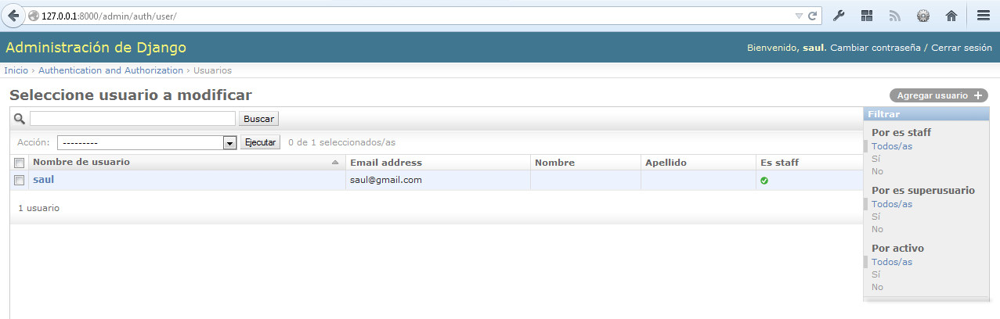

   **Figure 6-3.** La lista de cambios de usuarios.

.. Imagen actualizada

Esta página muestra todos los usuarios de la base de datos, puedes pensar en
ella como en una versión estilizada de una consulta SQL:
``SELECT * FROM auth_user;`` Si estas siguiendo estos ejemplos, asumiremos que
solo haz agregado un usuario, sin embargo una vez que agregues mas usuarios,
es  probable que encuentres útiles las opciones para filtrar, ordenar o buscar.
Las opciones para filtrar están en el lado derecho, las opciones para ordenar
están disponibles dando clic en la cabecera de la columna y la caja de busqueda
está situada en la parte superior y te permitirán buscar usuarios por su nombre.

Da clic en el nombre de un usuario que hayas creado,  para editarlo.

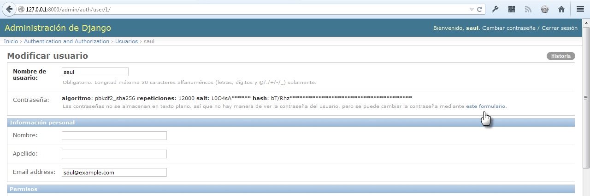

   **Figure 6-4.** Un formulario para editar usuarios.

.. Imagen actualizada

Esta página te permite cambiar los atributos de un usuario, tal como el nombre,
los apellidos y los distintos permisos.(Observa que para cambiar la contraseña
de un usuario, es necesario dar clic en el formulario "cambiar contraseña", en
el link "este formulario", debajo del campo contraseña, para cambiar el código
hash.) Otra cosa que debes notar es que los distintos campos, utilizan diferentes
widgets --Por ejemplo el campo fecha/tiempo tiene controles como un calendario y
un reloj, los campos booleanos tienen checkboxes, los campos de caracteres
tienen una simple caja de entrada de texto.

Puedes eliminar un registro, dando clic en el botón borrar, que se encuentra en
el lado izquierdo de el formulario. La interfaz de administración solicita una
confirmación para prevenir errores. La eliminación de un objeto se desencadena
en cascada, y la página de confirmación de eliminación del objeto muestra todos
los objetos relacionados que se eliminarán con él. (Por ejemplo, si borras un
Editor; cualquier libro que pertenezca a ese editor será borrado también.)

.. figure:: graphics/chapter06/editar_pasword.png
   :alt: Captura de pantalla de un formulario para cambiar contraseña de usuario.

   **Figure 6-5.** Un formulario para cambiar contraseña de usuario.

Puedes agregar un nuevo usuario, dando clic en "Agregar" en la columna
correspondiente, en la página de inicio de la interfaz administrativa. Esto te
llevara a una  pagina vacía, lista para que la rellenes.

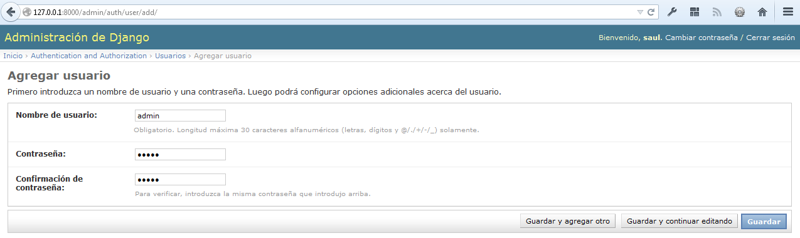

   **Figura 6-6.** Un formulario de edición para agregar un usuario.

Te darás cuenta que la interfaz de administración también controla por ti la
validez de los datos ingresados.  Intenta dejar un campo requerido (los cuales
aparecen con letras en negritas) en blanco o poner una fecha inválida en un campo
tipo fecha y verás los avisos resaltados en rojo, cuando intentes guardar el
objeto, como se muestra en la Figura siguiente:

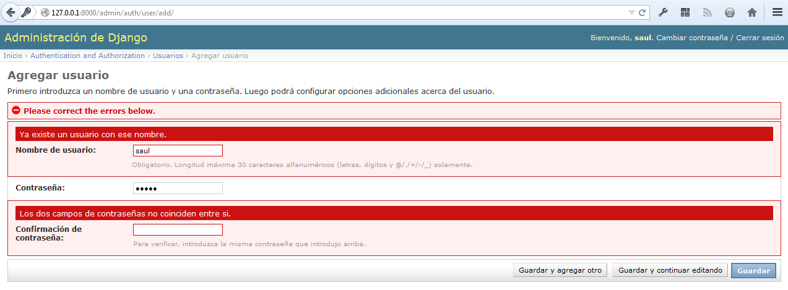

   **Figura 6-7.** Un formulario de edición mostrando errores de validación.

.. Imagen actualizada

Cuando editas un objeto existente, verás el botón "Historia" en la esquina
superior derecha de la ventana.  Cada cambio realizado a través de la interfaz
de administración es registrado, y puedes examinar este registro haciendo
clic en este botón (mira la Figura 6-8).

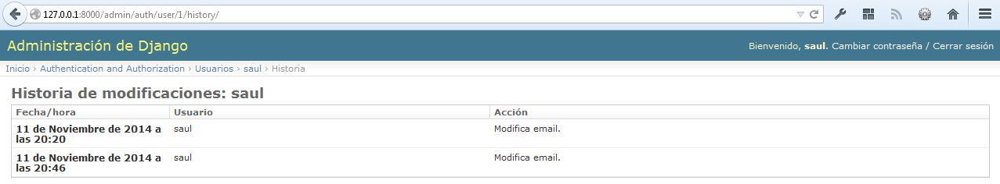

   **Figura 6-8.** Página de historia de un objeto django.

.. Imagen actualizada

Agrega tus modelos al sitio administrativo
==========================================

Hay una parte crucial que no hemos hecho todavía. Y es agregar nuestros modelos
a la interfaz administrativa, para poder agregar, cambiar y borrar objetos en
las tablas de la base de datos usando una interfaz agradable. Continuando con
el  ejemplo del :doc:`capitulo 5<chapter05>`, previamente definimos en nuestra
aplicación ``biblioteca``,  tres modelos: ``Editor``, ``Libro`` y ``Autor``.

Dentro del directorio interno ``biblioteca`` (``misitio/biblioteca``), existe
un archivo vacio llamado ``admin.py``, creado automáticamente por el comando
``startapp``  agreguemosle las siguientes líneas de código, para registrar
nuestros tres modelos:

.. code-block:: python

    from django.contrib import admin
    from biblioteca.models import Editor, Autor, Libro

    admin.site.register(Editor)
    admin.site.register(Autor)
    admin.site.register(Libro)

Este código registra, cada uno de los modelos en la interfaz administrativa,
para que Django nos ofrezca una interfaz para cada uno de los modelos registrados,
bajo el nombre de la aplicación y podamos introducir datos directamente en ellos.

Una vez que hemos hecho esto, podemos navegar a la página de inicio usando un
navegador Web en: http://127.0.0.1:8000/admin/, y podremos ver una sección
llamada "Biblioteca" con enlaces para Autor, Libros y Editores.(Si estabas
ejecutando el servidor de desarrollo, es necesario detenerlo e iniciarlo de
nuevo para que los cambios surtan efecto.)

Django usa el nombre de cada uno de los modelos, para presentarlos en la interfaz
administrativa,  sin embargo agrega la letra "s" para mostrar el nombre en plural, lo
cual no siempre es lo más adecuado, si quieres mostrar el nombre en plural usa la opción
``verbose_name_plural`` en cada clase Meta interna, a la que le quieras agregar un
nombre en plural. Agregale uno a cada modelo asi:

.. parsed-literal::

  class Autor(models.Model):
      nombre = models.CharField(max_length=30)
      apellidos = models.CharField(max_length=40)
      email = models.EmailField()

      class Meta:
          ordering = ["nombre"]
          **verbose_name_plural = "Autores"**

      def __str__(self):            # __unicode__ en Python 2
          return '%s %s' % (self.nombre, apellidos)

Ahora tienes una completa interfaz administrativa funcional para cada uno de tus
tres modelos. **¡Eso fue sencillo!**

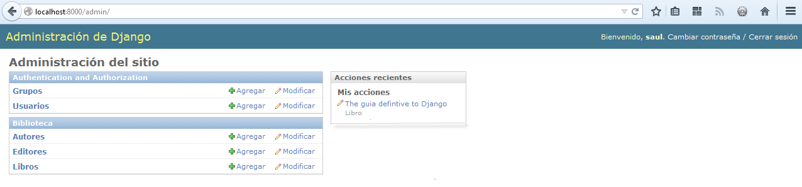

   **Figura 6-9.** Página de inicio de la interfaz administrativa.

Tomate un momento para agregar, cambiar e insertar algunos registros mas
en tu  base de datos. Si estas siguiendo los ejemplos, en especial
los del :doc:`capítulo5<chapter05>` cuando agregamos objetos mediante la
terminal  al modelo ``Editor`` (y no los borraste), puedes ver esos
registros en la página de listado de editores.

Una característica que vale la pena mencionar, es que el sitio administrativo
maneja las relaciones foráneas y las relaciones muchos a muchos, las cuales
aparecen en el modelo ``Libro``, si recuerdas así es como definimos el
modelo::

    class Libro(models. Model):
        titulo = models.CharField(max_length=100)
        autores = models.ManyToManyField(Autor)
        editores = models.ForeignKey(Editor)
        fecha_publicacion = models.DateField()

        def __str__(self):
            return self.titulo

Observa que el sitio de administración, contiene una página "Agregar libro"
ubicada en: http://127.0.0.1:8000/admin/biblioteca/libro/add/, donde
tenemos distintos tipos de campos como el de los editores (una "relación
foránea" ``ForeignKey``), la cual es representada por una caja de selección y
tenemos el campo autores (Una relación "Muchos a muchos" ``ManyToManyField``),
la cual es representada por una caja de selección múltiples. Ambos campos están
situados al lado de un icono verde que permite agregar registros a las
relaciones. Por ejemplo si das clic en el icono verde (un signo de "mas") en
un campo de "editores" veras una ventana flotante que te permitirá agregar un
editor. Después de que hayas creado satisfactoriamente un editor en la ventana
flotante, el formulario "Agregar libro" mostrara una actualización con el nuevo
editor creado.

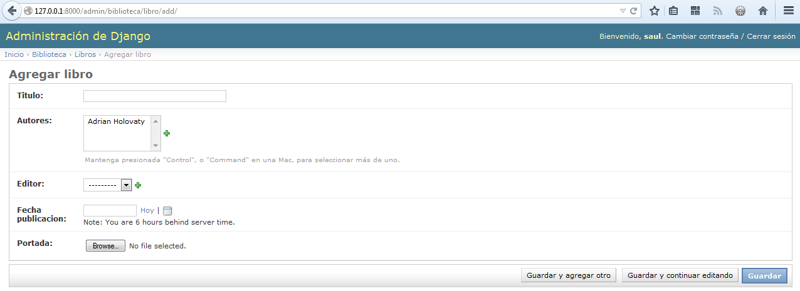

   **Figura 6-10.** Formulario para agregar libros, en la interfaz administrativa.

Como trabaja la interfaz administrativa
=======================================

Detrás de escena, la forma en que trabaja la interfaz administrativa, es
bastante directa.

Al iniciar el servidor, Django carga tus URLconf de  ``urls.py`` y ejecuta
la declaración ``admin.autodiscover()`` (que es habilitada por omisión), la cual
se encarga de activar la interfaz administrativa. Esta función itera sobre cada
una de las aplicaciones listadas en ``INSTALLED_APPS``  y busca un archivo
llamado ``admin.py`` en cada una de las  aplicaciones instaladas. Si existe un
archivo ``admin.py``, ejecuta el código del archivo. (Django automáticamente
busca un modulo admin en cada una de las aplicaciones y lo importa.)

En el archivo ``admin.py`` de nuestra aplicación ``biblioteca``, cada una de las
llamadas a ``admin.site.register()`` simplemente registra cada uno de los
modelos en la interfaz administrativa. De esta forma el sitio administrativo
mostrara una interfaz, que nos permitirá editar/cambiar cada uno de los modelos
que hayamos explícitamente registrado.

La aplicación ``django.contrib.auth`` incluye su propio archivo ``admin.py``,
por lo que tanto Usuarios y Grupos aparecieron automáticamente en la interfaz
administrativa.  Otras aplicaciones de ``django.contrib``, tal como
``django.contrib.redirects``  también pueden agregarse, así como muchas de las
aplicaciones de terceros que descarguemos de la Web.

Mas allá de esto, la interfaz administrativa es solo una aplicación Django, la
cual incluye sus propios modelos, plantillas, vistas y patrones URL. Puedes
agregarla  a tus aplicaciones simplemente anclándola a tus URLconfs, tal como
lo harías con una vista. Puedes inspeccionar sus plantillas, vistas y patrones
URL, las cuales se encuentran en ``django/contrib/admin``, en la copia de tu
código base -- Pero no intentes cambiar nada directamente, ya que existen otras
formas para cambiar y personalizar la manera en que trabaja el sitio
administrativo. (Si decides hurgar en la interfaz administrativa ten en cuenta
que esta realiza, una gran cantidad de cosas bastante complicadas leyendo los
metadatos de los modelos, así que probablemente te tomara una buen tiempo leer
y comprender el código.)

Como crear campos opcionales
============================

Después de jugar un rato con el sitio de administración, probablemente
encuentres algunas limitaciones -- las formas para editar requieren que todos
los campos sean completados, sin embargo en algunos casos es necesario que
algunos campos sean opcionales. Digamos por ejemplo, que queremos que un
modelo ``Autor`` contenga un campo ``email`` que sea opcional --  es decir que
permita cadena en blanco. En el mundo real, un autor puede no tener una
dirección de correo electrónico o email .

Para especificar que un campo ``email``  sea opcional, edita el modelo
``Autor`` (el cual creamos en el :doc:`capítulo5<chapter05>`, y que se encuentra
en ``misitio/biblioteca/models.py``). Simplemente agrega ``blank=True`` al campo
``email`` así:

.. parsed-literal::

    class Autor(models.Model):
        nombre = models.CharField(max_length=30)
        apellidos = models.CharField(max_length=40)
        email = models.EmailField(**blank=True**)

.. SL Tested ok

Esto le dice a Django que los valores en blanco están permitidos en el campo
``email`` de la tabla ``Autor``. Por omisión, todos los campos se asígnan con
``blank=False``, lo cual no permite valores en blanco.

Veamos algunas cosas interesantes que pasan aquí:

Hasta ahora con la excepción del método ``__str__()``, nuestros modelos ha
servido como definiciones para las tablas de la base de datos --Esencialmente
expresiones Pythonicas de la sentencia  ``CREATE TABLE`` de  SQL. Agregando
``blank=True``, hemos comenzado a desplegar nuestro modelo más allá de una
simple definición de tablas de nuestra base de datos. Ahora nuestro modelo
de clases empieza a ser una rica colección de definiciones acerca de el
objeto ``Autor`` y lo que puede hacer. No únicamente es el  campo ``email``
que representa una columna ``VARCHAR`` en la base de datos, es  también un
campo opcional dentro del contexto de la interfaz administrativa.

Una vez que hemos agregado ``blank=True``, recarga el formulario
"Agregar autor" en: http://127.0.0.1:8000/admin/biblioteca/autor/add/  y
podrás darte cuenta que la etiqueta --"Email"-- ya no está en negritas. Esto
significa que el campo ya  no es requerido. Podemos agregar ahora autores sin
necesidad de proveer una dirección de email; por lo que ya no veremos el
campo marcado de rojo que nos dice el mensaje "Este campo es requerido", ya que
ahora podemos dejar el campo vacio.

Como crear campos numéricos y de fechas opcionales
--------------------------------------------------

Un problema común relacionado con ``blank=True`` tiene que ver con los campos
numéricos y de fechas, este tema requiere un poco de explicación a fondo.

SQL tiene su propias maneras de especificar los valores en blanco -- un valor
especial llamado ``NULL``. ``NULL`` significa "desconocido" o "no valido" u
algún otro significado especifico.

En SQL un valor ``NULL`` es diferente que una cadena vacía, tal como el objeto
especial Python ``None``, que es diferente a una cadena vacía en Python (``""``).
Esto significa que es posible que un campo de caracteres particular (por ejemplo
una columna ``VARCHAR`` ) contenga ambos valores: ``NULL`` y una cadena vacía.

Esto puede causar cierta ambigüedad y confusión, ¿"Porque  este registro tiene
un  valor ``NULL`` y este otro una cadena vacía"? ¿Existe una diferencia o
fueron los datos registrados inconsistentemente? y como obtengo todos los
registros que tienen un valor en blanco -- busco ambos registros o únicamente
selecciono las cadenas vacía.

Para ayudar a evitar estas ambigüedades, Django automáticamente genera un
declaración ``CREATE TABLE`` (Que cubrimos en el capítulo 5) y agrega
explícitamente en cada columna una definición ``NOT NULL``. Por ejemplo
esta es la declaración generada por el modelo ``Autor`` del capítulo 5:

.. code-block:: sql

    CREATE TABLE "biblioteca_autor" (
        "id" serial NOT NULL PRIMARY KEY,
        "nombre" varchar(30) NOT NULL,
        "apellidos" varchar(40) NOT NULL,
        "email" varchar(75) NOT NULL
    );

En la mayoría de los casos, este comportamiento por omisión es optimo para
usarlo en nuestras aplicaciones y nos ayudara a guardar nuestros datos y evitar
inconsistencias y dolores de cabeza, tal como el sitio de administración que
inserta cadenas vacías (no valores ``NULL`` ) cuando dejamos un campo de
caracteres en blanco.

Pero existe una excepción con algunas columnas de la base de datos que no aceptan
cadenas vacías -- por ejemplo los de tipo fechas, y los númericos. Si intentas
insertar una cadena vacía en una columna de tipo fecha o número entero, solo
conseguirás un error de la base de datos, dependiendo de la base de datos que
estés utilizando (PostgreSQL es estricta y lanzara una excepción; MySQL puede
aceptar o no dependiendo de la versión que estés usando, el tiempo, el día y la
fase de la luna) En este caso ``NULL`` es únicamente una forma de especificar
que el valor esta vacio. En los modelos de Django, puedes especificar ``NULL``
agregando ``null=True`` a los campos, donde sea necesario.

De modo que existe una manera más larga de decir esto: si quieres permitir
valores en blanco en un campo (por ejemplo: ``DateField``, ``TimeField``,
``DateTimeField``) o numerico (por ejemplo: ``IntegerField``,
``DecimalField``, ``FloatField``), necesitas agregar ambos tipos:
``null=True`` *y* ``blank=True``.

Para ejemplificar mejor lo anterior, cambiemos el modelo ``Libro`` para que el
campo ``fecha_publicacion`` permita espacios en blanco y valores nulos. Este es el
código revisado:

.. parsed-literal::

    class Libro(models.Model):
        titulo = models.CharField(max_length=100)
        autores = models.ManyToManyField(Autor)
        editores = models.ForeignKey(Editor)
        fecha_publicacion = models.DateField(**blank=True, null=True**)

Agregar ``null=True`` es más complicado que agregar ``blank=True``, porque
``null=True`` cambia la semántica de la base de datos -- esto es, cambia la
declaración ``CREATE TABLE`` para que remueva del campo ``fecha_publicacion``,
la declaración ``NOT NULL`` de la base de datos --. Para completar este cambio
necesitamos actualizar el esquema de la base de datos.

En versiones anteriores de Django para  actualizar la base de datos,
necesitábamos manualmente usar el interprete de comandos (especifico de cada base
de datos) y utilizar SQL para alterar el  esquema de la base de datos, una vez que
habíamos sincronizado nuestros modelos. Sin embargo esto ya no es necesario (aunque
hay sus exepciones), ya que podemos usar las migraciones para realizar esta tareas,
recuerdas los tres pasos que seguimos para instalar los modelos:

* Cambia tu modelo (en ``models.py``).
* Ejecuta ``manage.py makemigrations`` para crear las migraciones para
  esos cambios.
* Ejecuta ``manage.py migrate`` para aplicar esos cambios a la base de
  datos.

Cada vez que cambiemos nuestros modelos, es necesario ejecutar  estos dos comandos
para sincronizar los cambios en el esquema de la base de datos automáticamente.

Una vez que hayamos creado las migraciones, sincronizando los modelos (para agregar
valores nulos y campos en blanco), traemos de vuelta la interfaz administrativa,
ahora  el formulario "Agregar libro" permite publicar valores vacios en el
campo ``fecha_publicacion`` y lo mejor de todo es que no tenemos que ejecutar SQL
directamente.

Personalizar las etiquetas de los campos
========================================

En los formularios de el sitio de administración, cada etiqueta de texto es
generada, de cada uno de los nombres de cada campo. El algoritmo es simple:
Django reemplaza los guiones bajos con espacios y pone en mayúscula la primera
letra de la palabra. Así que por ejemplo,  en el modelo ``libro``, el campo
``fecha_publicacion`` tiene la etiqueta "Fecha publicación"

De cualquier manera, el nombre de los campos no siempre se presenta de una forma
agradable en las etiquetas de texto, en algunos casos lo más recomendable es
personalizar la etiqueta. Para hacerlo es necesario especificarlo con la etiqueta
``verbose_name``  en el campo del modelo.

Por ejemplo,  así es como podemos cambiar la etiqueta del campo ``Autor`` email
a "e-mail" con un guion enmedio:

.. parsed-literal::

    class Autor(models.Model):
        nombre = models.CharField(max_length=30)
        apellidos = models.CharField(max_length=40)
        email = models.EmailField(blank=True, **verbose_name='e-mail'**)

Para que los cambios surtan efecto, recarga el servidor y podrás ver la nueva
etiqueta de texto ``e-mail``,  en el formulario para editar autores.

Observa que no necesitas poner en mayúscula la primera letra de la palabra
cuando utilizas ``verbose_name`` ya que esta *siempre* será mostrada con la
primera palabra en mayúsculas, a menos de que ha si lo requieras (por ejemplo:
``"USA estate"``). Django automáticamente usara la mayúscula cuando lo necesite
y mostrara la salida exacta de el valor ``verbose_name`` en otros lugares que no
requieran mayúsculas.

Finalmente, nota que puedes pasar argumentos posicionales a ``verbose_name``,
para una sintaxis ligeramente más compacta. Este ejemplo es equivalente al
anterior:

.. parsed-literal::

    class Autor(models.Model):
        nombre = models.CharField(max_length=30)
        apellidos = models.CharField(max_length=40)
        email = models.EmailField(**'e-mail',** blank=True)

Aunque esto no trabaja con campos ``ManyToManyField`` o ``ForeignKey``, porque
estas  relaciones requieren como primer argumento un modelo de clase. En estos
casos, es necesario especificar explícitamente ``verbose_name`` de la forma
habitual.

Clases personalizadas de la interfaz administrativa
===================================================

Los cambios que hemos realizado hasta ahora ``blank=True``, ``null=True`` y
``verbose_name`` son realmente a nivel de modelos, no a nivel administrativo.
Es decir estos cambios son fundamentalmente  una parte del modelo y solo
ocurren cuando usamos el sitio administrativo, por lo que no hay nada especifico
acerca de ellos.

Más allá de esto, el sitio administrativo ofrece abundantes opciones que te
permiten modificar la forma en que el sitio administrativo trabaja para
determinados modelos. Estas opciones  se encuentran en las clases **ModelAdmin**
que son las clases que contienen la configuración específica para un modelo, de
una  instancia del sitio administrativo.

Personalizar la lista de cambios
--------------------------------

Vamos a sumergirnos en la personalizacion de la interfaz administrativa,
especificando que campos serán mostrados en la lista de cambios de el modelo
``Autor``. Por omisión, la lista de cambios sólo muestra la cadena
de representación del modelo que agregamos con el método ``__str__``. En el
capitulo 5,  definimos un método  ``__str__``  para el objeto ``Autor`` que
muestra el primer nombre y los apellidos juntos:

.. parsed-literal::

    class Autor(models.Model):
        nombre = models.CharField(max_length=30)
        apellidos = models.CharField(max_length=40)
        email = models.EmailField(blank=True, verbose_name='e-mail')

        **def __str__(self):**
            **return  '%s %s' % (self.nombre, self.apellidos)**

Como consecuencia la lista de cambios para el objeto ``Autor`` muestra juntos
el nombre y los apellidos , como puedes ver en la figura 6-11.

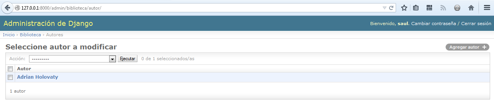

   **Figura 6-11.** Página de lista de cambios del modelo Autor.

.. Imagen actualizada

Podemos pulir este comportamiento por omisión agregando algunos campos
mas a la lista de cambios. Sería conveniente,  por ejemplo ver el correo
electrónico de cada autor y seria agradable poder ordenarlos por nombres y
apellidos.

Para hacer que esto suceda, necesitamos definir una clase ``ModelAdmin`` para el
modelo ``Autor``. Esta clase es la clave para personalizar la interfaz
administrativa y una de las cosas básicas que nos permite hacer,  es especificar
la  lista de campos que queremos visualizar en la lista de cambios.

Edita el archivo ``admin.py`` para realizar estos cambios.

.. parsed-literal::

    from django.contrib import admin
    from biblioteca.models import Editor, Autor, Libro

    **class AutorAdmin(admin.ModelAdmin):**
        **list_display = ('nombre', 'apellidos', 'email')**

    admin.site.register(Editor)
    **admin.site.register(Autor, AutorAdmin)**
    admin.site.register(Libro)

.. SL Tested ok

Esto es lo que hicimos:

* Creamos la clase ``AutorAdmin``. Esta clase, la cual es una subclase de
  ``django.contrib.admin.ModelAdmin``, se encarga de llevar a cabo la
  configuración para un modelo especifico de la interfaz administrativa.
  Únicamente especificamos una personalización --``list_display``,  la cual es
  una tupla de nombres de campos, que controla que columnas aparecen en la
  lista de cambios. Siempre y cuando estos nombres de campos, existan en el
  modelo.

* Alteramos la llamada a ``admin.site.register()``, para agregar ``AuthorAdmin``
  después de ``Autor``. Puedes leer esto como: "Registra el modelo ``Autor`` con
  las opciones de ``AuthorAdmin``."

  La función ``admin.site.register()`` toma un subclase ``ModelAdmin`` como un
  segundo argumento opcional. Si no necesitas especificar un segundo argumento
  (como en el caso de ``Editor`` y de ``Libro``) Django usara por omisión las
  opciones administrativas para el modelo.

Con estos cambios realizados, recarga la lista de cambios de autor y ahora
podrás ver tres columnas --Nombre, Apellidos y E-mail. En suma,  cada uno de
estas columnas se puede ordenar dando clic en la cabecera de la columna.
(Ve la figura 6-12)

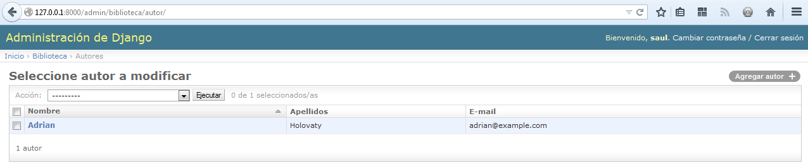

   **Figura 6-12.** La pagina de lista de cambios de autor, después de usar "list_display"

.. Imagen actualizada

Ahora, agreguémosle una barra de búsqueda. Agrega ``search_fields`` a la clase
``AutorAdmin``, así:

.. parsed-literal::

    class AuthorAdmin(admin.ModelAdmin):
        list_display = ('nombre', 'apellidos' 'email')
        **search_fields = ('nombre', 'apellidos')**

.. SL Tested ok

Recarga la pagina en tu navegador y podrás observar una barra de búsqueda en la
parte superior (Observa la Figura 6-9.). Acabamos de informarle a la lista de
cambios que incluya una barra de búsqueda, que se encargue de buscar en los
campos ``nombre`` y  ``apellidos`` de la base de datos. Como cualquier usuario
pudiera esperar, no distingue entre  mayúsculas y minúsculas y busca en ambos
campos, así que si buscamos la palabra ``"bar"`` podríamos encontrar un autor
llamado "Barney"  y también otro autor cuyo apellido sea "Hobarson".

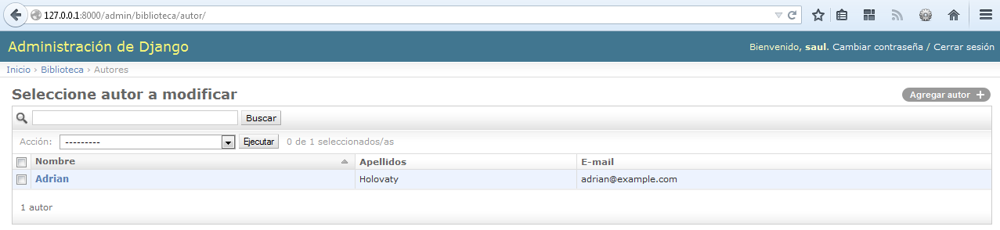

   **Figura 6-13.** Lista de cambios, después de agregar "search_fields".

.. Imagen actualizada

Después, podemos agregar algunos filtros al modelo ``Libro`` para mostrar la lista
de cambios, por fechas de publicaciones:

.. parsed-literal::

    from django.contrib import admin
    from biblioteca.models import Editor, Autor, Libro

    class AutorAdmin(admin.ModelAdmin):
        list_display = ('nombre', 'apellidos', 'email')
        search_fields = ('nombre', 'apellidos')

    **class LibroAdmin(admin.ModelAdmin):**
        **list_display = ('titulo', 'editor', 'fecha_publicacion')**
        **list_filter = ('fecha_publicacion',)**

    admin.site.register(Editor)
    admin.site.register(Autor, AutorAdmin)
    **admin.site.register(Libro, LibroAdmin)**

Aqui vemos porque usamos  diferentes tipos de opciones, primero hemos creado
una nueva a clase separada de ``ModelAdmin`` llamada ``LibroAdmin``. Primero
definimos ``list_display`` solo para mostrar la lista de cambios de forma más
agradable. Luego usamos ``list_filter``, la cual es una tupla de campos que se
usa para crear filtros a lo largo de la barra lateral, del lado derecho  de la
lista de cambios. Para los campos de fechas Django provee algunos atajos para
filtrar las listas, tal como  "Hoy", "Últimos 7 días", "Este mes" y "Este año"
--atajos que los desarrolladores de Django han encontrado muy útiles para casos
en lo que se necesite filtrar por fechas. La figura 6-14 muestra la forma en
que lucen.

.. figure:: graphics/chapter06/ejemplo_de_filtros.png
   :alt: Captura de pantalla de la lista de cambios de biblioteca, después de aplicar filtros con "list_filter".

   **Figura 6-14.** Lista de cambios de biblioteca,  después de aplicar filtros con "list_filter".

.. Imagen actualizada

Otra forma de ofrecer los filtros en fechas es usando la opción
``date_hierarchy`` así:

.. parsed-literal::

    class LibroAdmin(admin.ModelAdmin):
        list_display = ('titulo', 'editor', 'fecha_publicacion')
        list_filter = ('fecha_publicacion',)
        **date_hierarchy = 'fecha_publicacion'**

.. SL Tested ok

Con esto en su lugar, la lista de cambios obtiene una barra de navegación
desplegable en la parte superior de la lista, como se muestra en la figura 6-11.
Esta comienza con una lista desplegable de años, de meses y termina con los días
de forma individual.

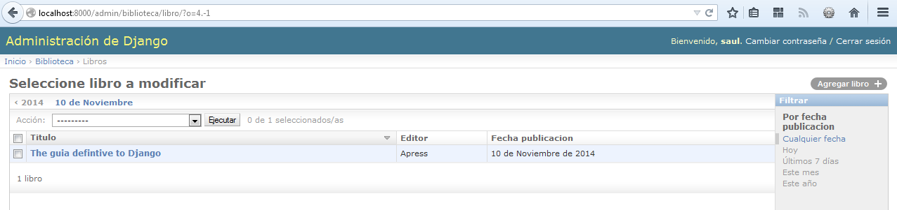

   **Figura 6-15.** Lista de cambios de biblioteca, después de agregar "date_hierarchy".

.. Imagen Actualizada

Observa que la opcion ``date_hierarchy`` toma una *cadena*, no una tupla porque
únicamente toma un campo de tipo fecha, el cual ha sido usado para crear la
jerarquía.

Finalmente, tambien podemos cambiar el ordenamiento por omisión de la página de
inicio de la lista de cambios, para que siempre sean ordenados en orden
descendiente de acuerdo a la fecha de publicación. Por omisión el orden de los
objetos en la lista de  cambios se da de acuerdo al orden especificado en el
modelo con ``ordering``  en la ``class Meta`` (La cual cubrimos en el capítulo 5)
--pero como aun no hemos especificado este valor ``ordering``, el ordenamiento es
aun indefinido.

.. parsed-literal::

    class LibroAdmin(admin.ModelAdmin):
        list_display = ('titulo', 'editor', 'fecha_publicacion')
        list_filter = ('fecha_publicacion',)
        date_hierarchy = 'fecha_publicacion'
        **ordering = ('-fecha_publicacion',)**

.. SL Tested ok

La opción ``ordering``  trabaja exactamente como lo hace en los modelos
dentro de la clase interna ``class Meta``, excepto que únicamente usa el primer
nombre de un campo en la lista. Solo pasa una tupla a la lista de nombres de
campos, y agrega un signo (-) al campo para usarlo en orden descendente.

Hasta aqui, hemos cubierto las principales opciones de la lista de cambios.
Usando estas opciones, puedes  crear interfaces  muy poderosas y listas para
producir y editar datos, agregando solo  algunas pocas líneas de código

Personalizar formularios de edición
-----------------------------------

Al igual que las listas de cambios que pueden ser hechas a la medida, los
formulario para edición pueden personalizarse de muchas maneras.

Primero, personalicemos los campos y la forma en que son ordenados. Por omisión
el orden de un campo en un forma o formulario de edición, corresponde al orden
en el que se haya definido en el modelo. Sin embargo podemos cambiar el
ordenamiento, usando la opción: ``fields`` en una subclase  de ``ModelAdmin``.

.. parsed-literal::

    class LibroAdmin(admin.ModelAdmin):
        list_display = ('titulo', 'editor', 'fecha_publicacion')
        list_filter = ('fecha_publicacion',)
        date_hierarchy = 'fecha_publicacion'
        ordering = ('-fecha_publicacion',)
        **fields = ('titulo', 'autores', 'editor', 'fecha_publicacion')**

.. SL Tested ok

Después de realizar estos cambios, la forma para editar libros, utilizara el
orden definido  con ``fields`` . Es más natural tener autores después del
título del libro. Aunque el orden de los campos dependerá de tu flujo de
trabajo y de la entrada de los datos que manejes. Cada forma de trabajo es diferente.

Otra cosa útil, la opción ``fields`` permite que *excluyas* ciertos campos de un
formulario. Solo deja fuera el campo que quieres excluir. Esto puede ser útil
si los usuarios administradores en quienes confías únicamente quieren editar
una parte de los  datos, o si una parte de los campos son cambiados desde fuera
digamos, mediante un proceso automático. Por ejemplo en la base de datos biblioteca,
podemos ocultar el campo ``fecha_publicacion`` para que no sea editable por los
usuarios.

.. parsed-literal::

    class LibroAdmin(admin.ModelAdmin):
        list_display = ('titulo', 'editor', 'fecha_publicacion')
        list_filter = ('fecha_publicacion',)
        date_hierarchy = 'fecha_publicacion'
        ordering = ('-fecha_publicacion',)
        **fields = ('titulo', 'autores', 'editor', 'portada')**

.. SL Tested ok

Como resultado, la forma para editar biblioteca,  no ofrece una forma para especificar
la fecha de publicación. Esto puede ser útil en algunos casos, digamos por
ejemplo que eres un editor que prefiere que sus autores no especifiquen la
fecha de publicación (Claro que esto, es solo un ejemplo hipotético.)

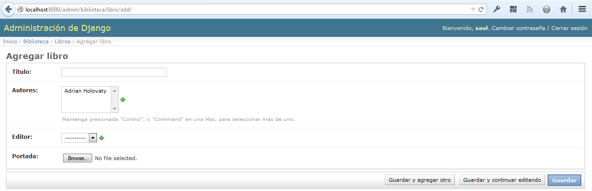

   **Figura 6-16.** Uso de "field" para mostrar y ocultar campos

De esta forma cuando un usuario sube el formulario sin el campo
``fecha_publicacion``, para agregar un libro, Django simplemente trata el campo
como ``None`` -- ya que el campo acepta valores nulos, que definimos con la
opción: ``null=True``, por lo que puede quedar en blanco.

Otro uso muy común para usar formularios personalizados, se da al usar campos
muchos a muchos. Tal como vimos en el formulario para editar libros, en la
interfaz administrativa, este cuenta con una caja de selección múltiple, que
representa un campo ``ManyToManyField``, el cual lógicamente usa un widget
HTML para la entrada de datos --sin embargo las caja de selección múltiple
puede dificultar su uso. Si quieres seleccionar múltiples objetos, tienes que
mantener presionada la tecla "control" o "comando" en Mac (el sitio de
administración inserta algunos fragmentos de texto en forma de ayuda que
explican esto), sin embargo esto se vuelve inmanejable cuando el campo contiene
centenares de opciones.

La solución es cambiar la disposición de la interfaz administrativa usando
``filter_horizontal``.  Agreguemos esto a ``LibroAdmin``  y veamos lo que
ocurre.

.. parsed-literal::

    class LibroAdmin(admin.ModelAdmin):
        list_display = ('titulo', 'editor', 'fecha_publicacion')
        list_filter = ('fecha_publicacion',)
        date_hierarchy = 'fecha_publicacion'
        ordering = ('-fecha_publicacion',)
        **filter_horizontal = ('autores',)**

(Si estas siguiendo esto interactivamente, nota que removimos la opción
``fields`` para restaurar todos los campos del formulario.)

Recarga el formulario para editar libros y podrás ver que ahora la sección de
"Autores" usa una interfaz elegante y un filtro en Java Script que permite
explorar a través de las opciones de forma dinámica, lo que permite encontrar
autores especificos y permite mover de  "Autores disponibles" a la
caja "Autores elegidos" y viceversa.

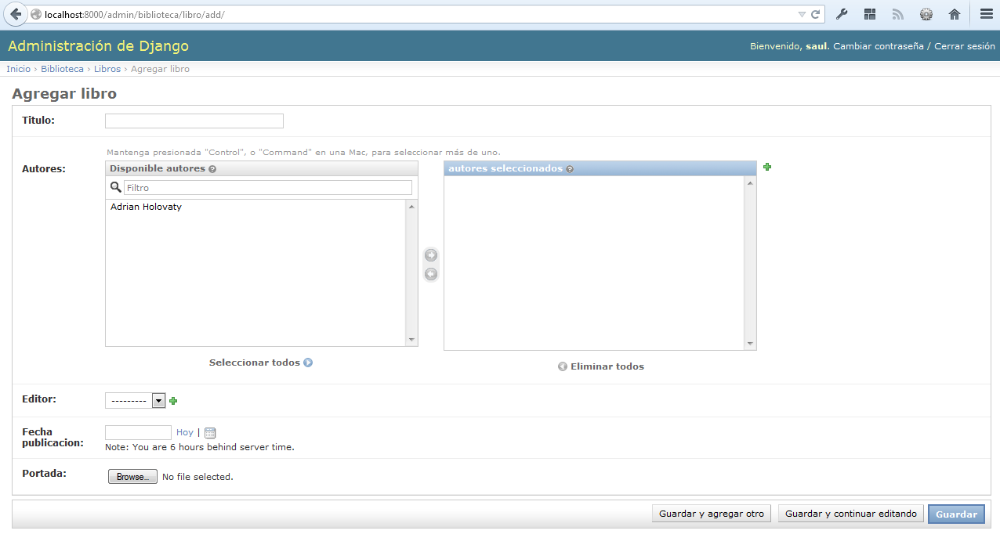

   **Figura 6-17.** Formulario para editar libros, después de agregar "filtro horizontal".

.. Imagen Actualizada

Recomendamos usar el filtro horizontal, ``filter_horizontal`` para cualquier
campo ``ManyToManyField`` que  contenga más de 10 objetos. Es más sencillo de
usar que el widget de selección múltiple. También puedes usar ``filter_horizontal``
en campos múltiples --solo especifica cada nombre en una tupla.

La clase ``ModelAdmin`` también soporta la opción filtro vertical, ``filter_vertical``.
La cual trabaja exactamente como ``filter_horizontal``, pero la interfaz Java Script
resultante, es una pila que contiene dos cajas verticales en lugar de una.
Todo es cuestión de gustos y necesidades.

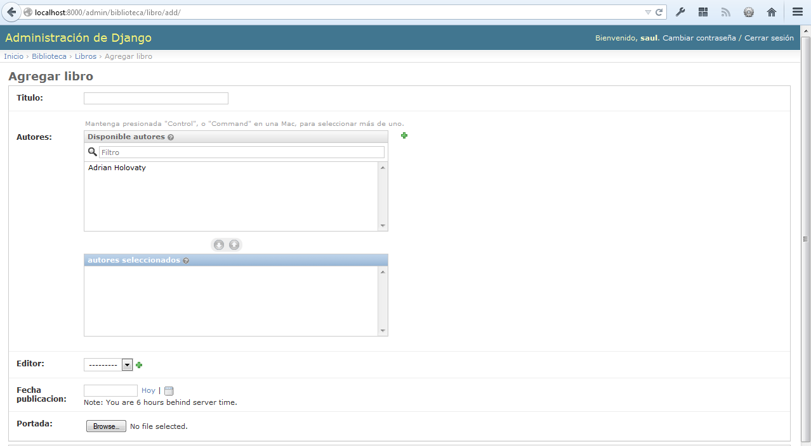

   **Figura 6-18.** Formulario para editar libros, después de agregar un filtro vertical.

Los filtros ``filter_horizontal`` y ``filter_vertical`` únicamente trabajan con
campos ``ManyToManyField`` no así con campos ``ForeignKey``. Por omisión la
interfaz administrativa usa simples cajas ``select``, para mostrar los campos
``ForeignKey``, pero al igual que con los campos ``ManyToManyField``, algunas
veces será necesario buscar la forma de no tener que seleccionar todos los
objetos relacionados,  ya que si nuestra base de datos incluye a millares de
editores, la forma para "Agregar libros" puede tardar un buen rato en cargarlos
a todos (lo que genera sobrecarga en la base de datos), ya que tendría que
cargar a cada editor para mostrar la caja ``<select>``.

La forma de corregir esto es usar una opción llamada ``raw_id_fields``.
Colocando en una tupla los nombres de los campos de el ``ForeignKey``, para
mostrarlos en la interfaz administrativa, dentro de una simple caja de texto
(``<input type="text">``) en lugar de ``<select>``.  Mira la figura 6-14.

.. parsed-literal::

    class LibroAdmin(admin.ModelAdmin):
        list_display = ('titulo', 'editor', 'fecha_publicacion')
        list_filter = ('fecha_publicacion',)
        date_hierarchy = 'fecha_publicacion'
        ordering = ('-fecha_publicacion',)
        filter_horizontal = ('autores',)
        **raw_id_fields = ('editor',)**

.. SL Tested ok

   **Figura 6-19.** El formulario para editar biblioteca, después de agregar "raw_id_fields"

.. admonition:: ¿Y ahora como escribo en esa caja?

    La base de datos identifica a cada editor con un ID (una clave primaria).
    Dado que los seres humanos no memorizamos normalmente identificadores (ID)
    de las base de  datos, existe un icono con forma de lupa que permite, con un
    simple clic, desplegar una ventana flotante, en la cual se pueden seleccionar
    al editor para agregarlo a la forma. Por lo que no necesitas escribir
    directamente en la caja.

Personalizar la apariencia de la interfaz de administración
===========================================================

Claramente, tener la frase "Administración de Django" en la cabecera de cada
página de administración es ridículo. Es sólo un texto de relleno que es fácil
de cambiar, usando el sistema de plantillas de Django. El sitio de
administración de Django está propulsado por el mismo Django, sus interfaces
usan el sistema de plantillas propio de Django. (El sistema de plantillas de
Django fue presentado en él :doc:`capítulo4<chapter04>`.)

Como explicamos en él :doc:`Capítulo4<chapter04>`, la configuración de ``TEMPLATE_DIRS``
especifica una lista de directorios a verificar cuando se cargan plantillas
Django. Para personalizar las plantillas del sitio de administración,
simplemente copia el conjunto relevante de plantillas de la distribución Django
en uno de los directorios apuntados por ``TEMPLATE_DIRS``.

El sitio de administración  muestra "Administración de Django" en la cabecera
porque esto es lo que se incluye en la plantilla ``admin/base_site.html``.
Por defecto, esta plantilla se encuentra en el directorio de plantillas de
administración de Django, ``django/contrib/admin/templates``, que puedes
encontrar buscando en tu directorio ``site-packages`` de Python, o donde sea que
Django fue instalado. Para personalizar esta plantilla ``base_site.html``, copia
la original dentro de un subdirectorio llamado ``admin`` dentro de cualquier
directorio que este usando ``TEMPLATE_DIRS``. Por ejemplo, si tu directorio
``TEMPLATE_DIRS`` incluye ``"/home/misplantillas"``, entonces copia
``django/contrib/admin/templates/admin/base_site.html`` al directorio
``/home/misplantillas/admin/base_site.html``. No te olvides del subdirectorio
``admin``.

Luego, sólo edita el nuevo archivo ``admin/base_site.html`` para reemplazar el
texto genérico de Django, por el nombre de tu propio sitio, tal como lo quieres
ver.

Nota que cualquier plantilla por defecto de Django Admin puede ser reescrita.
Para reescribir una plantilla, haz lo mismo que hicimos con ``base_site.html``:
copia esta desde el directorio original a tu directorio personalizado y haz los
cambios sobre esta copia.

Puede que te preguntes cómo, si ``TEMPLATE_DIRS`` estaba vació al principio,
Django encuentra las plantillas por defecto de la interfaz de administración. La
respuesta es que, por defecto, Django automáticamente busca plantillas dentro
del subdirectorio ``templates/`` de cada paquete de aplicación como alternativa.
Mira él :doc:``capítulo 10 <chapter10>`` para obtener más información sobre cómo
funciona esto.

Personalizar la página índice del administrador
===============================================

En una nota similar, puedes tener la intención de personalizar la apariencia (el
*look & feel*) de la página principal del administrador. Por defecto, aquí se
muestran todas las aplicaciones, de acuerdo a la configuración que tenga
``INSTALLED_APPS``, ordenados por el nombre de la aplicación. Quizás quieras,
por ejemplo, cambiar el orden para hacer más fácil ubicar determinada aplicación
que estás buscando.  Después de todo, la página inicial es probablemente la más
importante de la interfaz de administración, y debería ser fácil utilizarla.

La plantilla para personalizarla es ``admin/index.html``. (Recuerda copiar
``admin/index.html`` a tu directorio de plantillas propio como en el ejemplo
previo). Edita el archivo, y verás que usa una etiqueta llamada ````. Esta etiqueta devuelve todas las
aplicaciones Django instaladas. En vez de usar esta etiqueta, puedes incluir
vínculos explícitos a objetos específicos de la manera que creas más
conveniente.  Si el código explícito en una plantilla no te satisface, puedes ver
él :doc:`Capítulo 10<chapter10>` para encontrar detalles sobre cómo implementar
tu propias etiquetas de plantillas.

Para detalles completos sobre la personalización del sitio de administración de
Django, mira él :doc:`Capítulo 17<chapter17>`.

Usuarios, Grupos y Permisos
---------------------------

Desde que estás identificado como un superusuario, tienes acceso a crear, editar
y eliminar cualquier objeto. Sin embargo, la interfaz de administración tiene un
sistema de permisos de usuario que puedes usar para darle a otros usuarios
acceso limitado a las partes de la interfaz que ellos necesitan.

Puedes editar estos usuarios y permisos a través de la interfaz de
administración, como si fuese cualquier otro objeto. Los vínculos a los modelos
``Usuarios`` y ``Grupos`` se encuentran en el índice de la página principal
junto con todo el resto de los modelos que haz definido.

Los objetos ``usuario`` tienen  campos estándar: nombre de usuario,
contraseña, dirección de correo, y nombre real que puedes esperar, seguidos de
un conjunto de campos que definen lo que el usuario tiene permitido hacer en la
interfaz de administración. Primero, hay un conjunto de tres opciones
seleccionables:

* La opción **Activo** define si el usuario está activo en todo sentido. Si
  está desactivada, el usuario no tendrá acceso a ninguna URL que requiera
  identificación.

* La opción **Es staff**  indica que el usuario está habilitado a ingresar a
  la interfaz de administración (por ejemplo, indica que el usuario es
  considerado un miembro del staff en tu organización). Como el mismo
  sistema de usuarios puede usarse para controlar el acceso al sitio público
  (es decir, sitios restringidos no administrativos. Mira él
  :doc:`capítulo 12<chapter12>`.), esta opción diferencia entre usuarios
  públicos y administradores.

* La opción **es superusuario** da al usuario completo e irrestricto acceso a
  todos los elementos de la interfaz de administración, y sus permisos
  regulares son ignorados.

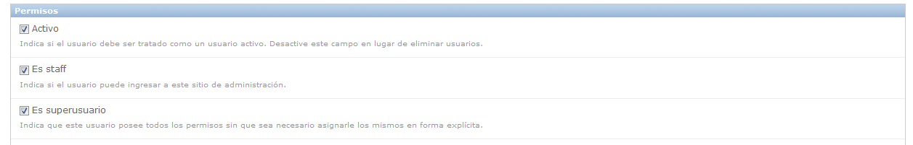

   **Figura 6-20.** Tipos de permisos.

Los administradores "normales" -- esto es, activos, no superusuarios y miembros
del staff -- tienen accesos que dependen del conjunto de permisos concedidos.
Cada objeto editable a través de la interfaz de administración tiene tres
permisos: un permiso de *crear* [#]_, un permiso de *modificar* [#]_, y un
permiso de *eliminar* [#]_. Lógicamente, asígnando permisos a un usuario
habilitas que este acceda a realizar la acción que el permiso describe.

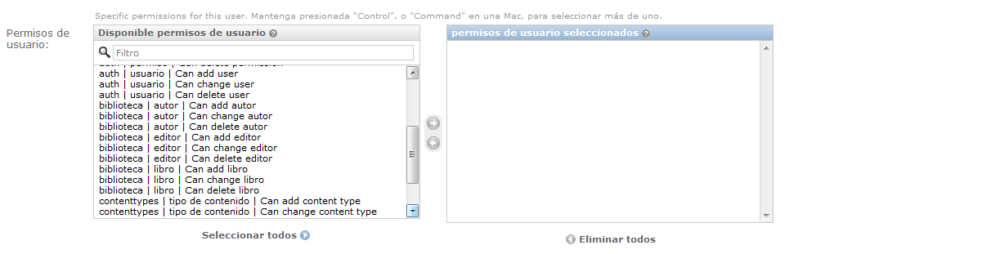

   **Figura 6-21.** Asignar permisos.

.. admonition:: Nota:

    El acceso a editar usuarios y permisos también es controlado por el sistema
    de permisos.  Si le das a alguien el permiso de editar usuarios, ¡estará en
    condiciones de editar sus propios permisos, que probablemente no es lo que
    querías!

También puedes asígnar usuarios a grupos. Un *grupo* es simplemente un conjunto
de permisos a aplicar a todos los usuarios de ese grupo. Los grupos son útiles
para otorgar idénticos permisos a un gran número de usuarios.

Cuándo y porqué usar la interfaz de administración
==================================================

Pensamos que la interfaz de administración de Django es bastante espectacular.
De hecho, diríamos que es una de sus *killer feautures*, o sea, una de sus
características sobresalientes. Sin embargo, a menudo nos preguntan sobre "casos
de uso" para la interfaz de administración (¿Cuándo debemos usarlo y por qué?).
A lo largo de los años, hemos descubierto algunos patrones donde pensamos que
usar la interfaz de administración resulta útil.

Obviamente, es muy útil para modificar datos (se veía venir). Si tenemos
cualquier tipo de tarea de introducción de datos, el administrador es difícil de
superar. Sospechamos que la gran mayoría de lectores de este libro tiene una
horda de tareas de este tipo.

La interfaz de administración de Django brilla especialmente cuando usuarios no
técnicos necesitan ser capaces de ingresar datos; ese es el propósito detrás de
esta característica, después de todo. En el periódico donde Django fue creado
originalmente, el desarrollo de una característica típica online -- un reporte
especial sobre la calidad del agua del acueducto municipal, supongamos
-- implicaba algo así:

* El periodista responsable del artículo se reúne con uno de los
  desarrolladores y discuten sobre la información disponible.

* El desarrollador diseña un modelo basado en esta información y luego abre
  la interfaz de administración para el periodista.

* Mientras el periodista ingresa datos a Django, el programador puede
  enfocarse en desarrollar la interfaz accesible públicamente (¡la parte
  divertida!).

En otras palabras, la razón de ser de la interfaz de administración de Django es
facilitar el trabajo simultáneo de productores de contenido y programadores.

Sin embargo, más allá de estas tareas de entrada de datos obvias, encontramos
que la interfaz de administración es útil en algunos otros casos:

* *Inspeccionar modelos de datos*: La primer cosa que hacemos cuando hemos
  definido un nuevo modelo es llamarlo desde la interfaz de administración e
  ingresar algunos datos de relleno. Esto es usual para encontrar errores de
  modelado; tener una interfaz gráfica al modelo revela problemas
  rápidamente.

* *Gestión de datos adquiridos*: Hay una pequeña entrada de datos asociada a
  un sitio como ``http://chicagocrime.org``, puesto que la mayoría de los
  datos provienen de una fuente automática. No obstante, cuando surgen
  problemas con los datos automáticos, es útil poder entrar y editarlos
  fácilmente.

¿Qué sigue?
===========

Hasta ahora hemos creado algunos modelos y configurado una interfaz de primera
clase para modificar datos. En él :doc:`próximo capítulo<chapter07>`, nos
meteremos en el verdadero guiso del desarrollo Web: creación y procesamiento de
formularios.

.. [#] \N. del T.: *change list* es el nombre que recibe en inglés
.. [#] \N. del T.: *edit forms* es el nombre que recibe en inglés
.. [#] \N. del T.: En el control de selección de permisos aparece como *Can add*
.. [#] \N. del T.: *Can change*
.. [#] \N. del T.: *Can delete*

