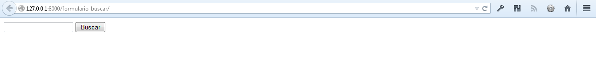
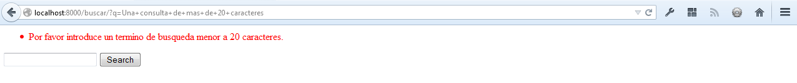
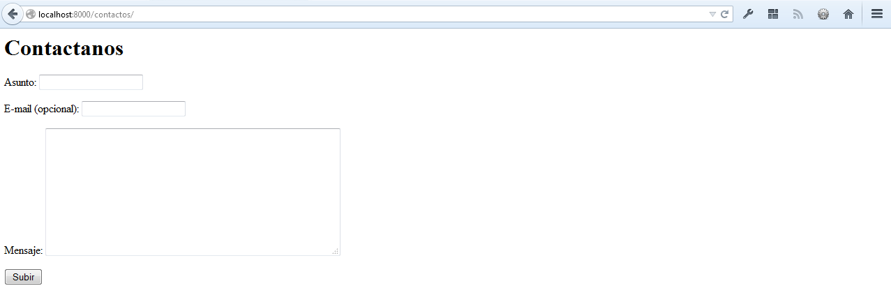
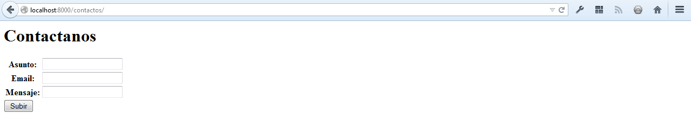
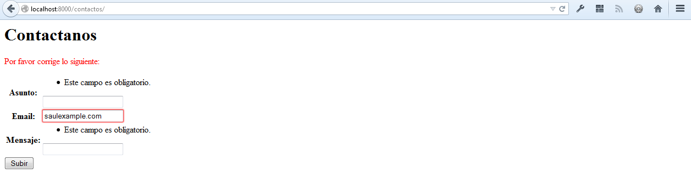
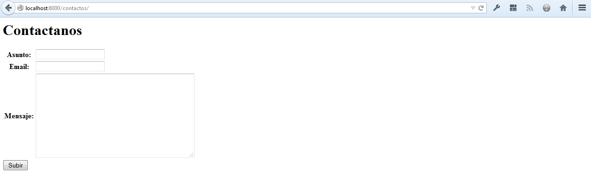
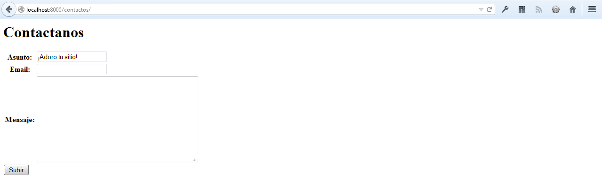
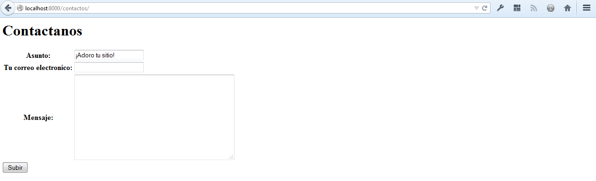
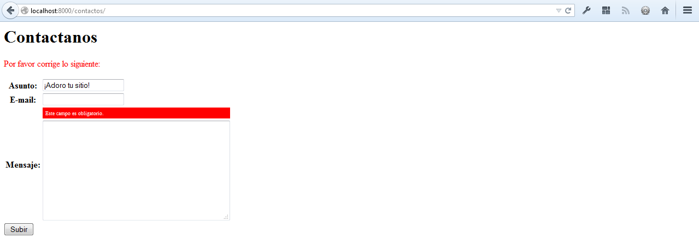

=======================
Capítulo 7: Formularios
=======================

**Los formularios en HTML**, son la columna vertebral de los sitios Web
interactivos, los encontramos como simples caja de búsquedas como los que usa
Google o como los inconfundibles formularios para subir comentarios siempre
presentes en la mayoría de blogs, pero también existen complejas interfaces
que permiten la entradas de datos interactivamente y de forma personalizada,
y es que los formularios son una necesidad básica en la mayoria de aplicaciones
Web modernas, que necesitan recopilar datos a través de  internet. Este
capítulo cubre  la manera de usar Django para recopilar datos a través de
formularios, validarlos y hacer algo útil con ellos. A lo largo de este
capítulo nos enfocaremos en conocer los objetos ``HttpRequest`` y los objetos
``Form``

Comenzaremos creando un simple formulario de búsquedas "a mano", observando
cómo manejar los datos suministrados al navegador. Y a partir de ahí, pasaremos
al uso del *framework* de formularios que viene incluido en Django.

Obteniendo datos de los objetos "Request"
=========================================

Introducimos los objetos ``HttpRequest``  en el :doc:`capítulo 3<chapter03>`,
cuando cubrimos las funciones vista, pero no tuvimos mucho que decir acerca de
ellos en aquel momento. Recuerdas que cada función de vista toma un objeto
``HttpRequest`` como primer parámetro, tal como en la vista ``hola()`` que
construimos::

    from django.http import HttpResponse

    def hola(request):
        return HttpResponse("Hola mundo")

Los objetos ``HttpRequest``, tal como la variable ``request``, contienen un numero
de atributos y métodos interesantes  con los cuales deberías familiarizarte, a
fin de saber cómo utilizarlos lo mejor posible. Puedes utilizar estos atributos
para conseguir información acerca de las peticiones que recibes (por ejemplo: el
usuario o el navegador que está cargando la pagina en tu sitio creado con
Django), al mismo tiempo que la función vista es ejecutada.

Información acerca de las URL
-----------------------------

Los objetos ``HttpRequest`` contienen algunas piezas de información acerca de
la URL requerida.

.. table:: Tabla 7.1 Información acerca de las URL

  ===========================   ====================================  ========================
  Atributos o Métodos           Descripción                           Ejemplo
  ===========================   ====================================  ========================
  ``request.path``              La ruta completa, no incluye el       ``"/hola/"``
                                dominio pero incluye, la barra
                                inclinada.

  ``request.get_host()``        El host (ejemplo: tu "dominio," en    ``"127.0.0.1:8000"`` o
                                lenguaje común).                      ``"www.example.com"``

  ``request.get_full_path()``   La ``ruta`` (path), mas una cadena
                                de consulta (si está disponible).     ``"/hola/?print=true"``

  ``request.is_secure()``       ``True`` si la petición fue hecha
                                vía  HTTPS. Si no, ``False``.         ``True`` o ``False``
  ===========================   ====================================  ========================

Siempre usa estos atributos/métodos en lugar de codificar en crudo tus URLs en
tu vistas. Esto hace más flexible tu código y mas fácil de usar en otros lugares.
Un simple ejemplo::

    # MAL!
    def vista_actual_url(request):
        return HttpResponse("Bienvenido a mi pagina en /pagina_actual/")

    # BIEN
    def vista_actual_url(request):
        return HttpResponse("bienvenido a mi pagina en  %s" % request.path)

Más información acerca de las peticiones o Request
--------------------------------------------------

``request.META``  es un diccionario Python , que contiene todas las cabeceras
HTTP disponibles para la petición dada --Incluyendo la dirección IP y el
agente-- Generalmente el nombre y la versión del navegador Web. Observa que
la lista completa de cabeceras disponibles depende de las cabeceras que el
usuario envía y  las cabeceras que el servidor Web seleccione. Algunas de las
claves mas comúnes están disponibles como diccionarios y son:

* ``HTTP_REFERER`` -- La respectiva URL, en dado caso. (Observa la forma en que
  se escribe  ``REFERER``.)
* ``HTTP_USER_AGENT`` -- El navegador del usuario en forma de cadena, cualquiera
  que sea.  Esta es algo si: ``"Mozilla/5.0 (X11; U; Linux i686; fr-FR; rv:1.8.1.17)
  Gecko/20080829 Firefox/2.0.0.17"``.
* ``REMOTE_ADDR`` -- La dirección IP de el cliente, por ejemplo:
  ``"12.345.67.89"``. (Si la petición ha pasado a través de un proxi,  entonces
  puede retornar una lista separada por comas, conteniendo  las direcciones IP,
  por ejemplo: ``"12.345.67.89,23.456.78.90"``.)

Observa que ``request.META`` es básicamente un diccionario Python, que contiene
todas las cabeceras HTTP  disponibles, las que dependen del navegador y del
servidor que se este usando en ese determinado momento, por lo que obtendrás una
excepción ``KeyError``  si intentas acceder a una clave que no existe. (Además las
cabeceras HTTP son datos *externos* -- que son subidos por los navegadores de los
usuarios, por lo que no deberías confiar en ellos, así que siempre diseña tus
aplicaciónes para que fallen airadamente,  si una cabecera en particular esta
vacía o no existe.) Aprende a usar las clausulas ``try``/``except`` o el método
``get()`` para manejar los casos en que alguna de  estas claves estén indefinidas,
para evitar errores::

    # MAL!
    def mostrar_navegador(request):
        ua = request.META['HTTP_USER_AGENT']  # ¡Podría lanzar: KeyError!
        return HttpResponse("Tu navegador es %s" % ua)

    # BIEN (VERSION 1)
    def mostrar_navegador(request):
        try:
            ua = request.META['HTTP_USER_AGENT']
        except KeyError:
            ua = 'unknown'
        return HttpResponse("Tu navegador es %s" % ua)

    # BIEN (VERSION 2)
    def mostrar_navegador2(request):
        ua = request.META.get('HTTP_USER_AGENT', 'unknown')
        return HttpResponse("Tu navegador es %s" % ua)

Te animamos a escribir pequeñas  vistas como estas, que muestren todos los datos
``request.META``,  que puedas conseguir para familiarizarte con los conceptos.
La vista puede empezar así::

    def atributos_meta(request):
        valor = request.META.items()
        valor.sort()
        html = []
        for k, v in valor:
            html.append('<tr><td>%s</td><td>%s</td></tr>' % (k, v))
        return HttpResponse('<table>%s</table>' % '\n'.join(html))

Como ejercicio trata de convertir la vista anterior, para que use el sistema de
plantillas en lugar de incrustar el código HTML en la vista. También trata de
agregar ``request.path``  y los otros métodos ``HttpRequest`` que vimos en la
sección anterior.

Información acerca de los datos recibidos
-----------------------------------------

Mas allá de los metadatos básicos obtenidos de las peticiones Web,  los objetos
``HttpRequest`` poseen dos atributos mas, que contienen información recibida de los
usuarios: ``request.GET`` y ``request.POST``. Ambos atributos son como objetos
tipo diccionarios que permiten el acceso a datos ``GET`` y ``POST``

.. admonition:: ¿Objetos como diccionarios?

    Cuando decimos  que ``request.GET`` y ``request.POST`` son como objetos
    tipo diccionario ("dictionary-like"), lo que tratamos de decirte es que se
    comportan como diccionarios estándar de Python, pero técnicamente en el
    fondo no son diccionarios. Por ejemplo ``request.GET`` y ``request.POST``
    contienen ambos,  métodos  como ``get()``, ``keys()`` y ``values()``, por
    lo que puede iterarse sobre sus claves usando ``for key in request.GET``.

    ¿Entonces porque la distinción? bueno, porque ambos ``request.GET`` y
    ``request.POST`` contienen métodos adicionales, que los diccionarios
    normales no, llegaremos a eso dentro de poco.

    Puede ser que encuentres el termino similar a "file-like objects" -- Objetos
    Python que contienen algunos métodos básicos como ``read()``, lo que
    le permite actuar a un  determinado archivo como un "objeto".

Los datos ``POST``  generalmente son recibidos de formularios (``<form>``) HTML,
mientras que los datos ``GET`` son enviados a los formularios (``<form>``) o
mediante una cadena de consulta a una página URL.

Tu primer formulario creado con Django
======================================

Continuando con el ejemplo en curso sobre: libros, autores y editores, vamos a
crear un formulario, mediante una vista muy simple que permita a los usuarios
buscar libros en la base de datos mediante el titulo.

Generalmente, se necesitan dos partes para desarrollar un formulario: la
interfaz de usuario en HTML y la vista que procesa los datos obtenidos o subidos
por los usuarios. La  primera parte es sencilla; solo necesitamos crear una vista
que muestre el formulario de busqueda::

  def formulario_buscar(request):
      return render(request, 'formulario_buscar.html')

Tal como aprendimos en el :doc:`capítulo 3<chapter03>`, la vista puede estar
en cualquier lugar de la ruta de búsqueda de Python. Pero por convensión esta
deve de ir en una vista, por lo que la colocamos en ``biblioteca/views.py``.

Acompañada de una plantilla ``formulario_buscar.html``, que deve ubicarse en
un directorio llamado ``templates``, dentro del directorio de la aplicación
``biblioteca``, en el mismo nivel que el directorio ``migrations``:

.. code-block:: html

  <html>
  <head>
      <title>Buscar</title>
  </head>
  <body>
      <form action="/buscar/" method="get">
          <input type="text" name="q">
          <input type="submit" value="Buscar">
      </form>
  </body>
  </html>

El patrón para la URL deve de ir en el archivo ``biblioteca/urls.py``  asi::

    from biblioteca  import views

    urlpatterns = [
        # ...
        url(r'^formulario-buscar/$', views.formulario_buscar),
        # ...
    ]

(Observa que hemos importando el modulo ``views`` directamente, en lugar de
hacer algo como esto: ``from biblioteca.views import buscar`` , porque lo
anterior es mas elegante y entendible. Veremos la forma de aprovechar este
tipo de importaciónes en más detalle,  en el :doc:`capítulo 8<chapter08>`.)

Ahora, ejecuta ``manage runserver`` o recarga la pagina y visita:
http://127.0.0.1:8000/formulario-buscar/, donde veras una  interfaz de búsqueda,
bastante simple, construida mediante un sencillo formulario:



   **Figura 7-1.** Ejemplo de un formulario de busquedas.

Trata de subir el formulario, y solo conseguirás  un error 404. El formulario
que apunta a la URL ``/buscar/``, aun no ha sido implementado. Reparemos eso
con una segunda funcion de vista y su respectiva URLconf:

.. snippet::
   :filename: urls.py

    urlpatterns = [
        # ...
        url(r'^formulario-buscar/$', views.formulario_buscar),
        url(r'^buscar/$', views.buscar),
        # ...
    ]

.. snippet::
   :filename: views.py

    def buscar(request):
        if 'q' in request.GET:
            mensaje = 'Estas buscando: %r' % request.GET['q']
        else:
            mensaje = 'Haz subido un formulario vacio.'
        return HttpResponse(mensaje)

.. SL Tested ok

Por el momento, esto exhibe meramente el término de búsqueda del usuario, así
que podemos estar seguros, de que los datos están siendo enviado a Django
correctamente, y puede darnos una ligera percepción sobre la manera en que el
término de búsqueda atraviesa el sistema.

En resumen:

1. El formulario HTML (``<form>``) define una variable ``q``. Cuando esta es
   subida el valor de ``q`` es enviado mediante el metodo ``GET`` a la URL
   ``/buscar/``.

2. La vista de Django maneja la URL ``/buscar/`` y tiene acceso al valor de
   ``q`` en la petición ``request.GET``.

Una cosa  que es importante precisar aquí, es que explícitamente verificamos
que ``'q'`` exista en  ``request.GET``. Como precisamos en la sección anterior
con las peticiones ``request.META``, no deberías confiar en nada que sea subido
por los usuarios o incluso asume que no subieron nada en primer lugar. Si no
agregas esta verificación, los formularios vacios lanzaran un error del tipo
``KeyError`` en la vista::

    # MAL!
    def buscar_no_hagas_esto(request):
        #¡Las siguientes lineas lanzan un error "KeyError" si no se envia 'q'!
        mensaje = 'Estas buscando: %r' % request.GET['q']
        return HttpResponse(mensaje)

.. SL Tested ok


.. admonition:: Parámetros de cadenas de consulta.

    Porque los datos ``GET`` se pasan en cadenas de  consultas  (por ejemplo:
    ``/buscar/?q=django``) puedes usar ``request.GET`` para acceder a las
    variables de las cadenas de consulta. En el capítulo 3,  "Introducción
    a los patrones URLconfs de Django", comparamos las URL bonitas contra las
    tradicionales URLs de PHP/Java tal como  ``/tiempo/mas?horas=3`` y dijimos
    que te mostraríamos como hacerlo más adelante en el capítulo 7. Ahora
    ya sabes cómo acceder a cadenas de parámetros en las vistas (tal como el
    ejemplo ``horas=3``) --Solo usa ``request.GET``.

Los datos ``POST`` trabajan de la misma forma que lo datos ``GET`` -- solo usa
``request.POST`` en lugar de ``request.GET``. ¿Entonces cual es la diferencia
entre ``GET`` y ``POST``? Usa ``GET`` cuando el acto de subir un formulario
solo sea para "pedir" datos. En cambio usa  ``POST`` siempre que el acto de
subir el formulario tenga efectos secundarios -- *cambiando* datos, enviando
un e-mail o algo que vaya más allá de simplemente *mostrar* datos. En el
ejemplo de búsquedas de el ejemplo, estamos usando ``GET`` porque la consulta no
cambia ningún dato en nuestro servidor. (Consulta
http://www.w3.org/2001/tag/doc/whenToUseGet.html  si quieres aprender más sobre
las peticiones ``GET`` and ``POST``.)

Ahora que hemos verificado que el metodo ``request.GET`` es pasado apropiadamente,
anclemos la consulta de búsquedas a la base de datos.(otra vez en ``views.py`` y
rescribamos la funcion buscar)::

    from django.http import HttpResponse
    from django.shortcuts import render
    from biblioteca.models import Libro

    def buscar(request):
        if 'q' in request.GET and request.GET['q']:
            q = request.GET['q']
            libros = Libro.objects.filter(titulo__icontains=q)
            return render(request, 'resultados.html',
                {'libros': libros, 'query': q})
        else:
            return HttpResponse('Por favor introduce un termino de búsqueda.')

Un par de notas sobre lo que hicimos:

* Aparte de checar que ``'q'`` exista en ``request.GET``,  nos aseguramos
  que ``request.GET['q']`` no sea una cadena vacía antes de pasarle la
  consulta a la base de datos.

* Estamos  usando ``Libro.objects.filter(titulo__icontains=q)`` para consultar
  en la tabla libros, todos los libros que incluyan en el titulo los datos
  proporcionados en  la consulta, ``icontains`` es un tipo de búsqueda (como
  explicamos en el capítulo 5 y el apéndice B) en la que no se distinguen
  mayúsculas de minúsculas (*case-insensitive*), y que internamente usa el
  operador ``LIKE`` de SQL en la base de datos. La declaración puede ser
  traducida como "Obtener todos los libros que contengan ``q``"

  Esta es una forma muy simple para buscar libros. No recomendamos usar
  una simple consulta ``icontains`` en bases de datos muy grandes en producción
  ya que esto puede ser muy lento. (En el mundo real,  es mejor usar un sistema
  de búsqueda personalizado de cierto tipo. Busca en la web  *proyectos
  libres de sistemas de búsquedas de texto* para que te des una idea de las
  posibilidades.)

* Pasamos ``libros``, como una lista de objetos ``Libro`` a la plantilla.
  El código de la plantilla ``resultados.html``  debe incluir algo como esto:

.. code-block:: html+django

    <p>Estas buscado: <strong>{{ query }}</strong></p>

    
        <p>Libros encontrados: {{ libros|length }} libro{{ libros|pluralize }}.</p>
        <ul>
            
            <li>{{ libros.titulo }}</li>
            
        </ul>
    
        <p>Ningun libro coincide con el criterio de busqueda.</p>
    

Observa que estamos usando el filtro de plantillas ``pluralize``, el cual
apropiadamente  agrega en la salida la "s", basado en el número de libros
encontrados.

Mejorando la forma de manejar un formulario
===========================================

En los capítulos anteriores te mostramos la forma más simple en la que podría
trabajar un formulario. Ahora te mostraremos algunos problemas que pueden surgir
y la manera de solucionarlos.

Primero,  la forma en que la vista ``buscar()`` maneja las consultas vacías es
pobre --solo mostramos un mensaje ``"Por favor introduce un termino de búsqueda."``
lo que requiere que el usuario, tenga que dar clic de nuevo en el botón para
regresar su navegador a la pagina de busquedas. Esto es horrible y poco profesional,
si implementas algo así, tus privilegios Django serán revocados.

Sería mucho mejor volver a mostrar el formulario con los errores resaltados, para
que el usuario pueda intentar nuevamente rellenarlo. La forma más fácil de hacer
esto, es renderizando la plantilla otra vez, así:

.. parsed-literal::

    from django.http import HttpResponse
    from django.shortcuts import render
    from biblioteca.models import Libro

    def formulario_buscar(request):
        return render(request, 'formulario_buscar.html')

    def buscar(request):
        if 'q' in request.GET and request.GET['q']:
            q = request.GET['q']
            libros = Libro.objects.filter(titulo__icontains=q)
            return render(request, 'resultados.html',
                {'libros': libros, 'query': q})
        else:
            **return render(request, 'resultados.html', {'error': True})**

(Observa que hemos incluido la vista  ``formulario_buscar()``, para que puedas observar
ambas vistas en un solo lugar.)

También hemos mejorado la vista ``buscar()`` para  renderizar la plantilla
``resultados.html`` otra vez, si la consulta está vacía. Ya que necesitamos
mostrar los mensajes de errores en la plantilla, hemos pasado la variable ``error``
a la plantilla. Ahora edita ``formulario_buscar.html`` y checa la variable
``error`` que hemos agregado:

.. parsed-literal::

    <html>
    <head>
        <title>Buscar</title>
    </head>
    <body>
        ****
            **<p style="color: red;">Por favor introduce un termino de busqueda.</p>**
        ****
        <form action="/buscar/" method="get">
            <input type="text" name="q">
            <input type="submit" value="Buscar">
        </form>
    </body>
    </html>

.. SL Tested ok

Con este cambio en su lugar, tenemos una mejor aplicación, pero ahora nos
preguntamos ¿Es realmente necesaria una vista dedicada ``formulario_buscar()``? Tal
y como están las cosas, una petición a una URL ``/buscar/`` (sin parámetros
``GET``) mostrara un formulario vacio (pero sin errores). Podemos remover la
vista ``formulario_buscar()``, junto con los patrones URL asociados, a si como cambiar
la vista ``buscar()`` para que esconda el mensaje de error cuando alguien visite
``/buscar/`` sin parameters  ``GET``::

    def buscar(request):
        error = False
        if 'q' in request.GET:
            q = request.GET['q']
            if not q:
                error = True
            else:
                libros = Libro.objects.filter(titulo__icontains=q)
                return render(request, 'resultados.html',
                    {'libros': libros, 'query': q})
        return render(request, 'formulario_buscar.html',
            {'error': error})

.. SL Tested ok

Con esta vista actualizada, cuando un usuario visita ``/buscar/`` sin
parámetros ``GET``, el formulario de búsqueda no mostrara los mensajes de error.
Si un usuario trata de subir un formulario con un valor vacio para ``'q'``,
el formulario de búsqueda mostrara el mensaje de error en letras rojas. Y
finalmente si un usuario sube un formulario con una cadena de consulta -- es decir
con valores no vacios para ``'q'``,  se mostraran los resultados de la búsqueda.

Podemos realizar una mejora final para nuestra aplicación, removiendo un poco de
redundancia. Ahora que hemos comenzado a refinar las dos vistas y las URLs en
una sola llamada ``/buscar/``, que manejara el despliegue y el formulario de
búsquedas y tambien mostrara los resultados, por lo que el formulario en HTML en
la plantilla ``formulario_buscar.html`` no necesita que se incruste el código en
la URL, en lugar de hacer esto::

   <form action="/buscar/" method="get">

Podemos cambiarlo por esto::

    <form action="" method="get">

``action=""`` significa "Envía el formulario con la misma URL a la pagina
actual". Con este cambio realizado, no tienes que recordar cambiar ``action``
cada vez que necesites enlazar la vista ``buscar()`` a otra URL.

Validación Simple
=================

Nuestro ejemplo de búsquedas es razonablemente simple, especificamente hablando
en términos de validación  de datos, ya que solamente nos aseguramos que las
consultas en las búsquedas no estén vacías. Muchos formularios en HTML incluyen
niveles de validación más complejos, que van más allá de asegurarse que los
valores no estén  vacios. Todos hemos visto mensajes de error en sitios Web
como estos.

* "Por favor introduce una dirección de correo electrónica valida". 'foo' no es
  una dirección de correo electrónica.
* "Por favor introduce un código postal valido de 5 dígitos". '123 no es un
  código postal valido'
* "Por favor introduce una  fecha valida en el formato YYYY-MM-DD."
* "Por favor introduce una contraseña que contenga al menos 8 caracteres y
  que contenga al menos un numero".

.. admonition:: Una nota sobre validación usando Java Script

    Este tema va mas allá del alcance de este libro, pero puedes usar Java Script
    para validar datos del lado del cliente, directamente en el navegador. Pero
    ten cuidado: incluso si haces esto, también *debes* de validar los datos de
    el lado del servidor.  Algunas personas pueden tener Java Script desactivado
    y algunos usuarios maliciosos pueden subir en crudo, datos no validos
    directamente al manejador de formularios, para ver que daños pueden causar
    sus travesuras.

    No hay nada que hacer en estos casos, con excepción de *siempre* validar
    los datos enviados por los usuarios de el lado del servidor (Por ejemplo en
    las vista de Django). Debes pensar en usar la validación en Java Script como
    una característica extra de usabilidad, no como la única manera de
    validación.

Bien, ajustemos la vista ``buscar()`` para que valide términos de búsqueda que
contengan como máximo 20 caracteres o menos. (Para efectos del ejemplo, digamos
que los términos largos pueden hacer las consultas muy lentas.) ¿Cómo podemos
hacer eso? La cosa más simple posible seria pensar en incrustar directamente la
lógica en la vista, más o menos así:

.. parsed-literal::

    def buscar(request):
        error = False
        if 'q' in request.GET:
            q = request.GET['q']
            if not q:
                error = True
            **elif len(q) > 20:**
                **error = True**
            else:
                libros = Libro.objects.filter(titulo__icontains=q)
                return render(request, 'buscar_results.html',
                    {'libros': libros, 'query': q})
        return render(request, 'buscar_form.html',
            {'error': error})

Ahora, si tratamos de enviar una consulta que contenga más de 20 caracteres de
longitud, no nos permitirá buscar, solo obtendremos un mensaje de error. Pero el
mensaje de error actual en ``buscar_form.html`` dice: ``"Por favor introduce un
termino de busqueda."`` Por lo que tendremos que cambiarlo para ser mas precisos
en ambos casos.

.. parsed-literal::

    <html>
    <head>
        <title>Buscar</title>
    </head>
    <body>
        
            <p style="color: red;">Por favor introduce un termino de busqueda menor a 20 caracteres.</p>
        
        <form action="/buscar/" method="get">
            <input type="text" name="q">
            <input type="submit" value="Buscar">
        </form>
    </body>
    </html>

.. SL Tested ok

Hay algo muy raro en esto. El único mensaje de error es potencialmente confuso.
¿Por qué el mensaje para el envió de un formulario vacio menciona un límite de
20 caracteres? Los mensajes de error deben ser específicos, no deben dar lugar
a ambigüedades y no deben ser confusos.

El problema está en el hecho de que estamos usando un simple valor booleano para
``error``, mientras que deberíamos usar una *lista*  de cadenas para mostrar
el mensaje de error. Esta es la forma en que podemos arreglarlo:

.. parsed-literal::

    def buscar(request):
        **errors = []**
        if 'q' in request.GET:
            q = request.GET['q']
            if not q:
                **errors.append('Por favor introduce un termino de busqueda.')**
            elif len(q) > 20:
                **errors.append('Por favor introduce un termino de busqueda menor a 20 caracteres.')**
            else:
                libros = Libro.objects.filter(titulo__icontains=q)
                return render(request, 'resultados.html',
                    {'libros': libros, 'query': q})
        return render(request, 'formulario_buscar.html',
            {**'errors': errors**})

Entonces,  necesitamos hacer algunos pequeños cambios a la plantilla
``formulario_buscar.html`` para que refleje ahora la forma en que estamos
pasando la lista de ``errors`` en lugar de un  valor booleano ``error``.

.. parsed-literal::

    <html>
    <head>
        <title>Buscar</title>
    </head>
    <body>
        ****
            **<ul>**
                ****
                **<li style="color: red;">{{ error }}</li>**
                ****
            **</ul>**
        ****
        <form action="/buscar/" method="get">
            <input type="text" name="q">
            <input type="submit" value="Buscar">
        </form>
    </body>
    </html>

.. SL Tested ok

De esta forma podemos validar de forma simple las cadenas de consultas:



   **Figura 7-2.** Ejemplo de un formulario para validar cadenas de datos.

Construir un formulario para contactos
======================================

A pesar de que buscamos mejorar el formulario de busquedas en el ejemplo pasado,
varias veces y lo mejoramos de forma elegante, sigue siendo fundamentalmente
simple; ya que contiene únicamente  un campo ``'q'``. Debido a que era tan simple,
no utilizamos la librería de formularios de Django, para tratar con ello. Pero los
formularios más complejos, necesitan un tratamiento más complicado -- y ahora
desarrollaremos algo más complicado: un formulario para un sitio de contactos.

El formulario de contactos permitirá a los visitantes del sitio enviar un poco de
retroalimentación junto con una dirección e-mail opcional. Después de que el
formulario sea enviado y los datos validados, automáticamente enviara un mensaje
vía e-email al personal del sitio.

Empezamos con la plantilla, ``formulario-contactos.html``.

.. code-block:: html

    <html>
    <head>
        <title>Contactanos</title>
    </head>
    <body>
        <h1>Contactanos</h1>

        
            <ul>
                
                <li>{{ error }}</li>
                
            </ul>
        

        <form action="/contactos/" method="post">
            <p>Asunto: <input type="text" name="asunto"></p>
            <p>E-mail (opcional): <input type="text" name="email"></p>
            <p>Mensaje: <textarea name="mensaje" rows="10" cols="50"></textarea></p>
            <input type="submit" value="Enviar">
        </form>
    </body>
    </html>

Definimos tres campos en la plantilla: el asunto, la dirección de correo
electrónico y el mensaje. El segundo es opcional, pero los otros dos campos son
obligatorios. Observa que estamos usando el ``metodo="post"`` en lugar de el
``metodo="get"`` porque al enviar el formulario, este tiene efectos secundarios
--envía un e-mail. También observa que copiamos la forma de mostrar los errores
de el código, de la anterior plantilla ``formulario_buscar.html``.

Si continuamos siguiendo el camino, que establecimos al crear la vista ``buscar()``
de la sección anterior, una versión preliminar de la vista ``contactos()`` podría
verse así::

    from django.core.mail import send_mail
    from django.http import HttpResponseRedirect
    from django.shortcuts import render

    def contactos(request):
        errors = []
        if request.method == 'POST':
            if not request.POST.get('asunto', ''):
                errors.append('Por favor introduce el  asunto.')
            if not request.POST.get('mensaje', ''):
                errors.append('Por favor introduce un mensaje.')
            if request.POST.get('email') and '@' not in request.POST['email']:
                errors.append('Por favor introduce una direccion de e-mail valida.')
            if not errors:
                send_mail(
                    request.POST['asunto'],
                    request.POST['mensaje'],
                    request.POST.get('email', 'noreply@example.com'),
                    ['siteowner@example.com'],
                )
                return HttpResponseRedirect('/contactos/gracias/')
        return render(request, 'formulario-contactos.html',
            {'errors': errors})

.. Falta comprobar

(Si continuas siguiendo los ejemplos, tal vez te preguntes, ¿Si debes poner la
vista en el archivo ``libros/views.py``. Aunque este no tenga nada que ver con
la aplicación libros, o debes de ponerla en otro lugar? Esta decisión es tuya;
a Django no le importa, con tal de que la vista apunte a la URLconf. Aunque
personalmente deberías crear un directorio separado, algo así como: ``contactos``,
en el mismo nivel en el que esta ``libros`` en el árbol de directorios,
conteniendo un archivo vacio ``__init__.py`` y una ``views.py``.

Algunas novedades que pasan aquí:

* Estamos comprobando que  ``request.method`` sea ``'POST'``. Esto únicamente
  será verdadero en los casos en que se envié el formulario y no en el caso de
  que  alguien simplemente mira el formulario de contactos (En este ultimo caso
  ``request.method será fijado como  'GET'``, porque los   navegadores Web
  normalmente exploran usando ``GET``, no ``POST``.) Esto hace más agradable
  aislar "El formulario para mostrar" de los casos en que se necesite presentar
  el  "Procesamiento de formularios".

* En lugar de  usar ``request.GET``,  estamos usando ``request.POST`` para
  acceder a los datos del formulario de envió. Esto es necesario porque el formulario
  HTML en ``formulario-contactos.html``  usa ``method="post"``. Si la vista es
  accedida vía  ``POST``,  en lugar de ``request.GET`` estara vacía.

* Esta vez tenemos *dos* campos requeridos, ``asunto`` y ``mensaje``, así que
  tenemos que validar ambos. Observa que utilizamos  ``request.POST.get()`` y
  proveemos una cadena en blanco como el valor por omisión para el tercer campo;
  esta es una manera agradable y corta de manejar ambos casos, para evitar que
  falten claves y se pierdan datos.

* Aunque el campo de ``email`` no es requerido, todavía podemos validarlo si nos
  lo envían. Nuestro algoritmo de validación es frágil -- solo comprobamos que
  la cadena contenga un carácter ``@``. En el mundo real, necesitamos una
  validación más robusta (y Django nos la proveerá, en breve te mostraremos
  como.)

* Estamos usando la funcion  ``django.core.mail.send_mail`` para enviar un
  e-mail. Esta funcion tiene cuatro argumentos obligatorios: el asunto y el
  cuerpo del mensaje, la dirección del emisor, y una lista de direcciones del
  destino. ``send_mail`` es un wrapper en torno a la clase ``EmailMessage``
  de Django, la cual provee características avanzadas tales como archivos
  adjuntos, mensajes multiparte y un control completo sobre los encabezados
  del mensaje.

  Ten en cuenta que para usar el envió de e-mail usando ``send_mail()``, tu
  servidor  debe de estar configurado para enviar emails, y Django debe de
  informar al servidor sobre la salida de e-mails. Mas adelante configuraremos
  un servidor de correo que nos  permitira enviar emails en el proceso de
  desarrollo.

* Después de que el e-mail es enviado con "éxito", redirige al usuario a otra
  página retornando un objeto  ``HttpResponseRedirect``. Te dejaremos la
  implementación de la pagina "enviado con éxito" (ya que es una simple
  vista/URLconf/plantilla) pero es necesario explicar que debes usar un
  redirecionamiento para dirigir al usuario a otro lugar, en vez de por ejemplo,
  simplemente llamar a ``render()``  con una plantilla allí mismo.

  **Esta es la razón:** Si un usuario selecciona *actualizar* sobre una página
  que muestra una consulta ``POST``, la consulta se repetirá. Esto probablemente
  lleve a un comportamiento no deseado, por ejemplo, que el registro se agregue
  dos veces a la base de datos. Redirigir luego del POST es un patrón útil que
  puede ayudar a prevenir este escenario. Así que luego de que se haya
  procesado el ``POST`` con éxito, *siempre* redirige al usuario a otra página
  en lugar de retornar el HTML directamente. Esta es una buena práctica de
  desarrollo  Web



   **Figura 7-3.** Ejemplo de un formulario para contactos.

La vista trabaja, pero algunas funciones de validación son  "repetitivas" Imagina
procesar un formulario con una docena de campos, ¿Realmente quieres escribir
todas esas  declaraciones ``if``?

Otro problema es si el usuario ha cometido algún error, *el formulario debería
volver a mostrarse*, junto a los mensajes de error resaltados. Los campos
deberían rellenarse con los datos previamente suministrados, para evitarle al
usuario tener que volver a tipear todo nuevamente.(El formulario debería volver
a mostrarse una y otra vez, hasta que todos los campos se hayan rellenado
correctamente.) Podemos devolver *manualmente* los datos ``POST`` a la
plantilla, pero tendríamos que corregir los campos en HTML para insertar el
valor apropiado en el lugar apropiado.

Finalmente esta es la vista y la plantilla final:

.. snippet::
   :filename: views.py

    def contactos(request):
        errors = []
        if request.method == 'POST':
            if not request.POST.get('asunto', ''):
                errors.append('Por favor introduce el  asunto.')
            if not request.POST.get('mensaje', ''):
                errors.append('Por favor introduce un mensaje.')
            if request.POST.get('email') and '@' not in request.POST['email']:
                errors.append('Por favor introduce una direccion de e-mail valida.')
            if not errors:
                send_mail(
                    request.POST['asunto'],
                    request.POST['mensaje'],
                    request.POST.get('email', 'noreply@example.com'),
                    ['siteowner@example.com'],
                )
                return HttpResponseRedirect('/contactos/gracias/')
        return render(request, 'formulario-contactos.html', {
            'errors': errors,
            'asunto': request.POST.get('asunto', ''),
            'mensaje': request.POST.get('mensaje', ''),
            'email': request.POST.get('email', ''),
        })

.. snippet:: html+django
   :filename: formulario-contactos.html

    <html>
    <head>
        <title>Contactanos</title>
    </head>
    <body>
        <h1>Contactanos</h1>

        
            <ul>
                
                <li>{{ error }}</li>
                
            </ul>
        

        <form action="/contactos/" method="post">
            <p>Asunto: <input type="text" name="asunto" value="{{ asunto }}"></p>
            <p>E-mail (opcional): <input type="text" name="email" value="{{ email }}"></p>
            <p>Mensaje: <textarea name="mensaje" rows="10" cols="50">{{ mensaje }}</textarea></p>
            <input type="submit" value="Enviar">
        </form>
    </body>
    </html>

.. SL Tested ok

Como seguramente te habras dado cuenta, el proceso de validacion de datos, no es
una tarea sencilla, ya que introduce una buena cantidad de oportunidades para
cometer errores humanos. Esperamos que comiences a ver la oportunidad que ofrecen
algunas bibliotecas de alto nivel en Django, que manejan los trabajos relacionados
con la validación, por ti.

Tu primer formulario usando clases
==================================

Django posee una librería llamada ``django.forms``, que maneja muchos tipos de
temas que hemos explorado en este capítulo --Formularios para validar y
mostrar HTML --.  Sumerjámonos dentro de nuestra aplicación para formularios de
contactos,  usando ahora los formularios del framework Django .

.. admonition:: La librería "forms" de Django

    A través de la comunidad de Django, puedes haber escuchado alguna
    conversación sobre algo llamado ``django.newforms``. Cuando la gente
    pregunta sobre  ``django.newforms``, ellos se refieren ahora a  ``django.forms``
    -- la librería que cubriremos en este capítulo --.

    La razón del cambio de nombre es histórico. Cuando Django fue lanzado al
    público por primera vez, poseía un sistema de formularios complicado y
    confuso, ``django.forms``. Como hacía muy dificultosa la producción de
    formularios, fue rescrito y llevo por nombre ``django.newforms``. Sin
    embargo algunas personas siguieron usando el viejo sistema. Cuando Django
    1.0 fue lanzado, el  viejo  ``django.forms`` se fue y ``django.newforms`` se
    convirtió en ``django.forms``.

Lo primero que necesitas para usar el framework de formularios es definir una
clase ``Form`` para cada ``formulario`` HTML que quieras crear,  En este caso
únicamente queremos un ``formulario``, así que solo necesitamos tener una clase
``Form``. Esta clase puede localizarse en cualquier lugar -- incluso podemos
ponerla directamente en el archivo de vistas ``views.py`` -- pero entre la
comunidad la convención es ponerla en un archivo separado llamado ``forms.py``.
Crea este archivo en el mismo directorio  que ``views.py`` e introduce lo
siguiente::

    from django import forms

    class FormularioContactos(forms.Form):
        asunto = forms.CharField()
        email = forms.EmailField(required=False)
        mensaje = forms.CharField()

Esto es bastante intuitivo y muy similar a la sintaxis de modelos de Django.
Cada campo en el formulario es representado por un tipo de clase  ``Field`` --
``CharField`` y ``EmailField`` son únicamente los tipos de campos usados como
atributos de la clase ``Form``. Cada campo es requerido por defecto, para
hacer que el campos ``email`` sea opcional, necesitas especificar
``required=False``.

Saltemos al intérprete interactivo de Python y veamos lo que esta clase puede
hacer (``usando manage.py shell``).

La primer cosa que puede hacer es mostrarse a sí misma como HTML::

    >>> from contactos.forms import FormularioContactos
    >>> f = FormularioContactos()
    >>> print (f)
    <tr><th><label for="id_asunto">Asunto:</label></th><td><input type="text"
        name="asunto" id="id_asunto" /></td></tr>
    <tr><th><label for="id_email">Email:</label></th><td><input type="text"
        name="email" id="id_email" /></td></tr>
    <tr><th><label for="id_mensaje">Mensaje:</label></th><td><input type="text"
        name="mensaje" id="id_mensaje" /></td></tr>

Para mayor accesibilidad, Django agrega una etiqueta ``<label>`` a cada campo,
La ideas es hacer el comportamiento predeterminado tan optimo como sea posible.

La salida predeterminada se da en forma de tabla, usando una ``<table>`` en
formato HTML, pero existen algunas otros tipos de salidas, por ejemplo::

    >>> print f.as_ul()
    <li><label for="id_asunto">Subject:</label> <input type="text"
        name="asunto" id="id_asunto" /></li>
    <li><label for="id_email">Email:</label> <input type="text"
        name="email" id="id_email" /></li>
    <li><label for="id_mensaje">Message:</label> <input type="text"
        name="mensaje" id="id_mensaje" /></li>
    >>> print f.as_p()
    <p><label for="id_asunto">Subject:</label> <input type="text"
        name="asunto" id="id_asunto" /></p>
    <p><label for="id_email">Email:</label> <input type="text"
        name="email" id="id_email" /></p>
    <p><label for="id_mensaje">Mensaje:</label> <input type="text"
        name="mensaje" id="id_mensaje" /></p>

.. SL Tested ok

Observa que las etiquetas ``<table>``, ``<ul>`` and ``<form>``  no se han
incluido; debes definirlas por tu cuenta en la plantilla. Esto te da control
sobre el comportamiento del formulario al ser suministrado. Los elementos
``label`` sí se incluyen, y proveen a los formularios de accesibilidad
“desde fábrica”.

Estos métodos son solo atajos para los casos comunes, en los que es necesario
"mostrar el formulario completo". Sin embargo también puedes mostrar un campo
en particular::

    >>> print f['asunto']
    <input type="text" name="asunto" id="id_asunto" />
    >>> print f['mensaje']
    <input type="text" name="mensaje" id="id_mensaje" />

.. SL Tested ok

La segunda cuestion sobre los objetos ``Form`` es como hacer algo de validación de
datos. Para validar datos, crea un nuevo objeto ``Form`` y pásale un diccionario
de datos que vincule los nombres de los campos con los datos::

  >>> f = FormularioContactos({'asunto': 'Hola', 'email': 'adrian@example.com',
      'mensaje': '¡Buen sitio!'})

Una vez que asocias datos, con una instancia de  ``Form``, haz creado un
formulario "vinculado" ::

    >>> f.is_bound
    True

.. SL Tested ok

Una instancia de formulario puede estar en uno de dos estados: bound (vinculado)
o unbound (no vinculado). Una instancia bound se construye con un diccionario
(o un objeto que funcione como un diccionario) y sabe cómo validar y volver a
representar sus datos. Un formulario no vinculado (unbound) no tiene datos
asociados y simplemente sabe cómo representarse a sí mismo.

Llama al método ``is_valid()`` en un cualquier formulario vinculado para saber
si lo datos son validos. En el ejemplo hemos pasado un valor valido a cada campo
de la clase ``Form``, así que  es completamente valido.::

    >>> f.is_valid()
    True

Aun si no pasamos el campo  ``email``, el formulario sigue siendo válido, porque
hemos especificado que el campo sea opcional con ``required=False`` ::

    >>> f = FormularioContactos({'asunto': 'Hola', 'mensaje': '¡Buen sitio!'})
    >>> f.is_valid()
    True

Pero si dejamos ya sea ``asunto`` o ``mensaje``, el ``Formulario`` ya no será
válido::

    >>> f = FormularioContactos({'asunto': 'Hola'})
    >>> f.is_valid()
    False
    >>> f = FormularioContactos({'asunto': 'Hola', 'mensaje': ''})
    >>> f.is_valid()
    False

.. SL Tested ok

También puedes obtener un mensaje más especifico sobre los errores de un campo
en particular, de esta forma::

    >>> f = FormularioContactos({'asunto': 'Hola', 'mensaje': ''})
    >>> f['mensaje'].errors
    [u'Este campo es obligatorio.']
    >>> f['asunto'].errors
    []
    >>> f['email'].errors
    []

.. SL Tested ok

Cada ``Formulario`` vinculado que instanciemos contiene un atributo con  una
variable llamada ``errors`` en forma de diccionario que asocia los nombres de
los campos con la lista de mensajes de errores a mostrar.::

    >>> f = FormularioContactos({'asunto': 'Hola', 'mensaje': ''})
    >>> f.errors
    {'mensaje': [u'Este campo es obligatorio.']}

.. SL Tested ok

Finalmente, cuando instanciemos un ``Formulario``  que contenga datos que han
sido encontrados validos, tendremos disponible un atributo llamado ``cleaned_data``.
El cual es un diccionario de datos enviados "Limpiamente". Sin embargo el framework
de formularios hace más que validar los datos, también los convierte a tipos de
datos Python.::

    >>> f = FormularioContactos({'asunto': 'Hola', 'email':'adrian@example.com',
        'mensaje': 'Buen sitio!'})
    >>> f.is_valid()
    True
    >>> f.cleaned_data
    {'mensaje': u'Buen sitio!', 'email': u'adrian@example.com', 'asunto': u'Hola'}

.. SL Tested ok

Nuestro formulario de contactos únicamente trata con cadena, las cuales
convierte "limpiamente" en objetos Unicode --pero si utilizáramos
``IntegerField`` o ``DateField``, el framework de formularios se aseguraría
de usar ``cleaned_data`` apropiadamente para tratar con enteros en Python o  con
objetos ``datetime.date`` para los campos dados.

Ligando formularios a vistas
============================

Con un básico conocimiento sobre la forma en que trabajan las clases ``Form``,
ahora puedes ver cómo usar esta infraestructura para remplazar algo de código
repetitivo en la vista ``contactos()`` que creamos anteriormente.  Esta es
la forma en que podemos rescribir la vista ``contactos()``, para usar el
framework de formularios de Django:

.. snippet::
   :filename: views.py

    from django.shortcuts import render
    from contactos.forms import FormularioContactos

    def contactos(request):
        if request.method == 'POST':
            form = FormularioContactos(request.POST)
            if form.is_valid():
                cd = form.cleaned_data
                send_mail(
                    cd['asunto'],
                    cd['mensaje'],
                    cd.get('email', 'noreply@example.com'),
                    ['siteowner@example.com'],
                )
                return HttpResponseRedirect('/contactos/gracias/')
        else:
            form = FormularioContactos()
        return render(request, 'formulario-contactos.html', {'form': form})


.. snippet:: html+django
   :filename: formulario-contactos.html

    <html>
    <head>
        <title>Contactanos</title>
    </head>
    <body>
        <h1>Contactanos</h1>

        
            <p style="color: red;">
                Por favor corrige lo siguiente:
            </p>
        

        <form action="" method="post">
            <table>
                {{ form.as_table }}
            </table>
            <input type="submit" value="Enviar">
        </form>
    </body>
    </html>

.. SL Tested ok

Trata de ejecutar esto localmente. Carga el formulario, envíalo sin datos, ahora
introduce una dirección de correo electrónica no valida, y finalmente envíalo
con los datos correctamente.



   **Figura 7-4.** Ejemplo de un formulario para contactos usando la clase form.

¡Observa cuanto código repetitivo  hemos quitado!. El framework de formularios
maneja la forma de mostrar el HTML, la validación, la limpieza de datos y se
encarga de volver a mostrar el formulario con los errores.



   **Figura 7-5.** Formulario para contactos usando la clase form y la validacion automaticas.

.. warning::

    Aunque dependiendo de la configuración de tu servidor de email, puedes
    obtener un mensaje de error cuando llames a ``send_mail()``, pero ese es
    otro asunto.

Enviar Emails usando Django
============================

Aunque Python hace relativamente fácil el envió de email, usando el módulo
``smtplib``, Django ofrece un par de envolturas livianas sobre él. Estos
wrappers hacen que el envió de emails se extraordinariamente rápido,
especialmente en el desarrollo de tu proyecto, cuando necesitas probar el
envió correcto de emails, por lo que Django provee soporte a plataformas que no
pueden utilizar SMPT.

El código se localiza en el modulo ``django.core.mail``.

Configurar el servidor de correo en Django
-------------------------------------------

En Django puedes enviar un email en dos líneas, usando el metodo ``send_mail()``:

Primero inicia el interprete interactivo con el comando ```manage.py shell``::

  from django.core.mail import send_mail

  send_mail('Este es el argumento', 'Aquí va el mensaje.', 'administrador@example.com',
      ['para@example.com'], fail_silently=False)

El correo se envía usando el servidor SMPT, con el puerto y el host especificado
en el archivo de configuración ``setting.py``, mediante ``EMAIL_HOST`` y
``EMAIL_PORT``,  mientras que las variables ``EMAIL_HOST_USER`` y
``EMAIL_HOST_PASSWORD`` se usan para autentificarte con el servidor SMPT si así
se requiere, por otra parte ``EMAIL_USE_TLS`` y ``EMAIL_USE_SSL`` se utilizan
para controlar las conexiones seguras y por ultimo ``EMAIL_BACKEND`` se utiliza
para configurar el servidor de correo a utilizar.

Por omisión Django utiliza SMTP, como la configuración por defecto. Si quieres
especificarla explícitamente usa lo siguiente en el archivo de configuraciones::

    EMAIL_BACKEND = 'django.core.mail.backends.smtp.EmailBackend'

Un servidor de correo usando la terminal
----------------------------------------

La manera más fácil de configurar el envió de email de forma local es utilizando
la consola. De esta forma el servidor de correo dirige todo el email a la salida
estándar, permitiéndote revisar el contenido del correo en la terminal.

Solo necesitas especificar el manejador de correo, usando la siguiente
configuration::

    EMAIL_BACKEND = 'django.core.mail.backends.console.EmailBackend'

Des esta forma los emails son redirigidos a la salida estandar de la terminal,
para que los puedas visualizar.

Un servidor de correo bobo
--------------------------

Así como se pueden recibir correos mediante la terminal, es posible también
configurar un servidor de correo "bobo", que como su nombre sugiere solo simula
el envió de correos de verdad.

Para especificarlo, solo usa la siguiente configuración::

    EMAIL_BACKEND = 'django.core.mail.backends.dummy.EmailBackend'

Este servidor de correo, no está diseñado para su uso en producción --ya que
solo provee una forma conveniente de enviar emails que puede ser usado en
desarrollo de forma local.

Otra forma de utilizar un servidor SMPT "tonto" que reciba los emails
localmente y puedas visualizarlos en la terminal, es usando una clase
incorporada en Python que inicia un servidor de correo con un solo comando::

    python -m smtpd -n -c DebuggingServer localhost:1025

Este comando inicia el servidor de correo en el puerto 1025, en el host
``localhost``. Simplemente imprime en la salida estándar las cabeceras y el
cuerpo de los emails, así que solo necesitas configurar ``EMAIL_HOST`` y
``EMAIL_PORT`` respectivamente en el archivo```settings.py``.

Cambiando la forma en que los campos son renderizados
=====================================================

Probablemente la primer cosa que notaras cuando renderices el formulario
localmente sea  que el campo ``mensaje`` se visualiza como un
``<input type="text">``, y quisieras que fuera un ``<textarea>``. Podemos
arreglar esto, configurando el *widget* del campo.

.. parsed-literal::

    from django import forms

    class ContactForm(forms.Form):
        asunto = forms.CharField()
        email = forms.EmailField(required=False)
        mensaje = forms.CharField(**widget=forms.Textarea**)

.. SL Tested ok

El framework de formularios separa la lógica de la presentación, para cada
campo  en un conjunto de widgets. Cada tipo de campo tiene un widget por
defecto, pero puedes sobrescribirlo fácilmente, o proporcionar uno nuevo de tu
creación.



   **Figura 7-6.** Formulario usando un widget ``textarea``.

Piensa en las clases **Field**  como las encargadas de la *lógica de validación*,
mientras que los **widgets** se encargan de la *lógica de presentación*.

Configurar una longitud máxima
==============================

Una de las necesidades mas comunes en cuanto a validación es comprobar que un
campo tenga un cierto tamaño, es decir que acepte un maximo de caracteres. Como
seguimos perfeccionando nuestro ``Formulario de contactos``, seria bueno limitar el
``asunto`` a 100 caracteres.  Todo lo que tenemos que hacer es agregarle un valor
maximo a la opcion ``max_length`` de un campo  ``CharField`` así:

.. parsed-literal::

    from django import forms

    class FormularioContactos(forms.Form):
        asunto = forms.CharField(**max_length=100**)
        email = forms.EmailField(required=False)
        mensaje = forms.CharField(widget=forms.Textarea)

Un argumento opcional ``min_length`` (mínimo requerido), también está disponible.

Especificar valores iníciales
=============================

Como una mejora mas para nuestro formulario, vamos a agregarle *valores iníciales*
a el campo ``asunto`` algo asi como; ``"¡Adoro este sitio!"`` (Un poco de sugestión
mental, no le hará daño a nadie.) Para hacer esto, usamos  un argumento ``initial``
en la  definición misma de la instancia del ``formulario``;

.. parsed-literal::

    def contactos(request):
        if request.method == 'POST':
            form = FormularioContactos(request.POST)
            if form.is_valid():
                cd = form.cleaned_data
                send_mail(
                    cd['asunto'],
                    cd['mensaje'],
                    cd.get('email', 'noreply@example.com'),
                    ['siteowner@example.com'],
                )
                return HttpResponseRedirect('/contactos/gracias/')
        else:
             form = FormularioContactos(**initial={'asunto': '¡Adoro tu sitio!'}**)
        return render(request, 'formulario-contactos.html', {'form': form})

.. SL Tested ok

Ahora el formulario inicial mostrara un mensaje en el campo ``asunto``, cada vez
que el formulario sea cargado.



   **Figura 7-7.** Formulario mostrando valores iniciales.

Observa que existe una diferencia entre pasar datos *iníciales* y pasar datos
*vinculados* a un formulario. La gran diferencia es que solo estamos pasando
datos *iníciales* , entonces el formulario *no está vinculado*, lo cual da a
entender que no existen mensajes de error.

Nuestras propias reglas de validación
=====================================

Imagina que hemos lanzado al público nuestro formulario de comentarios, y los
correos electrónicos han empezado a llegar a montones, y nos encontramos con
un problema:  algunos mensajes vienen con sólo una o dos palabras, es poco
probable que tengan algo interesante que decir. Por lo que decidimos adoptar
una nueva politica de validación: cuatro palabras o más, por favor.

Hay varias formas de insertar nuestras propias reglas de validacion en un
formulario de  Django. Si vamos a usar nuestra regla una y otra vez, podemos
crear un nuevo tipo de campo. Sin embargo, la mayoría de las validaciones que
agreguemos serán de un solo uso, y pueden agregarse directamente en el propio
``formulario``.

En este caso, necesitamos validación adicional sobre el campo ``mensaje``, así
que debemos agregar un método ``clean_mensaje()`` a nuestro formulario:

.. parsed-literal::

    from django import forms

    class ContactForm(forms.Form):
        asunto = forms.CharField(max_length=100)
        email = forms.EmailField(required=False)
        mensaje = forms.CharField(widget=forms.Textarea)

        def clean_mensaje(self):
          mensaje = self.cleaned_data['mensaje']
          num_palabras = len(mensaje.split())
          if num_palabras < 4:
              raise forms.ValidationError("¡Se requieren minimo 4 palabras!")
          return mensaje

.. SL Tested ok

El sistema de formularios de Django, automáticamente busca cualquier método que
empiece con ``clean_`` y termine con el nombre del campo. Si cualquiera de estos
métodos existe, este será llamado durante la validación.

Específicamente, el  método ``clean_mensaje()`` es llamado *después* de
la validación lógica para el campo por defecto (en este caso, la validación
lógica de el campo ``CharField`` es obligatoria). Dado que los datos del campo
ya han sido parcialmente procesados, necesitamos obtenerlos desde el diccionario
``self.cleaned_data`` del formulario. Por lo que no debemos preocuparnos
por comprobar que el valor exista y que no esté vacio; ya que el validador
se encargara de realizar este trabajo por defecto.

Usamos una combinación de len() y split() para contar la cantidad de palabras.
Si el usuario ha ingresado pocas palabras (menos de 4), lanzamos un error
``forms.ValidationError``. El texto que lleva esta excepción se mostrará al
usuario como un elemento mas de la lista de errores.

Es importante que retornemos explícitamente el valor limpio del campo al final del
método. Esto nos permite modificar el valor (o convertirlo a otro tipo de Python)
dentro de nuestro método de validación. Si nos olvidamos de retornarlo,
se retornará ``None``  y el valor original ser perdera.

Como especificar Etiquetas
==========================

Por defecto las etiquetas HTML autogeneradas por los formularios, son creadas
para remplazar los guiones bajos con espacios y con mayúsculas la primera letra.
-- Así por ejemplo la etiqueta para el campo ``email`` es ``"Email"`` (¿Te suena
familiar? es el mismo algoritmo que Django usa en los modelos, para calcular los
valores predeterminados de cada campo usando ``verbose_name``.  Los cuales
cubrimos en el :doc:`capítulo 5<chapter05>` )

Así como personalizamos los modelos en Django, tambien podemos personalizar las
etiquetas para un campo determinado. Usando para ello la etiqueta ``label``, así:

.. parsed-literal::

    class ContactForm(forms.Form):
        asunto = forms.CharField(max_length=100)
        email = forms.EmailField(required=False, **label='E-mail**)
        mensaje = forms.CharField(widget=forms.Textarea)

.. SL Tested ok



   **Figura 7-8.** Formulario mostrando etiquetas personalizadas.

Diseño de formularios personalizados
====================================

La plantilla que usamos ``formulario-contactos.html`` usa  el
formato para tablas ``{{ form.as_table }}`` para mostrar el formulario, pero podemos
visualizar el  formulario de otras maneras, para tener un control más especifico
sobre la presentacion.

La forma más rápida de personalizar la presentación de un formulario es usando
CSS. En particular, la lista de errores puede dotarse de mejoras visuales, y el
elemento ``<ul class="errorlist">``  tiene asignada una clase para ese propósito.
El CSS a continuación hace que nuestros errores salten a la vista, agrega lo siguiente
a ``formulario-contactos.html``:

.. code-block:: html

     <style type="text/css">
        ul.errorlist {
            margin: 0;
            padding: 0;
        }
        .errorlist li {
            background-color: red;
            color: white;
            display: block;
            font-size: 10px;
            margin: 0 0 3px;
            padding: 4px 5px;
        }
    </style>



   **Figura 7-9.** Formulario mostrando el resaltado de errores.

Si bien es conveniente que el HTML del formulario sea generado por nosotros, en
muchos casos la disposición por defecto no queda bien en nuestra aplicación.
``{{ form.as_table }}`` y similares son atajos útiles que podemos usar mientras
desarrollamos nuestra aplicación, pero todo lo que concierne a la forma en que
nuestro formulario es representado puede ser sobreescrito, casi siempre desde
la plantilla misma.

Cada widget de un campo (``<input type="text">``, ``<select>``, ``<textarea>``,
o similares) puede generarse individualmente accediendo a ``{{ form.fieldname }}``
en la plantilla y cualquier error asociado con un campo está disponible mediante
``{{ form.fieldname.errors }}``. Con esto en mente,  podemos construir nuestra
propia plantillas personalizada para  nuestro formulario de contactos, con el
siguiente código:

.. code-block:: html+django

    <html>
    <head>
        <title>Contactanos</title>
    </head>
    <body>
        <h1>Contactanos</h1>

        
            <p style="color: red;">
                Por favor corrige lo siguiente:
            </p>
        

        <form action="" method="post">
            <div class="field">
                {{ form.asunto.errors }}
                <label for="id_asunto">Asunto:</label>
                {{ form.asunto }}
            </div>
            <div class="field">
                {{ form.email.errors }}
                <label for="id_email">E-mail:</label>
                {{ form.email }}
            </div>
            <div class="field">
                {{ form.mensaje.errors }}
                <label for="id_mensaje">Mensaje:</label>
                {{ form.mensaje }}
            </div>
            <input type="submit" value="Enviar">
        </form>
    </body>
    </html>

``{{ form.mensaje.errors }}`` muestra un ``<ul class="errorlist">`` si se
presentan errores y muestra una cadena de caracteres en blanco si el campo
es válido (o si el formulario no está vinculado). También podemos tratar a la
variable ``form.mensaje.errors`` como a un booleano o incluso iterar sobre el
mismo como una lista, por ejemplo:

.. code-block:: html+django

    <div class="field errors">
        
            <ul>
            
                <li><strong>{{ error }}</strong></li>
            
            </ul>
        
        <label for="id_mensaje">Mensaje:</label>
        {{ form.mensaje }}
    </div>

.. SL Tested ok

En caso de errores de validación, esto agrega a la clase “errors” el
contenedor ``<div>`` y muestra los errores en una lista ordenada.

¿Qué sigue?
============

Este capítulo concluye con el material introductorio de este libro.
-- el también denominado **"curriculum base"**. La siguiente sección del libro,
en especial los capítulos 8 al 12 tratan con más detalle sobre el uso avanzado
de Django, incluyendo como desplegar una aplicación Django.
(:doc:`capítulo 12<chapter12>`).

Luego de estos primeros siete capítulos, deberías saber lo suficiente como para
comenzar a escribir tus propios proyectos en Django. El resto del material de
este libro te ayudará a completar las piezas faltantes a medida que las vayas
necesitando.

Comenzaremos el :doc:`capítulo 8<chapter08>`  retrocediendo un poco, volviendo para
darle una mirada más de cerca a las vistas y a los URLconfs (introducidos por
primera vez en el :doc:`capítulo 3<chapter03>`.

